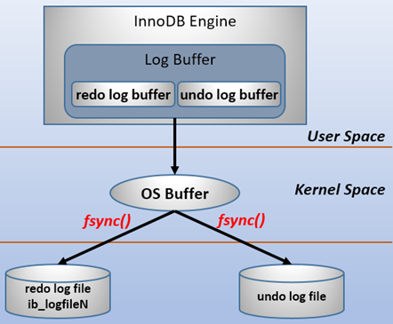

# MySQL的三大日志-binlog、redo log和undo log

## binlog

`binlog `用于记录数据库执行的写入性操作(不包括查询)信息，以二进制的形式保存在磁盘中。 `binlog `是 `mysql`
的逻辑日志，并且由 `Server `层进行记录，使用任何存储引擎的 `mysql `数据库都会记录 `binlog `日志。

- **逻辑日志**： 可以简单理解为记录的就是sql语句 。
- **物理日志**： `mysql `数据最终是保存在数据页中的，物理日志记录的就是数据页变更 。

`binlog `是通过追加的方式进行写入的，可以通过 `max_binlog_size `参数设置每个 `binlog`
文件的大小，当文件大小达到给定值之后，会生成新的文件来保存日志。

## Redo log

事务的四大特性里面有一个是 **持久性** ，具体来说就是
**只要事务提交成功，那么对数据库做的修改就被永久保存下来了，不可能因为任何原因再回到原来的状态** 。

那么 `mysql`是如何保证一致性的呢？

最简单的做法是在每次事务提交的时候，将该事务涉及修改的数据页全部刷新到磁盘中。但是这么做会有严重的性能问题，主要体现在两个方面：

1. 因为 `Innodb `是以 `页 `为单位进行磁盘交互的，而一个事务很可能只修改一个数据页里面的几个字节，这个时候将完整的数据页刷到磁盘的话，太浪费资源了！
2. 一个事务可能涉及修改多个数据页，并且这些数据页在物理上并不连续，使用随机IO写入性能太差！

因此 `mysql `设计了 `redo log `， MySQL利用WAL技术，WAL的全称是Write-Ahead Logging，它的关键点就是先写日志，再写磁盘。

### redo log的概念

* #### `redo log `包括两部分：

  * ##### 一个是内存中的日志缓冲( `redo log buffer `)

  * ##### 另一个是磁盘上的日志文件( ` redo log file `)。

##### `mysql `每执行一条 `DML `语句，先将记录写入 `redo log buffer `，后续某个时间点再一次性将多个操作记录写到 `redo log file `。这种 **先写日志，再写磁盘** 的技术就是 `MySQL`里经常说到的 `WAL(Write-Ahead Logging) `技术。

如图所示，在计算机操作系统中，用户空间( `user space `)下的缓冲区数据一般情况下是无法直接写入磁盘的，中间必须经过操作系统内核空间( `
kernel space `)缓冲区( `OS Buffer `)。因此， `redo log buffer `写入 `redo log
file `实际上是先写入 `OS Buffer `，然后再通过系统调用 `fsync() `将其刷到 `redo log file `中。

`mysql `支持三种将 `redo log buffer `写入 `redo log file `的时机，可以通过 `
innodb_flush_log_at_trx_commit ` 参数配置，各参数值含义如下：

| 参数值              | 含义                                                         |
| ------------------- | ------------------------------------------------------------ |
| 0（延迟写）         | 事务提交时不会将 `redo log buffer `中日志写入到 `os buffer `，而是每秒写入 `os buffer `并调用 `fsync() `写入到 `redo log file `中。也就是说设置为0时是(大约)每秒刷新写入到磁盘中的，当系统崩溃，会丢失1秒钟的数据。 |
| 1（实时写，实时刷） | 事务每次提交都会将 `redo log buffer `中的日志写入 `os buffer `并调用 `fsync() `刷到 `redo log file `中。这种方式即使系统崩溃也不会丢失任何数据，但是因为每次提交都写入磁盘，IO的性能较差。 |
| 2（实时写，延迟刷） | 每次提交都仅写入到 `os buffer `，然后是每秒调用 `fsync() `将 `os buffer `中的日志写入到 `redo log file `。 |

### Redo log记录形式

`redo log `实际上记录数据页的变更，而这种变更记录是没必要全部保存，因此 `redo log`
实现上采用了大小固定，循环写入的方式，当写到结尾时，会回到开头循环写日志。如下图：

在innodb中，既有` redo log `需要刷盘，还有 `数据页 `也需要刷盘， `redo log `存在的意义主要就是降低对 `数据页 `刷盘的要求 **。**

**在上图中， `write pos `表示 `redo log `当前记录的 `LSN` (逻辑序列号)位置， `check point `表示** 数据页更改记录** 刷盘后对应 `redo log `所处的 `LSN `(逻辑序列号)位置。

 `write pos `到 `check point `之间的部分是 `redo log `空着的部分，用于记录新的记录；` check point `到 `write pos `之间是 `redo log `待落盘的数据页更改记录。

当 `write pos `追上 `check point `时，会先推动 `check point `向前移动，空出位置再记录新的日志。

启动 `innodb `的时候，不管上次是正常关闭还是异常关闭，总是会进行恢复操作。因为 `redo log `记录的是数据页的物理变化，因此恢复的时候速度比逻辑日志(如 `binlog `)要快很多。

 重启 `innodb `时，首先会检查磁盘中数据页的 `LSN `，如果数据页的 `LSN `小于日志中的 `LSN `，则会从 `checkpoint `开始恢复。 还有一种情况，在宕机前正处于`checkpoint `的刷盘过程，且数据页的刷盘进度超过了日志页的刷盘进度，此时会出现数据页中记录的 `LSN `大于日志中的 `LSN`，这时超出日志进度的部分将不会重做，因为这本身就表示已经做过的事情，无需再重做。

### redo log与binlog区别

|          | redo log                                                     | binlog                                                       |
| -------- | ------------------------------------------------------------ | ------------------------------------------------------------ |
| 文件大小 | `redo log `的大小是固定的。                                  | `binlog `可通过配置参数 `max_binlog_size `设置每个` binlog `文件的大小。 |
| 实现方式 | `redo log `是 `InnoDB `引擎层实现的，并不是所有引擎都有。    | `binlog `是 `Server` 层实现的，所有引擎都可以使用 `binlog `日志 |
| 记录方式 | redo log 采用循环写的方式记录，当写到结尾时，会回到开头循环写日志。 | binlog通过追加的方式记录，当文件大小大于给定值后，后续的日志会记录到新的文件上 |
| 适用场景 | `redo log `适用于崩溃恢复(crash-safe)                        | `binlog `适用于主从复制和数据恢复                            |

由 `binlog `和 `redo log `的区别可知： `binlog `日志只用于归档，只依靠 `binlog `是没有 `
crash-safe `能力的。但只有 `redo log `也不行，因为 `redo log `是 `InnoDB `特有的，且日志上的记录落盘后会被覆盖掉。因此需要 `binlog `和 `redo log`二者同时记录，才能保证当数据库发生宕机重启时，数据不会丢失。

## undo log

数据库事务四大特性中有一个是 **原子性** ，具体来说就是 **原子性是指对数据库的一系列操作，要么全部成功，要么全部失败，不可能出现部分成功的情况**。

实际上， **原子性** 底层就是通过 `undo log `实现的。 `undo log `主要记录了数据的逻辑变化，比如一条 ` INSERT
`语句，对应一条 `DELETE `的 `undo log `，对于每个 `UPDATE `语句，对应一条相反的 `UPDATE `的`
undo log `，这样在发生错误时，就能回滚到事务之前的数据状态。同时， `undo log `也是 `MVCC `(多版本并发控制)实现的关键。

## 两阶段提交

如图所示是一条更新sql的执行流程 update T set c=c+1 where ID=2；

注意：最后三步为什么将redo log的写拆成了两个步骤：prepare和commit，这就是mysql典型的“两阶段提交”流程。

##### 为什么一定要有“二阶段提交”？

因为这是为了让两份日志之间的逻辑保持一致。要么都成功，要么都失败。

##### 如果两个日志分开执行会有什么样的结果？

1. ##### 先写redo log后写binlog。

   假设redo log写完，binlog还没有写完的时候，MySQL进程异常重启。由于redo log写完之后，系统即使崩溃，仍然能够把数据恢复回来，所以恢复后这一行c的值是1。但是由于binlog没写完就crash了，这时候binlog里面就没有记录这个语句。因此，之后备份日志的时候，存起来的binlog里面就没有这条语句。

   如果需要用这个binlog来恢复临时库的话，由于这个语句的binlog丢失，这个临时库就会少了这一次更新，恢复出来的这一行c的值就是0，与原库的值不同。

2. ##### 先写binlog后写redo log。

   如果binlog写完之后crash，由于redo log还没写，崩溃恢复以后这个事务无效，所以这一行c的值是0。但是binlog里面已经记录了“把c从0改成1”这个日志。所以，在之后用binlog来恢复的时候就多了一个事务出来，恢复出来的这一行c的值就是1，与原库的值不同。

所以如果不使用“两阶段提交”，那么数据库的状态就有可能和用它的日志恢复出来的库的状态不一致。

## 参考

[必须了解的mysql三大日志-binlog、redo log和undo log](https://segmentfault.com/a/1190000023827696)

[MySQL实战45讲]()

