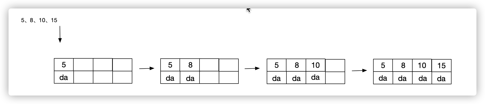

# 平衡二叉树、B树、B+树的理解

[toc]

## 平衡二叉树

### 概念

平衡二叉树是基于二分法的策略提高数据的查找速度的二叉树的数据结构。

### 特点

* 非叶子节点只能允许最多两个子节点存在。
* 每个非叶子节点数据分布规则为左变的子节点小于当前节点的值，右边的子节点大于当前节点的值。
* 树的左右两边的层级树相差不会大于1（避免树形结构由于删除增加编程线性链表影响查询效率）
* 没有值相等重复的节点

如图：

## B树（B-树）

B树和B- tree这两个是同一种树

### 概念

B树和平衡二叉树稍有不同的是B树属于多叉树又名平衡多路查找树（查找路径不止两个），数据库索引技术里大量使用B树和B+树的数据结构。

### 特点

* 所有节点关键字是按递增次序排列，并遵循左小右大原则；
* 非叶子节点的子节点数>1,且<=M,且M>=2，空树除外（注：M阶代表一个树节点最多有多少个查找路径，M=M路，当M=2时则是二叉树，M=3则是3叉树）;
* 枝节点的关键字数量大于恩义ceil(m/2)-1个且小于等于M-1个（注：ceil()是咯朝正无穷方向取整的函数，如ceil(1.1)结果是2）;
* 所有叶子节点均在同一层、叶子节点除了包含了关键字和关键字记录的指针外也有志向其子节点的指针只不过其指针地址都为null，如图中的空白格子。

### 举例

定义一个5阶树（平衡5路查找树;），现在我们要把3、8、31、11、23、29、50、28 这些数字构建出一个5阶树出来;

遵循规则：

（1）节点拆分规则：当前是要组成一个5路查找树，那么此时m=5,关键字数必须<=5-1（这里关键字数>4就要进行节点拆分）；

（2）排序规则：满足节点本身比左边节点大，比右边节点小的排序规则;

插入步骤：

1. 先插入3、8、11、23

如图：

2. 插入 23、29

   这时按照节点拆分规则，此时m=5,关键字数必须<=5-1（这里关键字数>4就要进行节点拆分）

   如图拆分过程：

   

3. 插入50、28

   如图插入过程

   

注意：当前节点满足拆分条件，当下一个关键字进入时进行拆分。

## B+树

### 概念

B+树是B树的一个升级版，相对于B树来说B+树更充分的利用了节点的空间，让查询速度更加稳定，其速度完全接近于二分查找。

### 规则

* B+跟B树不同B+树的非叶子节点不保存关键字记录的指针，只进行数据索引，这样使得B+树每个非叶子节点所能保存的关键字大大增加；
* B+树**叶子**节点保存了父节点的所有关键字记录的指针，所有数据地址必须要到叶子节点才能获取到。所以每次数据查询的次数都一样；
* B+树叶子节点的关键字从小到大有序排列，左边结尾数据都会保存右边节点开始数据的指针。
* 非叶子节点的子节点数=关键字数（来源百度百科）（根据各种资料 这里有两种算法的实现方式，另一种为非叶节点的关键字数=子节点数-1（来源维基百科)，虽然他们数据排列结构不一样，但其原理还是一样的Mysql 的B+树是用第一种方式实现）;

### 特点

* B+**树的层级更少**：相较于B树B+每个**非叶子**节点存储的关键字数更多，树的层级更少所以查询数据更快
* B+**树查询速度更稳定**：B+所有关键字数据地址都存在**叶子**节点上，所以每次查找的次数都相同所以查询速度要比B树更稳定;
* B+**树天然具备排序功能：**B+树所有的**叶子**节点数据构成了一个有序链表，在查询大小区间的数据时候更方便，数据紧密性很高，缓存的命中率也会比B树高。
* B+**树全节点遍历更快：**B+树遍历整棵树只需要遍历所有的**叶子**节点即可，，而不需要像B树一样需要对每一层进行遍历，这有利于数据库做全表扫描。

### 举例

插入5阶的B+树数据

1. 插入 5、8、10、10的过程，按照规则插入，如图步骤：

2. 此时当前节点key存满了，如果在继续插入当前节点就要进行分裂，继续插入关键字16

在叶子结点分裂时，假设分裂出来的左结点有 2 个记录，右节点有 3 个记录，中间 key 成为索引结点中的 key，会成为一个父节点，分裂后的两个节点都指向了父结点（根结点）

3. 继续插入关键字17

注意：节点自始至终都是保持有序的。

4. 继续插入关键字18

   此时，右边的节点满足了分裂条件，所以进行分裂变化，分裂前后，节点上的关键字保持有序性。

5. 就这样，当我们再插入 10 个数据后，如图：

此时，根节点的关键字个数超过 4，需要进行分裂。分裂后，左结点 2 个关键字，右结点 2 个关键字，关键字 16 进入到父结点中，将分裂后的节点指向父结点。

以此类推，当插入的数据满足节点分裂时就会进行分裂。但是分裂后，关键字都是有序的。

根据这个插入过程，一个 B+ 树的高度，是有一个节点能存储多少关键字，也就是索引决定的。通常，一棵 [MySQL](https://cloud.tencent.com/product/cdb?from=10680) 的 B+ 树，树高为 3 的话，大约能存上亿条。树的高度太高的话，查询效率会大打折扣！

