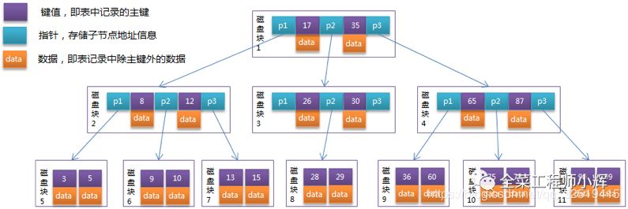
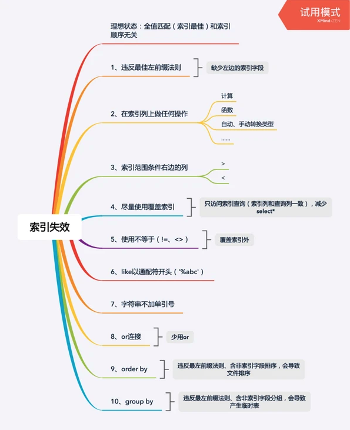
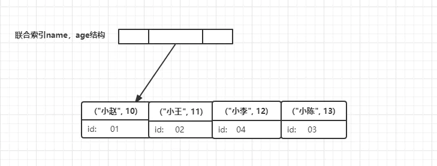
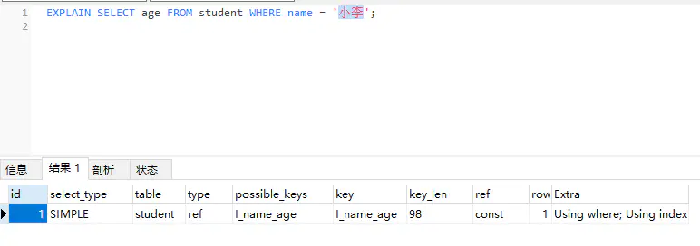

# MySQL数据库索引总结

## 索引是什么？

[toc]

索引是帮助数据库高效获取数据的数据结构。查询数据如同查询字典时的目录一样，快速定位到需要查询的数据。

## 索引的分类

* ### 从存储结构上来划分

  * B tree索引（B+ tree，B- tree）
  * 哈希索引
  * full-index全文索引
  * RTree

* ### 从应用层次上来划分

  * 普通索引：即一个索引只包含单个列，一个表可以有多个单列索引。
  * 唯一索引：索引列的值必须唯一，但不允许有空值。
  * 复合索引：一个索引包含多个列。

* ### 从表记录的排列顺序和索引的排列顺序是否一致来划分

  * 聚集索引：表记录的排列顺序和索引的排列顺序一致。
  * 非聚集索引：表记录的排列顺序和索引的排列顺序不一致。

* ### 聚集索引和非聚集索引

  * 聚集索引：以主键创建的索引。
    * 聚集索引表记录的排列顺序和索引的排列顺序一致，所以查询效率快，因为只有找到第一个索引值记录，其余的连续性的记录在表中也会连续存放，一起就可以查询到。
    * 缺点：新增比较慢，因为为了保证表中记录的物理顺序和索引顺序一致，在记录插入的时候，会对数据页重新排序。
  * 非聚集索引：以非主键创建的索引（二级索引）。
    * 索引的逻辑顺序与磁盘上行的物理存储顺序不同，非聚集索引在叶子节点存储的是主键和索引列，当我们使用非聚集索引查询数据时，需要拿到叶子上的主键再去表中查到想要查找的数据。这个过程就是我们所说的回表。
  * 聚集索引和非聚集索引的区别
    * 聚集索引在叶子节点存储的是表中的数据。
    * 非聚集索引在叶子节点存储的是主键和索引列。

## MySQL如何添加索引

### 1）添加PRIMARY KEY（主键索引）

```mysql
ALTER TABLE `table_name` ADD PRIMARY KEY ( `column` )
```

### 2）添加UNIQUE（唯一索引）

```mysql
ALTER TABLE `table_name` ADD UNIQUE (`column`)
```

### 3）添加INDEX（普通索引）

```mysql
ALTER TABLE `table_name` ADD INDEX index_name (`column` )
```

### 4）添加FULLTEXT（全文索引）

```mysql
ALTER TABLE `table_name` ADD FULLTEXT (`column`)
```

### 5）添加多列索引

```mysql
ALTER TABLE `table_name` ADD INDEX index_name (`column1`,`column2`,`column3`)
```

## 索引底层数据结构

### 哈希索引

可能直接想到的就是用哈希表来实现快速查找，就像我们平时用的hashmap一样，value = get(key) O(1)时间复杂度一步到位，确实，哈希索引是一种方式。

* #### 定义

  * 哈希索引就是采用一定的哈希算法，只需一次哈希算法即可立刻定位到相应的位置，速度非常快。本质上就是把键值换算成新的哈希值，根据这个哈希值来定位。

    

* 局限性
  * 哈希索引没办法利用索引完成排序。 
  * 不能进行多字段查询。 
  * 在有大量重复键值的情况下，哈希索引的效率也是极低的（出现哈希碰撞问题）。 
  * 不支持范围查询。

### B树索引

* #### B树的特点

  * 关键字分布在整棵树的所有节点。 

  * 任何一个关键字出现且只出现在一个节点中。 

  * 搜索有可能在非叶子节点结束。 

  * 其搜索性能等价于在关键字全集内做一次二分查找。

    

* #### B+树

  * ##### B+树基本特点

    * 非叶子节点的子树指针与关键字个数相同。 
    * 非叶子节点的子树指针P[i]，指向关键字属于 [k[i],K[i+1])的子树（注意：区间是前闭后开)。 
    * 为所有叶子节点增加一个链指针。 
    * 所有关键字都在叶子节点出现。

    如图：

    

  * ##### B+树的特性

    * 所有的关键字都出现在叶子节点的链表中，且链表中的关键字是有序的。 
    * 搜索只在叶子节点命中。 
    * 非叶子节点相当于是叶子节点的索引层，叶子节点是存储关键字数据的数据层。

  * ##### 相对B树，B+树做索引的优势

    - B+树的磁盘读写代价更低。**B+树的内部没有指向关键字具体信息的指针，**所以其内部节点相对B树更小，如果把所有关键字存放在同一块盘中，那么盘中所能容纳的关键字数量也越多，一次性读入内存的需要查找的关键字也就越多，**相应的，IO读写次数就降低了。** 
    - 树的查询效率更加稳定。B+树所有数据都存在于叶子节点，所有关键字查询的路径长度相同，每次数据的查询效率相当。而B树可能在非叶子节点就停止查找了，所以查询效率不够稳定。 
    - B+树只需要去遍历叶子节点就可以实现整棵树的遍历。

## MySQL索引失效

### 举例

这里建立了一张表，里面建立了三个单列索引userId,mobile,billMonth。

然后进行多列查询。

```mysql
explain select * from `t_mobilesms_11` where userid = '1' and mobile = '13504679876' and billMonth = '1998-03'
```


我们发现查询时只用到了userid这一个单列索引，这是为什么呢？**因为这取决于MySQL优化器的优化策略。**

**当多条件联合查询时，优化器会评估哪个条件的索引效率高，它会选择最佳的索引去使用。也就是说，此处三个索引列都可能被用到，只不过优化器判断只需要使用userid这一个索引就能完成本次查询，故最终explain展示的key为userid。**

### 总结

多个单列索引在多条件查询时优化器会选择最优索引策略，可能*只用一个索引，也可能将多个索引都用上。*

但是多个单列索引底层会建立多个B+索引树，比较占用空间，也会浪费搜索效率 所以*多条件联合查询时最好建联合索引。*

### 联合索引失效问题



创建user表，然后建立 name, age, pos, phone 四个字段的联合索引 全值匹配（索引最佳）。

索引生效，这是最佳的查询。

#### 何时索引会失效呢？

* ##### 违反最左匹配原则

  * **最左匹配原则：最左优先，以最左边的为起点任何连续的索引都能匹配上，如不连续，则匹配不上。**

    如：建立索引为(a,b)的联合索引，那么只查 where b = 2 则不生效。换句话说：如果建立的索引是(a,b,c)，也只有(a),(a,b),(a,b,c)三种查询可以生效。

  * **遇到范围查询（>、<、between、like）就会停止匹配。**

    比如：a= 1 and b = 2 and c>3 and d =4 如果建立(a,b,c,d)顺序的索引，d是用不到索引的，因为c字段是一个范围查询，它之后的字段会停止匹配。

* ##### 在索引列上做任何操作

  * 如计算、函数、（手动或自动）类型转换等操作，会导致索引失效而进行全表扫描。

    ```mysql
    explain select * from user where left(name,3) = 'zhangsan' and age =20
    ```

    这里对name字段进行了left函数操作，导致索引失效。

* ##### 使用不等于（!= 、<>）

  ```mysql
  explain select * from user where age != 20;
  
  explain select * from user where age <> 20;
  ```

* ##### like中以通配符开头('%abc')

  ```mysql
  explain select * from user where name like ‘%zhangsan’;
  
  explain select * from user where name like ‘zhangsan%’;
  ```

* ##### 字符串不加单引号索引失效

  ```mysql
  explain select * from user where name = 2000;
  ```

* ##### or连接索引失效

  ```mysql
  explain select * from user where name = ‘2000’ or age = 20 or pos =‘cxy’;
  ```

* ##### order by

  正常（索引参与了排序），没有违反最左匹配原则。

  ```mysql
  explain select * from user where name = 'zhangsan' and age = 20 order by age,pos;
  ```

  违反最左前缀法则，导致额外的文件排序（会降低性能）。

  ```mysql
  explain select name,age from user where name = 'zhangsan' order by pos;
  ```

* ##### group by

  正常（索引参与了排序）。

  ```mysql
  explain select name,age from user where name = 'zhangsan' group by age;
  备注：分组之前必排序（排序同order by）
  ```

  违反最左前缀法则，导致产生临时表（会降低性能）。

  ```mysql
  explain select name,age from user where name = 'zhangsan' group by pos,age;
  ```

### 创建索引的注意事项

* 选择合适的字段创建索引
  * 不为null的字段
  * 被频繁查询的字段
  * 被作为条件查询的字段
  * 频繁需要排序的字段
  * 被经常频繁用于连接的字段
* 被频繁更新的字段应该慎用创建索引
* 尽量考虑使用联合索引而不是单列索引
* 避免冗余索引
* 考虑在字符串类型的字段上使用前缀索引代替普通索引

## 覆盖索引

覆盖索引（covering index ，或称为索引覆盖）即从非主键索引中就能查到的记录，而不需要查询主键索引中的记录，避免了回表的产生减少了树的搜索次数，显著提升性能。

### 如何使用覆盖索引？

#### 举例

建立了表student，那么现在出现的业务需求中要求根据名称获取学生的年龄，并且该搜索场景非常频繁，以name和age两个字段建立联合索引，sql命令与建立后的索引树结构如下

```mysql
ALTER TABLE student ADD INDEX I_name_age(name, age);
```



执行sql：

```mysql
SELECT age FROM student WHERE name = '小李'；
```

流程为：

1. 在name,age联合索引树上找到名称为小李的节点
2. 此时节点索引里包含信息age 直接返回 12

####  如何确定数据库成功使用了覆盖索引呢？

当发起一个索引覆盖查询时，在explain的extra列可以看到using index的信息



这里我们很清楚的看到Extra中Using index表明我们成功使用了覆盖索引

> 总结：覆盖索引避免了回表现象的产生，从而减少树的搜索次数，显著提升查询性能，所以使用覆盖索引是性能优化的一种手段.

## 参考

[一张图搞懂MySQL的索引失效](https://segmentfault.com/a/1190000021464570)

[深入理解MySQL索引](https://mp.weixin.qq.com/s/sT-Jz67p8Gadvcft-iO-9g)

[MySQL 覆盖索引详解](https://juejin.cn/post/6844903967365791752)


