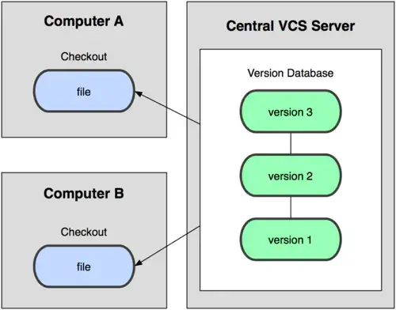

# Git版本控制工具学习笔记

### Git 简介

Git是一个开源的分布式版本控制系统。什么是版本控制呢？版本控制就是一种记录一个或若干文件内容变化，方便将来查阅特定版本修订情况的系统。

版本控制系统分为 **分布式版本控制系统** 和 **集中式版本控制系统**。

* ##### 集中式版本控制系统

  集中式版本控制系统，比如CVS、Subversion等版本控制系统，都有一个单一的集中管理的服务器，保存所有文件的修订版本，而协同工作的人员都是通过客户端连到这台服务器上，取出最新的文件或者提交更新。

  这样做存在一个很明显的缺点，那就是如果中央服务器的单点故障。如果宕机几个小时，那么在这几个小时内，任何人都无法提交更新，也就无法协同工作。要是中央服务器的磁盘发生故障，又碰巧没有做备份，或者备份不及时，就会有丢失数据的风险。最坏的情况是彻底丢失整个项目的所有历史更改记录。

  

* ##### 分布式版本控制系统

  分布式版本控制系统的客户端并不只是提取最新版本的文件快照，而是把代码仓库完整地镜像下来。这样的话，任何一处协同工作用的服务器发生故障，事后都可以用任何一个镜像出来的本地仓库恢复。因为每一次的提取操作，实际上都是一次对代码仓库的完整备份。

  

### Git和Svn的区别

* **Git是分布式的，Svn是集中式的**。因为Git是分布式的，所以Git支持离线工作，在本地可以进行很多操作。而SVN必须联网才能正常工作。

* **Git复杂细节多，SVN简单易上手**。

  使用Git的话，Git的命令有很多，日常工作需要掌握add、commit、status、fetch、push、rebase等命令，若要熟练掌握，还需要掌握rebase和merge的区别，fetch和pull的区别等。除此之外，还有submodule。stash等功能的使用。在易用性方面，SVN对于新手来说会更友好一些。

* **Git分支廉价，SVN分支昂贵**。

  在版本管理里，分支是很常使用的功能。在发布版本前，需要发布分支，进行大需求开发，需要 feature 分支，大团队还会有开发分支，稳定分支等。在大团队开发过程中，常常存在创建分支，切换分支的要求。

  Git 分支是指针指向某次提交，而 SVN 分支是拷贝的目录。这个特性使 Git 的分支切换非常迅速，并且创建成本非常低。

  而且 Git 有本地分支，SVN 无本地分支。在实际开发过程中，经常会遇到有些代码没写完，但是需紧急处理其他问题，若我们使用 Git，便可以创建本地分支存储没写完的代码，待问题处理完后，再回到本地分支继续完成代码。

### Git工作的原理

请参考文章 [图文详解 Git 工作原理](https://mp.weixin.qq.com/s?__biz=MzI0MDQ4MTM5NQ==&mid=2247508393&idx=2&sn=36bcbd46a1539d2939ca4dce9a0828da&chksm=e918c4b5de6f4da378ad358fdb7c3e812b94aa508457cf837ab6247b45fd1718fc90b389abfa&token=1267489950&lang=zh_CN#rd)

### Git安装

在Git官方下载地址下载对应系统的安装包即可，Windows系统下载exe文件，Mac系统安装mac安装包。

Windows系统安装时，建议安装 Git Bash 这个git 的命令行工具。

### Git的基本概念

* ##### 版本库

  当我们一个项目到本地或创建一个git项目，项目目录下会有一个隐藏的.git子目录，这个目录是git用来跟踪管理版本库的，千万不要手动修改。

* ##### 哈希值

  Git 中所有数据在存储前都计算校验和，然后以校验和来引用。这意味着不可能在 Git 不知情时更改任何文件内容或目录内容。这个功能建构在 Git 底层，是构成 Git 哲学不可或缺的部分。若你在传送过程中丢失信息或损坏文件，Git 就能发现。

  Git 用以计算校验和的机制叫做 SHA-1 散列（hash，哈希）。这是一个由 40 个十六进制字符（0-9 和 a-f）组成字符串，基于 Git 中文件的内容或目录结构计算出来。SHA-1 哈希看起来是这样：

  24b9da68982543567252987aa493b52f8696cd6d
  Git 中使用这种哈希值的情况很多，你将经常看到这种哈希值。实际上，Git 数据库中保存的信息都是以文件内容的哈希值来索引，而不是文件名。

* ##### 文件状态

  在 GIt 中，我们的文件可能会处于三种状态之一：

  - **已修改（modified）** - 已修改表示修改了文件，但还没保存到数据库中。
  - **已暂存（staged）** - 已暂存表示对一个已修改文件的当前版本做了标记，使之包含在下次提交的快照中。
  - **已提交（committed）** - 已提交表示数据已经安全的保存在本地数据库中。

  与文件状态对应的，不同状态的文件在 Git 中处于不同的工作区域。

  - **工作区（working**） - 当我们 git clone 一个项目到本地，相当于在本地克隆了项目的一个副本。工作区是对项目的某个版本独立提取出来的内容。这些从 Git 仓库的压缩数据库中提取出来的文件，放在磁盘上供你使用或修改。
  - **暂存区（staging）**- 暂存区是一个文件，保存了下次将提交的文件列表信息，一般在 Git 仓库目录中。有时候也被称作 `‘索引’'，不过一般说法还是叫暂存区。
  - **本地仓库（local）** - 提交更新，找到暂存区域的文件，将快照永久性存储到 Git 本地仓库。
  - **远程仓库（remote）** - 以上几个工作区都是在本地。为了让别人可以看到你的修改，我们需要将我们的更新推送到远程仓库。同理，如果我们想同步别人的修改，我们就需要从远程仓库拉取更新。

  

* ##### Git分支

  分支是为了将修改记录的整个流程分开存储，让分开的分支不受其它分支的影响，所以在同一个数据库里可以同时进行多个不同的修改。

  

  Git会为我们自动创建一个分支，这个分支叫主分支（master），其它分支开发完成之后都要合并到master分支上。

  

* ##### HEAD

  HEAD指向的是当前分支的最新提交版本。

### Git命令使用


* ##### 创建版本库

  克隆一个已经创建的仓库：

  ```shell
  // Https方式克隆
  $ git clone https://github.com/sunwjblog/JavaGitBook.git
  
  // SSH方式克隆
  $ git clone git@github.com:sunwjblog/JavaGitBook.git
  ```

* ##### 初始化本地版本库

  ```shell
  $ git init
  ```

  * 添加修改
    添加修改到暂存区：

    ```shell
    # 把指定文件添加到暂存区
    $ git add xxx
    
    # 把当前所有修改添加到暂存区
    $ git add .
    
    # 把所有修改添加到暂存区
    $ git add -A
    ```

    提交修改到本地仓库：

    ```shell
    # 提交本地的所有修改
    $ git commit -a
    
    # 提交之前已标记的变化
    $ git commit
    
    # 附加消息提交
    $ git commit -m 'commit message'
    ```

* ##### 储藏

  有时，我们需要在同一个项目的不同分支上工作。当需要切换分支时，偏偏本地的工作还没有完成，此时，提交修改显得不严谨，但是不提交代码又无法切换分支。这时，你可以使用 git stash 将本地的修改内容作为草稿储藏起来。官方称之为储藏，也可以理解为存草稿。

  ```shell
  # 1. 将修改作为当前分支的草稿保存
  $ git stash
  
  # 2. 查看草稿列表
  $ git stash list
  stash@{0}: WIP on master: 6fae349 :memo: Writing docs.
  
  # 3.1 删除草稿
  $ git stash drop stash@{0}
  
  # 3.2 读取草稿
  $ git stash apply stash@{0}
  ```

* ##### 撤销

  撤销本地修改：

  ```shell
  # 移除缓存区的所有文件（i.e. 撤销上次git add）
  $ git reset HEAD
  
  # 将HEAD重置到上一次提交的版本，并将之后的修改标记为未添加到缓存区的修改
  $ git reset <commit>
  
  # 将HEAD重置到上一次提交的版本，并保留未提交的本地修改
  $ git reset --keep <commit>
  
  # 放弃工作目录下的所有修改
  $ git reset --hard HEAD
  
  # 将HEAD重置到指定的版本，并抛弃该版本之后的所有修改
  $ git reset --hard <commit-hash>
  
  # 用远端分支强制覆盖本地分支
  $ git reset --hard <remote/branch> e.g., upstream/master, origin/my-feature
  
  # 放弃某个文件的所有本地修改
  $ git checkout HEAD <file>
  ```

  删除添加.gitignore文件前错误提交的文件：

  ```shell
  $ git rm -r --cached .
  $ git add .
  $ git commit -m "remove xyz file"
  ```

  撤销远程修改（创建一个新的提交，并回滚到指定版本）：

  ```shell
  $ git revert <commit-hash>
  ```

  彻底删除指定版本：

  ```shell
  # 执行下面命令后，commit-hash 提交后的记录都会被彻底删除，使用需谨慎
  $ git reset --hard <commit-hash>
  $ git push -f
  ```

* ##### 远程操作

  更新：

  ```shell
  # 下载远程端版本，但不合并到HEAD中
  $ git fetch <remote>
  
  # 将远程端版本合并到本地版本中
  $ git pull origin master
  
  # 以rebase方式将远端分支与本地合并
  $ git pull --rebase <remote> <branch>
  ```

  推送：

  ```shell
  # 将本地版本推送到远程端
  $ git push remote <remote> <branch>
  
  # 删除远程端分支
  $ git push <remote> :<branch> (since Git v1.5.0)
  $ git push <remote> --delete <branch> (since Git v1.7.0)
  
  # 发布标签
  $ git push --tags
  ```

* ##### 修改和提交

  显示工作路径下已修改的文件：

  ```shell
  $ git status
  ```

  显示与上次提交版本文件的不同：

  ```shell
  $ git diff
  ```

  显示提交历史：

  ```shell
  # 从最新提交开始，显示所有的提交记录（显示hash， 作者信息，提交的标题和时间）
  $ git log
  
  # 显示某个用户的所有提交
  $ git log --author="username"
  
  # 显示某个文件的所有修改
  $ git log -p <file>
  ```

  * 显示搜索内容：

    ```shell
    # 从当前目录的所有文件中查找文本内容
    $ git grep "Hello"
    
    # 在某一版本中搜索文本
    $ git grep "Hello" v2.5
    ```

* ##### 分支

  增删查分支：

  ```shell
  # 列出所有的分支
  $ git branch
  
  # 列出所有的远端分支
  $ git branch -r
  
  # 基于当前分支创建新分支
  $ git branch <new-branch>
  
  # 基于远程分支创建新的可追溯的分支
  $ git branch --track <new-branch> <remote-branch>
  
  # 删除本地分支
  $ git branch -d <branch>
  
  # 强制删除本地分支，将会丢失未合并的修改
  $ git branch -D <branch>
  ```

  切换分支：

  ```shell
  # 切换分支
  $ git checkout <branch>
  
  # 创建并切换到新分支
  $ git checkout -b <branch>
  ```

  标签

  ```shell
  # 给当前版本打标签
  $ git tag <tag-name>
  
  # 给当前版本打标签并附加消息
  $ git tag -a <tag-name>
  ```

* ##### 合并和重置

  merge 与 rebase 虽然是 git 常用功能，但是强烈建议不要使用 git 命令来完成这项工作。

  因为如果出现代码冲突，在没有代码比对工具的情况下，合并比较麻烦。

  可以考虑使用各种 Git GUI 工具。

  合并：

  ```shell
  # 将分支合并到当前HEAD中
  $ git merge <branch>
  ```

  重置：

  ```shell
  # 将当前HEAD版本重置到分支中，请勿重置已发布的提交
  $ git rebase <branch>
  ```

### Git分支开发

Git 是目前最流行的源代码管理工具。为规范开发，保持代码提交记录以及 git 分支结构清晰，方便后续维护，现规范 git 的相关操作。

**分支命名**

1、**master 分支**

master 为主分支，也是用于部署生产环境的分支，确保master分支稳定性， master 分支一般由develop以及hotfix分支合并，任何时间都不能直接修改代码

2、**develop 分支**

develop 为开发分支，始终保持最新完成以及bug修复后的代码，一般开发的新功能时，feature分支都是基于develop分支下创建的。

- **feature 分支**

开发新功能时，以develop为基础创建feature分支。
分支命名: feature/ 开头的为特性分支， 命名规则: feature/user_module、 feature/cart_module

- **release分支**

release 为预上线分支，发布提测阶段，会release分支代码为基准提测。当有一组feature开发完成，首先会合并到develop分支，进入提测时会创建release分支。如果测试过程中若存在bug需要修复，则直接由开发者在release分支修复并提交。当测试完成之后，合并release分支到master和develop分支，此时master为最新代码，用作上线。

- **hotfix 分支**

分支命名: hotfix/ 开头的为修复分支，它的命名规则与feature分支类似。线上出现紧急问题时，需要及时修复，以master分支为基线，创建hotfix分支，修复完成后，需要合并到master分支和develop分支

### Git使用技巧

* ##### 企业工作流程

  * Git Flow
  * 主干分支
  * 稳定分支
  * 开发分支
  * 补丁分支
  * 修改分支


* ##### Github Flow

  * 创建分支
  * 添加提交
  * 提交PR请求
  * 讨论和评估代码
  * 部署检测
  * 合并代码


* ##### 日常使用

  - **使用命令行代替图形化界面**
  - **使用命令行来操作，简洁且效率高**
  - **提交应该尽可能的表述提交修改内容**
  - **区分 subject 和 body 内容，使用空行隔开**
  - subject 一般不超过 50 个字符
  - body 每一行的长度控制在 72 个字符
  - subject 结尾不需要使用句号或者点号结尾
  - **body 用来详细解释此次提交具体做了什么**
  - **使用 .gitignore 文件来排除无用文件**
  - 可使用模板文件，然后根据项目实际进行修改
  - 基于分支或 fork 的开发模式
  - **不要直接在主干分支上面进行开发**
  - **在新建的分支上进行功能的开发和问题的修复**
  - **使用 release 分支和 tag 标记进行版本管理**
  - **使用 release 分支发布代码和版本维护(release/1.32)**
  - **使用 tag 来标记版本(A-大feature功能.B-小feature功能.C-只修bug)**

### 日常常用命令


```shell
# 工作区 -> 暂存区
$ git add <file/dir>

# 暂存区 -> 本地仓库
$ git commit -m "some info"

# 本地仓库 -> 远程仓库
$ git push origin master  # 本地master分支推送到远程origin仓库 
# 工作区 <- 暂存区
$ git checkout -- <file>  # 暂存区文件内容覆盖工作区文件内容

# 暂存区 <- 本地仓库
$ git reset HEAD <file>   # 本地仓库文件内容覆盖暂存区文件内容

# 本地仓库 <- 远程仓库
$ git clone <git_url>        # 克隆远程仓库
$ git fetch upstream master  # 拉取远程代码到本地但不应用在当前分支
$ git pull upstream master   # 拉取远程代码到本地但应用在当前分支
$ git pull --rebase upstream master  # 如果平时使用rebase合并代码则加上

# 工作区 <- 本地仓库
$ git reset <commit>          # 本地仓库覆盖到工作区(保存回退文件内容修改)
$ git reset --mixed <commit>  # 本地仓库覆盖到工作区(保存回退文件内容修改)
$ git reset --soft <commit>   # 本地仓库覆盖到工作区(保留修改并加到暂存区)
$ git reset --hard <commit>   # 本地仓库覆盖到工作区(不保留修改直接删除掉)
```


参考：[最新、最全、最详细的 Git 学习笔记总结（2021最新版）](https://segmentfault.com/a/1190000039921595)

