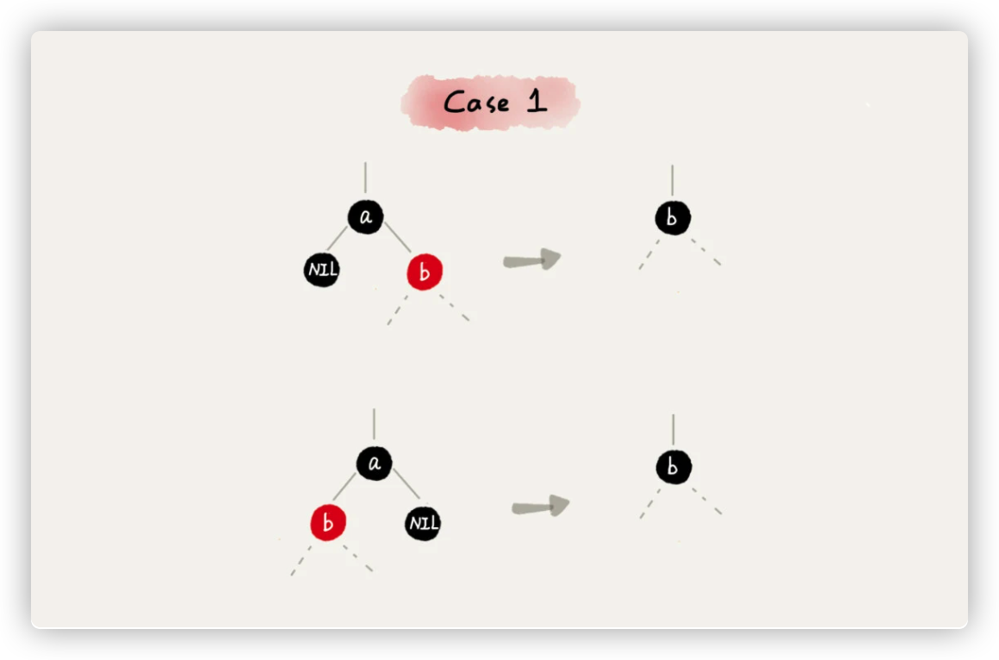

# 红黑树

[toc]

## 什么是“平衡二叉查找树”？

二叉树中任意一个节点的左右子树的高度相差不能大于1。

如图：

发明平衡二叉查找树这类数据结构的初衷是，解决普通二叉查找树在频繁的插入、删除等动态更新的情况下，出现事件复杂度退化的问题。

**所以，平衡二叉查找树中“平衡”的意思，其实就是让整棵树左右看起来比较“对称”、比较“平衡”，不要出现左子树很高、右子树很矮的情况。这样就能让整棵树的高度相对来说低一些，相应的插入、删除、查找等操作的效率高一些。**

## “红黑树”的定义

红黑树的英文是“Red-Black Tree”，简称R-B Tree。它是一种不严格的平衡的二叉查找树。红黑树中的节点，一类被标记为黑色，一类被标记为红色。一棵红黑树还需要满足一下要求：

* 根节点是黑色的；
* 每个叶子节点都是黑色的空节点（NIL），也就是说，叶子节点不存储数据；
* 任何相邻的节点都不能同时为红色，也就是说，红色节点是被黑色节点隔开的；
* 每个节点，从该节点到达其可达叶子节点的所有路径，都包含相同数目的黑色节点；

**“叶子节点都是黑色的空节点”，主要是为了简化红黑树的代码实现而设置的。**

如图：

### 红黑树的实现基本思想

知道了红黑树的定义，假如我们对红黑树进行操作，在插入、删除节点的过程中，第三、四点要求可能会被破坏，红黑树“平衡调整”时，就是要把被破坏的第三、四点恢复过来。

红黑树的平衡调整有：**左旋（rotate left）**、**右旋（rotate right）**。左旋全称其实是叫**围绕某个节点的左旋**，那右旋的全称就叫**围绕某个节点的右旋**。

如图：

图中的a，b，r表示子树，可以为空。

#### 插入操作的平衡调整

**红黑树规定，插入的节点必须是红色的。而且，二叉查找树中新插入的节点都是放在叶子节点上。所以，关于插入操作的平衡调整，有这样两种特殊情况。**

* 如果插入节点的父节点是黑色的，那我们什么都不用做，它仍然满足红黑树的定义。
* 如果插入的节点是根节点，那我们直接改变它的颜色，把它变成黑色就可以了。

除此之外，其他情况都会违背红黑树的定义，于是就需要进行调整，调整的过程包含两种基础的操作：**左右旋转**和**改变颜色**。

红黑树的平衡调整过程是一个迭代的过程。我们把正在处理的节点叫做**关注节点**。

新节点插入之后，如果红黑树的平衡被打破，那一般会有下面三种情况。只需要根据每种情况的特点，不停地调整，就可以让红黑树继续符合定义，也就是继续保持平衡。

**情况1：如果关注点时a，它的叔叔节点d是红色，**就依次执行下面的操作：

* 将关注节点a的父节点b、叔叔节点d的颜色都设置成黑色；
* 将关注节点 a 的祖父节点 c 的颜色设置成红色；
* 关注节点变成 a 的祖父节点 c；
* 跳到 情况 2 或者 情况 3。

**情况2：如果关注节点是 a，它的叔叔节点 d 是黑色，关注节点 a 是其父节点 b 的右子节点，**就依次执行下面的操作：

* 关注节点变成节点 a 的父节点 b；
* 围绕新的关注节点b 左旋；
* 跳到 情况 3。

**情况3：如果关注节点是 a，它的叔叔节点 d 是黑色，关注节点 a 是其父节点 b 的左子节点，**就依次执行下面的操作：

* 围绕关注点a的祖父节点c右旋；
* 将关注节点 a 的父节点 b、兄弟节点 c 的颜色互换；
* 调整结束。

#### 删除操作的平衡调整

删除操作的平衡调整分为两步：

* 第一步是针对删除节点初步调整。初步调整只是保证整棵红黑树在一个节点删除之后，仍然满足最后一条定义的要求，也就是说，每个节点，从该节点到达其可达叶子节点的所有路径，都包含相同数目的黑色节点；
* 第二步是针对关注节点进行二次调整，让它满足红黑树的第三条定义，即不存在相邻的两个红色节点。

##### 针对删除节点初步调整

红黑树的定义中“只包含红色节点和黑色节点”，经过初步调整之后，为了保证满足红黑树定义的最后一条要求，有些节点会被标记成两种颜色，“红 - 黑”或者“黑 - 黑”。如果一个节点被标记为了“黑 - 黑”，那在计算黑色节点个数的时候，要算成两个黑色节点。

**下面的图里面的红黑色对半分的节点的意思是这个节点既有可能是红节点也有可能是黑节点，而被增加的黑度会用一个多余的黑色小点来标识。 不要把红黑色对半分的节点当成了红-黑节点**

**情况1：如果删除的节点是a，它只有一个子节点b，**那就依次进行如下操作：

* 删除节点 a，并且把节点 b 替换到节点 a 的位置，这一部分操作跟普通的二叉查找树的删除操作一样；
* 节点 a 只能是黑色，节点 b 也只能是红色，其他情况均不符合红黑树的定义。这种情况下，我们把节点 b 改为黑色；
* 调整结束，不需要进行二次调整。

**情况2：如果要删除的节点 a 有两个非空子节点，并且它的后继节点就是节点 a 的右子节点 c。**就依次进行如下操作：

* 如果节点 a 的后继节点就是右子节点 c，那右子节点 c 肯定没有左子树。我们把节点 a 删除，并且将节点 c 替换到节点 a 的位置。这一部分操作跟普通的二叉查找树的删除操作无异；
* 然后把节点 c 的颜色设置为跟节点 a 相同的颜色；
* 如果节点 c 是黑色，为了不违反红黑树的最后一条定义，我们给节点 c 的右子节点 d 多加一个黑色，这个时候节点 d 就成了“红 - 黑”或者“黑 - 黑”；
* 这个时候，关注节点变成了节点 d，第二步的调整操作就会针对关注节点来做。

**情况3：如果要删除的是节点 a，它有两个非空子节点，并且节点 a 的后继节点不是右子节点，**就依次进行如下操作：

* 找到后继节点 d，并将它删除，删除后继节点 d 的过程参照 CASE 1；
* 将节点 a 替换成后继节点 d；
* 把节点 d 的颜色设置为跟节点 a 相同的颜色；
* 如果节点 d 是黑色，为了不违反红黑树的最后一条定义，我们给节点 d 的右子节点 c 多加一个黑色，这个时候节点 c 就成了“红 - 黑”或者“黑 - 黑”；
* 这个时候，关注节点变成了节点 c，第二步的调整操作就会针对关注节点来做。

#### 针对关注节点进行二次调整

经过初步调整之后，关注节点变成了“红 - 黑”或者“黑 - 黑”节点。针对这个关注节点，我们再分四种情况来进行二次调整。二次调整是为了让红黑树中不存在相邻的红色节点。

**情况1：如果关注节点是 a，它的兄弟节点 c 是红色的，**就依次进行如下操作：

* 围绕关注节点 a 的父节点 b 左旋；
* 关注节点 a 的父节点 b 和祖父节点 c 交换颜色；
* 关注节点不变；
* 继续从四种情况中选择适合的规则来调整。

**情况2：如果关注节点是 a，它的兄弟节点 c 是黑色的，并且节点 c 的左右子节点 d、e 都是黑色的，**就依次进行如下操作：

* 将关注节点 a 的兄弟节点 c 的颜色变成红色；
* 从关注节点 a 中去掉一个黑色，这个时候节点 a 就是单纯的红色或者黑色；
* 给关注节点 a 的父节点 b 添加一个黑色，这个时候节点 b 就变成了“红 - 黑”或者“黑 - 黑”；
* 关注节点从 a 变成其父节点 b；
* 继续从四种情况中选择符合的规则来调整。

**情况3：如果关注节点是 a，它的兄弟节点 c 是黑色，c 的左子节点 d 是红色，c 的右子节点 e 是黑色，**就依次进行如下操作：

* 围绕关注节点 a 的兄弟节点 c 右旋；
* 节点 c 和节点 d 交换颜色；
* 关注节点不变；
* 跳转到 CASE 4，继续调整。

**情况4：如果关注节点 a 的兄弟节点 c 是黑色的，并且 c 的右子节点是红色的，**就依次进行如下操作：

* 围绕关注节点 a 的父节点 b 左旋；
* 将关注节点 a 的兄弟节点 c 的颜色，跟关注节点 a 的父节点 b 设置成相同的颜色；
* 将关注节点 a 的父节点 b 的颜色设置为黑色；
* 从关注节点 a 中去掉一个黑色，节点 a 就变成了单纯的红色或者黑色；
* 将关注节点 a 的叔叔节点 e 设置为黑色；调整结束。

