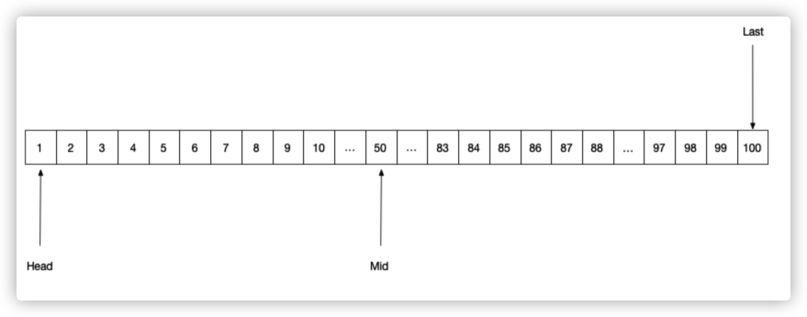

# 二分查找算法

如图：



注意：使用二分查找的前提，数据排序一定是有序的，否则不能使用二分查找算法。

### 举例

从1-100之间的数中查找 88 这个数字，利用二分查找算法查找。

#### 算法分析

* 首先获取有序序列的头指针和尾指针，并求出序列中间的指针值；
* 用目标值88与序列中间值相比较，比中间值大，则落在mid到last区间内找；否则落到head到mid区间内；又或者目标值等于中间序列值；
* 若目标值落在落在mid到last区间内，在头指针变为 Head = mid+1，中间值变为 （Last-Head）/ 2，以此类推比较，头指针和尾指针还有中间值动态变化查找目标值；
* 每次查找都会减少一半的数据，事件复杂度为O(logn)

### 伪代码

```
int last = array.length-1;
int head = 0;

while(head <= last) {

	mid = (last + head) / 2;
	midVal = array[mid];
	
	if (midVal == item) 
		return mid;
	if (midVal > item) 
		last = mid - 1;
	else 
		head = mid + 1;
}

return null
```

