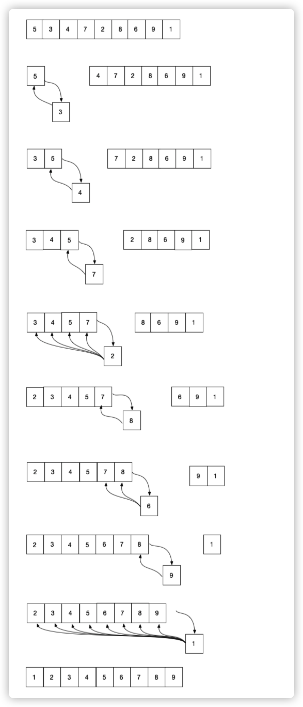

# 插入排序算法

插入排序是一种从序列左端开始依次对数据进行排序的算法。在排序过程中，左侧的数据陆续归位，而右侧留下的就是还未被排序的数据。插入排序的思路就是从右侧的未排序区域内取出一个数据，然后将它插入到已排序区域内合适的位置上。

如图：



在插入排序中，需要将取出的数据与其左边的数据进行比较。如图所示一样，如果左边的数字更小，就不需要继续比较，本轮操作到此结束，自然也不需要交换数字的位置。

然而，如果取出的数字比左边已归位的数字都要小，就必须不停比较大小，交换数字，直到它到达整个序列的最左边为止。具体来说，就是第k轮需要比较k-1次。如图排序2或者1时的变化。因此有，在最糟糕的情况下，第2轮需要操作1次，第3轮操作2次....第n轮操作n-1次，所以时间复杂度为O(n2)。


### 示例代码

```java
 public static void insertSort(int[] a) {
        int i, j, insertNote;// 要插入的数据
        for (i = 1; i < a.length; i++) {// 从数组的第二个元素开始循环将数组中的元素插入
            insertNote = a[i];// 设置数组中的第2个元素为第一次循环要插入的数据
            j = i - 1;
            while (j >= 0 && insertNote < a[j]) {
                a[j + 1] = a[j];// 如果要插入的元素小于第j个元素,就将第j个元素向后移动
                j--;
            }
            a[j + 1] = insertNote;// 直到要插入的元素不小于第j个元素,将insertNote插入到数组中
        }
    }

    public static void main(String[] args) {
        int a[] = { 38,65,97,76,13,27,49 };
        insertSort(a);
        System.out.println(Arrays.toString(a));
    }

```

