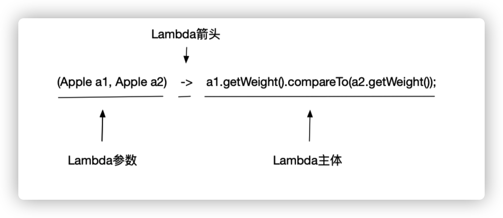
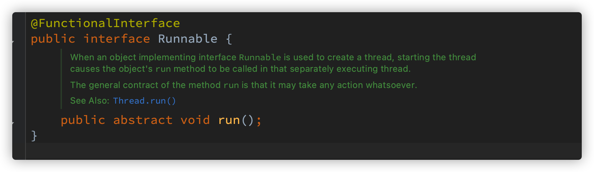
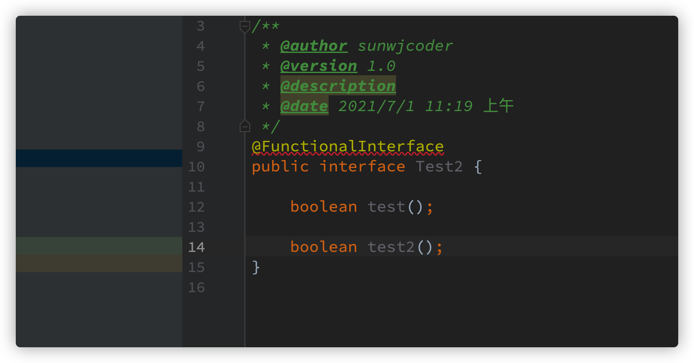
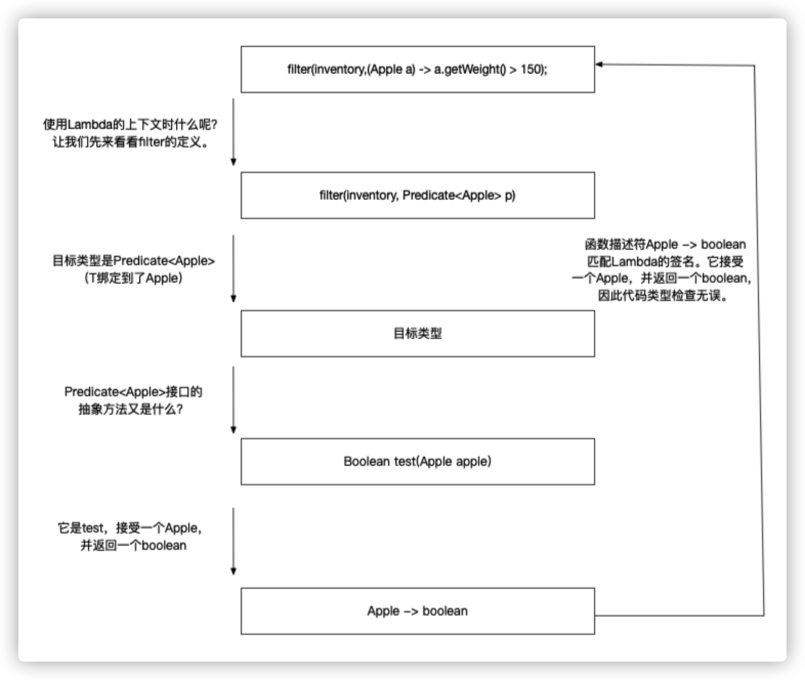

# Lambda表达式

[toc]

<!-- MarkdownTOC -->

- [Lambda表达式](#Lambda表达式)
  - [1.1 Lambda管中窥豹](##1.1 Lambda管中窥豹)

<!-- /MarkdownTOC -->

## 1.1 Lambda管中窥豹

### Lambda表达式

#### Lambda表达式初识

Lambda表达式理解为简洁地表示可传递的匿名函数的一种方式：它可以没有名称，但它有参数列表、函数主体、返回类型，可能还有一个可以抛出的异常列表。

* 匿名：说匿名，是因为它不像普通的方法那样有一个明确的名称：写得少而想的多！
* 函数：说它是函数，是因为Lambda函数不像方法那样属于某个特定的类。但和方法一样，Lambda有参数列表、函数主体、返回类型，还可能有可以抛出的异常列表。
* 传递：Lambda表达式可以作为参数传递给方法或存储在变量中。
* 简洁：无需像匿名类那样写的很多模版代码。

如：

内部类：

```java
Comparator<Apple> byWeight = new Comparator<Apple>() {

	public int compare(Apple a1, Apple a2) {
	
		return a1.getWeight().compareTo(a2.getWeight());
		
	}
	
}
```

使用Lambda表达式：

```java
Comparator<Apple> byWeight = (Apple a1, Apple a2) -> a1.getWeight().compareTo(a2.getWeight());
```

#### Lambda表达式定义

如图：



* 参数列表：这里它采用Comparator中的compare方法的参数，两个Apple。
* 箭头：箭头 --> 把参数列表与Lambda主体分隔开。
* Lambda主体：比较两个Apple的重量。表达式就是Lambda的返回值了。

**有效的Lambda表达式：**

```java
// Lambda表达式具有一个String类型的参数并返回一个int。Lambda没有return语句，因为意境隐含了return
(String s) -> s.length() 

// Lambda表达式有一个Apple类型的参数并返回一个boolean（苹果的重量是否超过150克）
(Apple a) -> a.getWeight() > 150

//Lambda表达式具有两个int类型的参数没有返回值（void返回）。注意Lambda表达式可以包含多行语句，这里是两行
(int x, int y) -> {
	
	sout("Result:");
	sout(x+y);

}

// Lambda表达式没有参数，返回一个int
() -> 42

// Lambda表达式具有两个Apple类型的参数，返回一个int：比较两个Apple的重量 
(Apple a1, Apple a2) -> a1.getWeight().compareTo(a2.getWeight())
```

**Lambda的基本语法：**

```
(parameters) -> expression
```

或（注意语句的花括号）

```
(parameters) -> { statement; }
```

**Lambda示例：**

| 使用案例              | Lambda示例                                                   |
| --------------------- | ------------------------------------------------------------ |
| 布尔表达式            | (List<String> list) -> list.isEmpty()                        |
| 创建对象              | () -> new Apple(10)                                          |
| 消费一个对象          | (Apple a) -> { sout(a.getWeight());}                         |
| 从一个对象中选择/抽取 | (String s) -> s.length()                                     |
| 组合两个值            | (int a, int b) -> a * b                                      |
| 比较两个对象          | (Apple a1, Apple a2) -> a.getWeight().compareTo(a2.getWeight()) |

## 1.2 在哪里以及如何使用Lambda

只有函数式接口，才能使用Lambda表达式。

举例：

```java
List<Apple> greenApples = filter(invertory, (Apple a) -> "green".equals(a.getColor()));
```

在代码中，可以把Lambda表达式作为第二个参数传给filter方法，因为它这里需要Predicate<T>,而这是一个函数式接口。

```java
public interface Predicate<T> {
 		boolean test(T t);
}
```

### 函数式接口

如上代码Predicate接口，这就是一个函数式接口，因为它仅仅定义了一个抽象方法。**所以函数式接口就是只定义一个抽象方法的接口。**

比如Java类库中像Comparetor、Runnable、Callable、PrivilegedAction等等这些接口类都是只定义了一个方法。

注意：在Java8中接口还可以拥有**默认方法（即在类没有对方法进行实现时，其主体为方法提供默认实现的方法）。**哪怕有很多默认方法，只要接口只定义了一个**抽象方法**，它就仍然是一个函数式接口。

举例如下代码为默认方法：

```java
interface Formula{

    double test1(int a);

    default double test2(int a) {
        return Math.sqrt(a);
    }

}
```

其中test1为抽象方法，test2为默认方法。

**思考：函数式接口我们可以使用它干什么？**

Lambda表达式允许我们直接以**内联的形式**为函数式接口的抽象方法提供实现，并把整个表达式作为函数式接口的实例（具体来说，是函数式接口一个具体实现的实例）。

我们以匿名内部类的方式也可以完成同样的事情，只不过这样做会比较笨拙：需要提供一个实现，然后再直接内联将它实例化。

如：

```java
// 使用Lambda表达式
Runnable r1 = sout("Hello World 1");

// 使用匿名内部类
Runnable r2 = new Runnable() {

	public void run() {
		sout("Hello World 2");
	}

}


// 测试
public static void process(Runnable r) {

 r.run();
	
}

process(r1);
process(r2);
process(() -> sout("Hello World 3"));
```

### 函数描述符

**思考：什么是函数描述符？**

函数式接口的抽象方法的签名基本上就是Lambda表达式的**签名**。我们将这种抽象方法叫作**函数描述符。**

举例：Ruannable接口可以看作一个什么也不接受什么也不返回(void)的函数的签名，因为它只有一个叫做run的抽象方法，这个方法什么也不接受，什么也不返回(void)。---> `() -> void` 代表了参数列表为空，且返回void函数。这就是Runnable接口所代表的。

#### @FunctionalInterface

我们查看Java8的类库，会发现函数式接口带有**@FunctionalInterface标注**。



这个标注用于表示该接口会设计成一个函数式接口。如果你用@FunctionalInterface定义了一个接口，而它却不是一个函数式接口的话，编译器将返回一个提示原因的错误。



Tips：**@FunctionalInterface不是一定必需的**，但是对于为此设计的接口而言，使用它是比较好的做法。就像是@Override标注表示方法被重写了。

## 1.3 环绕执行模式

### 环绕执行模式

**思考：什么是环绕式执行模式？**

比如我们资源处理（如处理文件或数据库）时一个常见的模式就是打开一个资源，做一些处理，然后关闭资源。这个设置和清理阶段总是很类似，并且会围绕着执行处理的那些重要代码，这就是**环绕执行模式**。

示例代码：

```java
public static String processFile() throws IOException {
	
	try(BufferedReader br = new BufferedReader(new FIleReader("data.txt"))){
	
		return br.readLine();
	}

}
```

这段代码只能读取文件内容的第一行，如果想要读取两行三行就没有那么灵活，下面用Lambda表达式来进行优化改造。

### Lambda改造优化

#### 记得行为参数化

你需要一种方法把行为传递给processFile，以便它可以利用BufferedReader执行不同的行为。

```java
String result = processFile((BufferedReader br) -> br.readLine() + br.readLine());
```

#### 使用函数式接口来传递行为

Lambda仅可用于上下文时函数式接口的情况。所以需要创建一个能匹配BufferedReader -> String，还可以抛出IOException异常的接口。

```java
@FunctionalInterface
public interface BufferedReaderProcessor {

	String process(BufferedReader b) throws IOException;
	
}

public static String processFile(BufferedReaderProcessor p) throws IOException {
  
  ....
}
```

#### 执行一个行为

任何BufferedReader-> String形式的Lambda都可以作为参数来传递，因为它们符合BufferedReaderProcessor接口中定义的process方法的签名。

Lambda表达式允许你直接内联，为函数式接口的抽象方法提供实现，并且将整个表达式作为函数式接口的一个实例。

```java
public static String processFile(BufferedReaderProcessor p) throws IOException {
	
	try(BufferedReader br = new BufferedReader(new FIleReader("data.txt"))){
		// 处理BufferedReader对象
		return p.process();
	}

}
```

#### 传递Lambda

现在你就可以通过传递不同的Lambda重用processFile方法，并以不同的方式处理文件了。

处理一行：

```java
String oneLine = processFile((BuferedReader br) -> br.readLine());
```

处理两行：

```java
String twoLine = processFile((BuferedReader br) -> br.readLine() + br.readLine());
```


## 函数式接口

JDK提供了大量常用的函数式接口以丰富Lambda的典型使用场景，它们主要在java.util.function包中提供。

### Supplier接口

java.util.function.Supplier<T> 接口仅包含一个无参的方法：**T get()**。用来获取一个泛型参数指定类型的对象数据，由于这是一个函数式接口，所以可以使用对应的Lambda表达式代替。

如：

```java
private static String getString(Supplier<String> function) {
        return function.get();
    }

public static void main(String[] args) {

        String test1 = getString(() -> "胡歌");
        System.out.println(test1);
    }
```

练习：求数组中最大值

```java
private static int maxValue (Supplier<Integer> sup) {
        return  sup.get();
    }

    public static void main(String[] args) {
        int[] arr = {1,2,3,4,5,6,7,66};

        int maxNum = maxValue(() -> {

            int max = arr[0];

            for (int i : arr) {
                if (i > max)
                    max = i;
            }
            return max;
        });

        System.out.println(maxNum);
    }
```

### Consumer接口

java.util.function.Consumer<T> 接口则正好与Supplier接口相反，它不是生产一个数据，而是消费一个数据，其数据类型由泛型决定。

Consumer接口中包含抽象方法**void accept(T t)**，意为消费一个指定泛型的数据。

```java
public class TestConsumer {

    private static void consumerString(String name,Consumer<String> function) {
        function.accept(name);
    }

    public static void main(String[] args) {

        consumerString("hello",
                // 对传递的字符串进行消费 直接输出
                (String name) -> System.out.println(name) );

        // 消费方式为反转
        consumerString("hello", (String name) -> {
            String retName = new StringBuilder(name).reverse().toString();
            System.out.println(retName);
        });
    }
}
```


## 1.5 类型推断

### 类型检查

Lambda的类型是从使用Lambda的上下文推断出来的。上下文（比如，接受它传递的方法的参数，或接受它的值的局部变量）中Lambda表达式需要的类型称为目标类型。



过程分析：

1. 首先，找出filter方法的声明。
2. 要求它是Predicate<Apple>（目标类型）对象的第二个正式参数。
3. Predicate<Apple>是一个函数式接口，定义了一个叫作test的抽象方法。
4. test方法描述了一个函数描述符，它可以接受一个Apple，并返回一个boolean。
5. 最后，filter的任何实际参数都必须匹配这个要求。

### 类型推断

Java编译器会从上下文（目标类型）推断出用什么函数式接口来配合Lambda表达式，这意味着它也可以推断出适合Lambda的签名，因为函数描述符可以通过目标类型来得到。

如：

```
List<Apple> greenApples = filter(inventory, a -> "green".equals(a.getColor()));
```

编译器可以了解Lambda表达式的参数类型，这样就可以在Lambda语法中省去标注参数类型。Java编译器会像上面这样推断Lambda的参数类型。

### 使用局部变量

Lambda可以没有限制地捕获（也就是在其主体中引用）实例变量和静态变量。但局部变量必须显式声明为final，或事实上式final。所以Lambda表达式只能捕获指派给他们的局部变量一次。（tips：捕获实例变量可以被看作捕获最终局部变量this。）

举例：

```
int portNumber = 1337;
Runnable r = () -> sout(portNumber);
portNumber = 31337; // 这样是错误的，因为Lambda表达式引用的局部变量必须是最终的final或事实上最终的。
```

**思考：为什么对局部变量有这些限制？**

1. 应为实例变量和局部变量本质的实现方式不同，实例变量都存储在堆中，而局部变量则保存在栈上。如果Lambda可以直接访问局部变量，而且Lambda是在一个线程中使用的，则使用Lambda的线程，可能会在分配该变量的线程将这个变量收回之后，去访问该变量。因此，Java在访问自由局部变量时，实际上是在访问它的副本，而不是访问原始变量。

**什么是闭包？**

**闭包就是一个函数的实例，且它可以无限制地访问那个函数的非本地变量。**例如，闭包可以作为参数传递给另一个函数。它也可以访问和修改其作用域之外的变量。

Java 8的Lambda和匿名类可以做类似于闭包的事情：**它们可以作为参数传递给方法，并且可以访问其作用域之外的变量。但有一个限制：它们不能修改定义Lambda的方法的局部变量的内容。这些变量必须是隐式最终的。可以认为Lambda是对值封闭，而不是对变量封闭。**

## 1.6 方法引用

### 管中窥豹

当需要使用方法引用时，目标引用放在分隔符 :: 前，方法的名称放在后面。如：Apple::getWeight就是应用了Apple类中定义的方法getWeight。tips：不需要括号，因为没有实际调用这个方法。

Apple::getWeight  <==> (Apple a) -> a.getWeight()

例子

| Lambda                                   | 等效的方法引用                    |
| ---------------------------------------- | --------------------------------- |
| (Apple a) -> a.getWeight()               | Apple::getWeight                  |
| () -> Thread.currentThread().dumpStack() | Thread.currentThread()::dumpStack |
| (Str, i) -> str.substring(i)             | String::substring                 |
| (String s) -> System.out.println(s)      | System.out::println               |

方法引用看作针对仅仅涉及单一方法的Lambda的语法糖。

#### 如何构建方法引用

方法引用主要由三类：

1. 指向**静态方法**的方法引用（例如Integer的parseInt方法，写作Integer::parseInt）。
2. 指向**任意类型实例方法**的方法引用（例如String的length方法，写作String::length）。
3. 指向**现有对象的实例方法的方法引用**（假设你有一个局部变量expensiveTransaction用于存放Transaction类型的对象，它支持实例方法getValue，那么你就可以写expensive-Transaction::getValue）。

### 构造函数引用

对于一个现有构造函数，你可以利用它的名称和关键字new来创建它的一个引用：**ClassName::new**。它的功能与指向静态方法的引用类似。

如：

```java
// 无参的构造函数
Supplier<Apple> a = Apple::new;
        Apple apple = a.get();
        
========等价
Supplier<Apple> a = () -> new Apple();
        Apple apple = a.get();

// 带有一个参数的构造函数
Function<Integer, Apple> a = Apple::new;
Apple apple = a.apply(100);

========等价
Function<Integer, Apple> a = (weight) -> new Apple(weight);
Apple apple = a.apply(100);

// 一个由Integer构成的List中的每个元素都通过我们前面定义的类似的map方法传递给了// Apple的构造函数，得到了一个具有不同重量苹果的List

public static List<Apple> map(List<Apple> list, Function<Integer, Apple> f){

	List<Apple> result = new ArrayList<>();
	for(Integer e : list) {
	
		result.add(f.apply(e));
	
	}
	return result;

}

List<Integer> weights = Arrays.asList(7, 3, 4, 10);
List<Apple> apples = map(weights, Apple::new);

// 有两个参数的构造函数
BiFunction<String, Integer, Apple> c3 = Apple::new;
Apple a3 = c3.apply("green", 10);
=========等价
BiFunction<String, Integer, Apple> c3 = (color, weight) -> new Apple(color, weight);
Apple a3 = c3.apply("green", 10);
```


## Lambda和方法引用实战

用不同的排序策略给一个Apple列表排序，并需要展示如何把一个原始粗暴的解决方案转变得更为简明。

代码如下：

```java
public class Sorting {

    public static void main(String[] args) {

        // 常规用法
        List<Apple> inventory = new ArrayList<>();
        inventory.addAll(Arrays.asList(new Apple(80,"green"), new Apple(155, "green"), new Apple(120, "red")));

        inventory.sort(new AppleComparator());
        System.out.println(inventory);

        inventory.set(1, new Apple(30, "green"));

        // 匿名内部类
        inventory.sort(new Comparator<Apple>() {
            @Override
            public int compare(Apple o1, Apple o2) {
                return o1.getWeight().compareTo(o2.getWeight());
            }
        });
        System.out.println(inventory);

        inventory.set(1,new Apple(20, "red"));

        // Lambda表达式
        inventory.sort((a1, a2) -> a1.getWeight().compareTo(a2.getWeight()));
        System.out.println(inventory);

        inventory.set(1, new Apple(10, "red"));

        // 方法引用
        inventory.sort(Comparator.comparing(Apple::getWeight));
        System.out.println(inventory);
    }

    public static class Apple {
        private int weight = 0;
        private String color = "";

        public Apple(int weight, String color){
            this.weight = weight;
            this.color = color;
        }

        public Integer getWeight() {
            return weight;
        }

        public void setWeight(Integer weight) {
            this.weight = weight;
        }

        public String getColor() {
            return color;
        }

        public void setColor(String color) {
            this.color = color;
        }

        public String toString() {
            return "Apple{" +
                    "color='" + color + '\'' +
                    ", weight=" + weight +
                    '}';
        }
    }

    static class AppleComparator implements Comparator<Apple> {

        @Override
        public int compare(Apple o1, Apple o2) {
            return o1.getWeight().compareTo(o2.getWeight());
        }
    }
}
```

## 1.8复合Lambda表达式的有用方法

### 比较器复合

```
// 使用静态方法Comparator.comparing，根据提取用于比较的键值的Function来返回一个Comparator

Comparator<Apple> c = Comparator.comparing(Apple::getWeight);

// 求逆序 按重量递减排序
inventory.sort(comparing(Apple::getWeight).reversed());

// 比较器链 两个苹果一样重时，进一步按国家排序
inventory.sort(comparing(Apple::getWeight).reversed().thenComparing(Apple::getCountry));

```

## 小结

1.  Lambda表达式可以理解为一种匿名函数：它没有名称，但有参数列表、函数主体、返回类型，可能还有一个可以抛出的异常的列表。
2. Lambda表达式让你可以简洁地传递代码。
3. 函数式接口就是仅仅声明了一个抽象方法的接口。
4. 只有在接受函数式接口的地方才可以使用Lambda表达式。
5. Lambda表达式允许你直接内联，为函数式接口的抽象方法提供实现，并且将整个表达式作为函数式接口的一个实例。
6. Java 8自带一些常用的函数式接口，放在java.util.function包里，包括Predicate<T>、Function<T, R>、Supplier<T>、Consumer<T>和BinaryOperator<T>
7. 为了避免装箱操作，对Predicate<T>和Function<T, R>等通用函数式接口的原始类型特化：IntPredicate、IntToLongFunction等。
8. 环绕执行模式（即在方法所必需的代码中间，你需要执行点儿什么操作，比如资源分配和清理）可以配合Lambda提高灵活性和可重用性。
9. Lambda表达式所需要代表的类型称为目标类型。
10. 方法引用让你重复使用现有的方法实现并直接传递它们。
11. Comparator、Predicate和Function等函数式接口都有几个可以用来结合Lambda表达式的默认方法。
