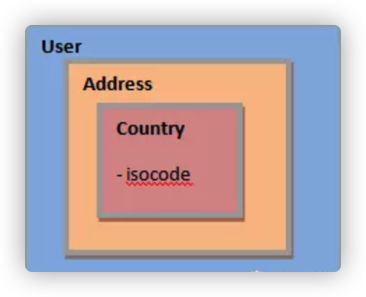

# Optional的使用

[toc]

## 创建Optional实例

### 创建一个空的Optional

```java
@Test(expected = NoSuchElementException.class)
public void whenCreateEmptyOptional_thenNull() {
    Optional<User> emptyOpt = Optional.empty();
    emptyOpt.get();
}
```

尝试访问 emptyOpt 变量的值会导致 NoSuchElementException。

### 创建包含值的Optional

of() 和 ofNullable() 方法创建包含值的 Optional。两个方法的不同之处在于如果你把 null 值作为参数传递进去，of() 方法会抛出 NullPointerException。

#### of()方式

```java
@Test(expected = NullPointerException.class)
public void whenCreateOfEmptyOptional_thenNullPointerException() {
    Optional<User> opt = Optional.of(user);
}
```

并没有完全摆脱 NullPointerException。因此，应该明确对象不为 null  的时候使用 of()。

#### ofNullable()方式

如果对象即可能是 null 也可能是非 null，你就应该使用 ofNullable() 方法。

```java
Optional<User> opt = Optional.ofNullable(user);
```

## 访问Optional对象的值

### 使用get()方法

从 Optional 实例中取回实际值对象的方法之一是使用 get() 方法。

```java
@Test
public void whenCreateOfNullableOptional_thenOk() {
    String name = "John";
    Optional<String> opt = Optional.ofNullable(name);

    assertEquals("John", opt.get());
}
```

这个方法会在值为 null 的时候抛出异常。要避免异常，你可以选择首先验证是否有值:

```java
@Test
public void whenCheckIfPresent_thenOk() {
    User user = new User("john@gmail.com", "1234");
    Optional<User> opt = Optional.ofNullable(user);
    assertTrue(opt.isPresent());

    assertEquals(user.getEmail(), opt.get().getEmail());
}
```

检查是否有值的另一个选择是 ifPresent() 方法。该方法除了执行检查，还接受一个Consumer(消费者) 参数，如果对象不是空的，就对执行传入的 Lambda 表达式：

```java
opt.ifPresent( u -> assertEquals(user.getEmail(), u.getEmail()));
```

这个例子中，只有 user 用户不为 null 的时候才会执行断言。

## 返回默认值

Optional 类提供了 API 用以返回对象值，或者在对象为空的时候返回默认值。

### orElse()方法

它的工作方式非常直接，如果有值则返回该值，否则返回传递给它的参数值：

```java
@Test
public void whenEmptyValue_thenReturnDefault() {
    User user = null;
    User user2 = new User("anna@gmail.com", "1234");
    User result = Optional.ofNullable(user).orElse(user2);

    assertEquals(user2.getEmail(), result.getEmail());
}
```

这里 user 对象是空的，所以返回了作为默认值的 user2。

如果对象的初始值不是 null，那么默认值会被忽略：

```java
@Test
public void whenValueNotNull_thenIgnoreDefault() {
    User user = new User("john@gmail.com","1234");
    User user2 = new User("anna@gmail.com", "1234");
    User result = Optional.ofNullable(user).orElse(user2);

    assertEquals("john@gmail.com", result.getEmail());
}
```

### orElseGet()方法

 orElseGet() —— 其行为略有不同。这个方法会在有值的时候返回值，如果没有值，它会执行作为参数传入的 Supplier(供应者) 函数式接口，并将返回其执行结果：

```java
User result = Optional.ofNullable(user).orElseGet( () -> user2);
```

### orElse()和orElseGet()的不同之处

这两种方法似乎起着同样的作用。然而事实并非如此。创建一些示例来突出二者行为上的异同。

先来看看对象为空时他们的行为：

```java
@Test
public void givenEmptyValue_whenCompare_thenOk() {
    User user = null
    logger.debug("Using orElse");
    User result = Optional.ofNullable(user).orElse(createNewUser());
    logger.debug("Using orElseGet");
    User result2 = Optional.ofNullable(user).orElseGet(() -> createNewUser());
}

private User createNewUser() {
    logger.debug("Creating New User");
    return new User("extra@gmail.com", "1234");
}
```

上面的代码中，两种方法都调用了 createNewUser() 方法，这个方法会记录一个消息并返回 User 对象。

代码输出：

```
Using orElse
Creating New User
Using orElseGet
Creating New User
```

由此可见，当对象为空而返回默认对象时，行为并无差异。

接下来看一个类似的示例，但这里 Optional  不为空：

```java
@Testpublic void givenPresentValue_whenCompare_thenOk() {    
  User user = new User("john@gmail.com", "1234");    
  logger.info("Using orElse");    
  User result = Optional.ofNullable(user).orElse(createNewUser());    
  logger.info("Using orElseGet");    
  User result2 = Optional.ofNullable(user).orElseGet(() -> createNewUser());
}
```

代码输出：

```java
Using orElse 
Creating New User 
Using orElseGet
```

这个示例中，两个 Optional  对象都包含非空值，两个方法都会返回对应的非空值。不过，orElse() 方法仍然创建了 User 对象。与之相反，orElseGet() 方法不创建 User 对象。

在执行较密集的调用时，比如调用 Web 服务或数据查询，这个差异会对性能产生重大影响。

## 返回异常

### orElseThrow()方法

除了 orElse() 和 orElseGet() 方法，Optional 还定义了 orElseThrow() API —— 它会在对象为空的时候抛出异常，而不是返回备选的值：

```java
@Test
public void givenPresentValue_whenCompare_thenOk() {
    User user = new User("john@gmail.com", "1234");
    logger.info("Using orElse");
    User result = Optional.ofNullable(user).orElse(createNewUser());
    logger.info("Using orElseGet");
    User result2 = Optional.ofNullable(user).orElseGet(() -> createNewUser());
}
```

如果 user 值为 null，会抛出 IllegalArgumentException。

这个方法让我们有更丰富的语义，可以决定抛出什么样的异常，而不总是抛出 NullPointerException。

## 转换值

### map()方法

```java
@Test
public void whenMap_thenOk() {
    User user = new User("anna@gmail.com", "1234");
    String email = Optional.ofNullable(user)
      .map(u -> u.getEmail()).orElse("default@gmail.com");

    assertEquals(email, user.getEmail());
}
```

map() 对值应用(调用)作为参数的函数，然后将返回的值包装在 Optional 中。这就使对返回值进行链试调用的操作成为可能 —— 这里的下一环就是 orElse()。

### flatMap()方法

flatMap() 也需要函数作为参数，并对值调用这个函数，然后直接返回结果。

下面的操作中，给 User 类添加了一个方法，用来返回 Optional：

```java
public class User {
    private String position;

    public Optional<String> getPosition() {
        return Optional.ofNullable(position);
    }

    //...
}
```

既然 getter 方法返回 String 值的 Optional，可以在对 User 的 Optional 对象调用 flatMap() 时，用它作为参数。其返回的值是解除包装的 String 值：

```java
@Test
public void whenFlatMap_thenOk() {
    User user = new User("anna@gmail.com", "1234");
    user.setPosition("Developer");
    String position = Optional.ofNullable(user)
      .flatMap(u -> u.getPosition()).orElse("default");

    assertEquals(position, user.getPosition().get());
}
```

## 过滤值

除了转换值之外，Optional  类也提供了按条件“过滤”值的方法。

### filter()方法

filter() 接受一个 Predicate 参数，返回测试结果为 true 的值。如果测试结果为 false，会返回一个空的 Optional。

```java
@Test
public void whenFilter_thenOk() {
    User user = new User("anna@gmail.com", "1234");
    Optional<User> result = Optional.ofNullable(user)
      .filter(u -> u.getEmail() != null && u.getEmail().contains("@"));

    assertTrue(result.isPresent());
}
```

如果通过过滤器测试，result 对象会包含非空值。

## Optional类的链式方法

为了更充分的使用 Optional，你可以链接组合其大部分方法，因为它们都返回相同类似的对象。

我们使用 Optional  重写最早介绍的示例。

首先，重构类，使其 getter 方法返回 Optional 引用：

```java
public class User {
    private Address address;

    public Optional<Address> getAddress() {
        return Optional.ofNullable(address);
    }

    // ...
}
public class Address {
    private Country country;

    public Optional<Country> getCountry() {
        return Optional.ofNullable(country);
    }

    // ...
}
```

上面的嵌套结构可以用下面的图来表示：



现在可以删除 null 检查，替换为 Optional 的方法：

```java
@Test
public void whenChaining_thenOk() {
    User user = new User("anna@gmail.com", "1234");

    String result = Optional.ofNullable(user)
      .flatMap(u -> u.getAddress())
      .flatMap(a -> a.getCountry())
      .map(c -> c.getIsocode())
      .orElse("default");

    assertEquals(result, "default");
}
```

上面的代码可以通过方法引用进一步缩减：

```java
String result = Optional.ofNullable(user)
  .flatMap(User::getAddress)
  .flatMap(Address::getCountry)
  .map(Country::getIsocode)
  .orElse("default");
```

结果现在的代码看起来比之前采用条件分支的冗长代码简洁多了。

## Optional应该怎样用

在使用 Optional 的时候需要考虑一些事情，以决定什么时候怎样使用它。

重要的一点是 Optional 不是 Serializable。因此，它不应该用作类的字段。

如果你需要序列化的对象包含 Optional 值，Jackson 库支持把 Optional 当作普通对象。也就是说，Jackson 会把空对象看作 null，而有值的对象则把其值看作对应域的值。这个功能在 jackson-modules-java8 项目中。

------

它在另一种情况下也并不怎么有用，就是在将其类型用作方法或构建方法的参数时。这样做会让代码变得复杂，完全没有必要：

```java
User user = new User("john@gmail.com", "1234", Optional.empty());
```

使用重载方法来处理非要的参数要容易得多。

Optional 主要用作返回类型。在获取到这个类型的实例后，如果它有值，你可以取得这个值，否则可以进行一些替代行为。

Optional 类有一个非常有用的用例，就是将其与流或其它返回 Optional 的方法结合，以构建流畅的API。

我们来看一个示例，使用 Stream 返回 Optional 对象的 findFirst() 方法：

```java
@Test
public void whenEmptyStream_thenReturnDefaultOptional() {
    List<User> users = new ArrayList<>();
    User user = users.stream().findFirst().orElse(new User("default", "1234"));

    assertEquals(user.getEmail(), "default");
}
```

