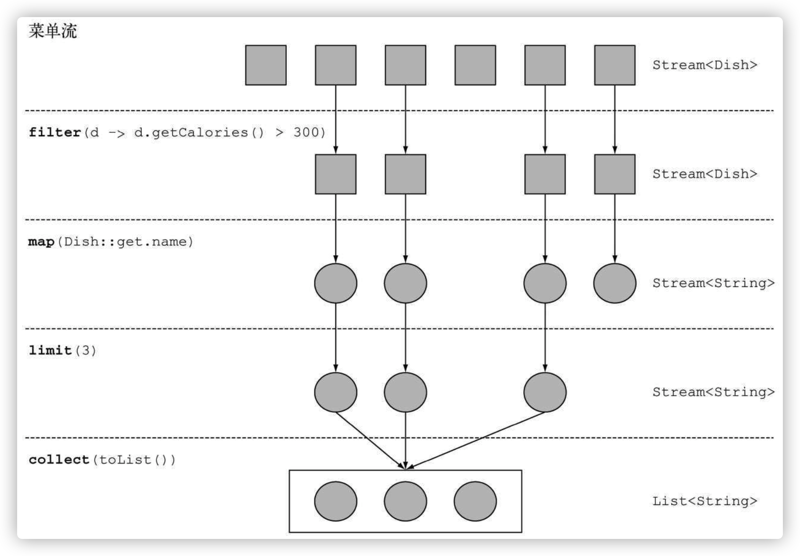
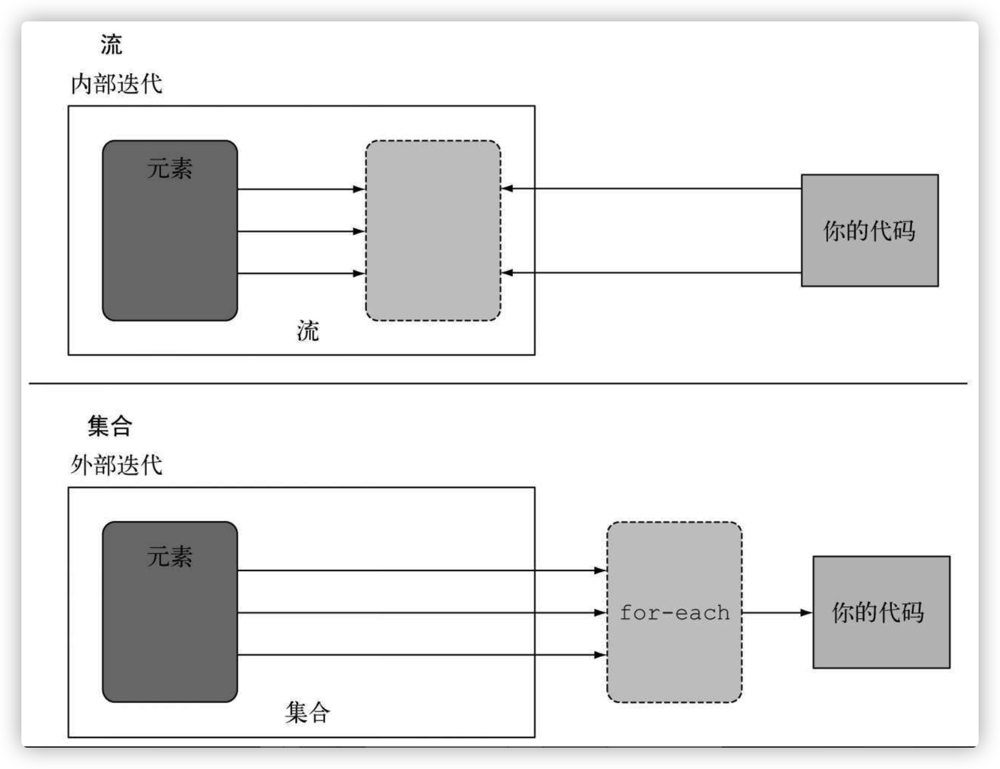

# 引入流

[toc]

## 什么是流

### 流是什么？

它是Java API的新成员，它允许你以声明性方式处理数据集合（通过查询语句来表达，而不是临时编写一个实现）。可以把它看成是遍历数据集的高级迭代器。

对比JDK1.7与JDK1.8 代码对比

JDK1.7:

```java
public static List<String> getLowCaloricDishesNamesInJava7(List<Dish> dishes){
  			// 使用一个临时变量lowCaloricDishes，它的作用是作为一次性的中间容器
        List<Dish> lowCaloricDishes = new ArrayList<>();
        for(Dish d: dishes){
            if(d.getCalories() < 400){
                lowCaloricDishes.add(d);
            }
        }
        List<String> lowCaloricDishesName = new ArrayList<>();
        Collections.sort(lowCaloricDishes, new Comparator<Dish>() {
            public int compare(Dish d1, Dish d2){
                return Integer.compare(d1.getCalories(), d2.getCalories());
            }
        });
        for(Dish d: lowCaloricDishes){
            lowCaloricDishesName.add(d.getName());
        }
        return lowCaloricDishesName;
    }
```


JDK1.8:

```java
 public static List<String> getLowCaloricDishesNamesInJava8(List<Dish> dishes){
        return dishes.stream()
          			// 选出400卡路里以下的菜肴
                .filter(d -> d.getCalories() < 400)
          			// 按照卡路里排序
                .sorted(comparing(Dish::getCalories))
          			// 提取菜肴的名称
                .map(Dish::getName)
          			//	将所有名称保存在List中
                .collect(toList());
    }
```

通过对比，可以看出来在jdk1.8中，我们可以把几个基本操作链接起来，来表达复杂的数据处理流水线（在filter后面接上sorted、map和collect操作），同时保持代码清晰可读。

Java8中的Stream API可以让我们写出这样的代码：

* 声明性 ----- 更简洁，更易读
* 可复合 ----- 更灵活
* 可并行 ----- 性能更好

### 流介绍

简短的定义就是：从支持数据处理操作的源生成的元素列。

**思考：什么是元素序列？什么是源？如何数据处理操作？**

* 元素序列就像集合一样，流提供了一个接口，可以访问特定元素类型的一组有序值。
* 源：流会使用一个提供数据的源，如集合、数组或输入/输出资源。tips：从有序集合生成流时会保留原有的顺序。由列表生成的流，其元素顺序与列表一致。
* 数据操作：流的数据处理功能支持类似于数据库的操作，以及函数式编程语言中的常用操作，如filter、map、reduce、find、match、sort等。流操作可以顺序执行，也可以并行执行。

流操作有两个重要的特点：

* 流水线：很多流操作本身会返回一个流，这样多个操作就可以链接起来，形成一个大的流水线。
* 内部迭代：与使用迭代器显式迭代的集合不同，流的迭代操作是在背后进行的。

**举例解释：**

```java
List<String> threeHighCaloricDishNames = menu.stream()
														.filter(d -> d.getCaloricies() > 300)
														.map(Dish::getName)
														.limit(3)
														.collect(toList());
```

1. 先是对menu调用stream方法，由菜单得到一个流;
2. 对流应用一系列数据处理操作：filter、map、limit，这些操作都会返回另一个流，这样他们就可以接成一条流水线，就可以看作对源的一个查询。
3. 最后，collect操作开始处理流水线，并返回结果（它和别的操作不一样，因为它返回的不是流，在这里是一个List）。

如图：



* filter——接受Lambda，从流中排除某些元素。
* map——接受一个Lambda，将元素转换成其他形式或提取信息。
* limit——截断流，使其元素不超过给定数量。
* collect——将流转换为其他形式。在本例中，流被转换为一个列表。

## 流与集合

简单概括，流与集合的区别：

**集合与流之间的差异就在于什么时候进行计算。**

集合是一个内存中的数据结构，它包含数据结构中目前所有的值——集合中的每个元素都得先算出来才能添加到集合中。（你可以往集合里加东西或者删东西，但是不管什么时候，集合中的每个元素都是放在内存里的，元素都得先算出来才能成为集合的一部分。）

流则是在概念上固定的数据结构（你不能添加或删除元素），其元素则是按需计算的。

流就像是一个延迟创建的集合：只有在消费者要求的时候才会计算值（用管理学的话说这就是需求驱动，甚至是实时制造)。

集合则是急切创建的（供应商驱动：先把仓库装满，再开始卖）。

### 只能遍历一次

tips：和迭代器类似，**流只能遍历一次**。遍历完之后，我们就说这个流已经被消费掉了。

**集合和流的另一个关键区别在于它们遍历数据的方式。**

### 内部迭代与外部迭代

**外部迭代：使用Collection接口需要用户去做迭代（比如用for-each），这称为外部迭代。**

**内部迭代：Streams库使用内部迭代——它帮你把迭代做了，还把得到的流值存在了某个地方，你只要给出一个函数说要干什么就可以了。**

如图：



## 中间操作与终端操作

### 中间操作

如以上例子，filter或sorted等中间操作会返回另一个流。这让多个操作可以连接起来形成一个查询。重要的是，除非流水线上触发一个终端操作，否则中间操作不会执行任何处理。这是因为中间操作一般都可以合并起来，在终端操作时一次性全部处理。

### 终端操作

**终端操作会从流的流水线生成结果。**其结果是任何不是流的值，比如List、Integer，甚至void。

### 使用流

流的使用一般包括三件事：

*  一个数据源（如集合）来执行一个查询；
* 一个中间操作链，形成一条流的流水线；
* 一个终端操作，执行流水线，并能生成结果。

## 小结

1. 流是“从支持数据处理操作的源生成的一系列元素”。
2. 流利用内部迭代：迭代通过filter、map、sorted等操作被抽象掉了。
3. 流操作有两类：中间操作和终端操作。
   1. filter和map等中间操作会返回一个流，并可以链接在一起。可以用它们来设置一条流水线，但并不会生成任何结果。
4. forEach和count等终端操作会返回一个非流的值，并处理流水线以返回结果。
5. 流中的元素是按需计算的。

# 使用流
