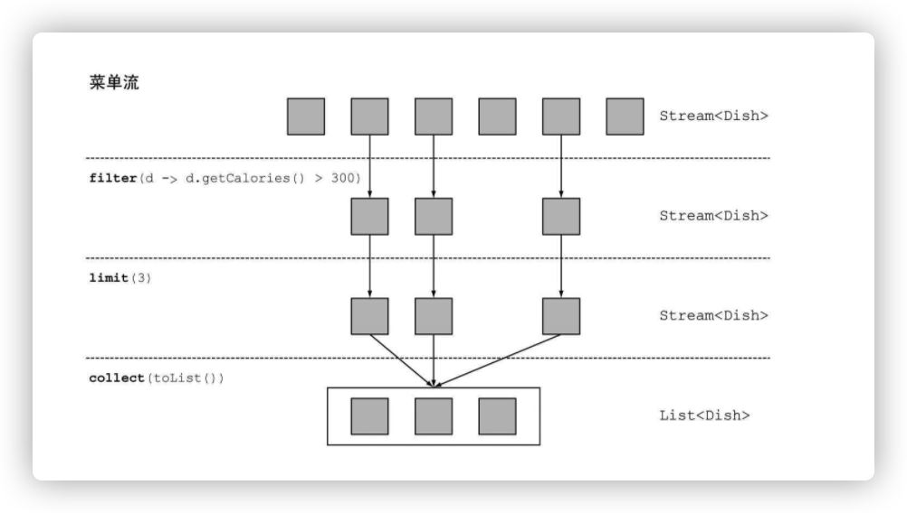

# 引入流

[toc]

## 什么是流

### 流是什么？

它是Java API的新成员，它允许你以声明性方式处理数据集合（通过查询语句来表达，而不是临时编写一个实现）。可以把它看成是遍历数据集的高级迭代器。

对比JDK1.7与JDK1.8 代码对比

JDK1.7:

```java
public static List<String> getLowCaloricDishesNamesInJava7(List<Dish> dishes){
  			// 使用一个临时变量lowCaloricDishes，它的作用是作为一次性的中间容器
        List<Dish> lowCaloricDishes = new ArrayList<>();
        for(Dish d: dishes){
            if(d.getCalories() < 400){
                lowCaloricDishes.add(d);
            }
        }
        List<String> lowCaloricDishesName = new ArrayList<>();
        Collections.sort(lowCaloricDishes, new Comparator<Dish>() {
            public int compare(Dish d1, Dish d2){
                return Integer.compare(d1.getCalories(), d2.getCalories());
            }
        });
        for(Dish d: lowCaloricDishes){
            lowCaloricDishesName.add(d.getName());
        }
        return lowCaloricDishesName;
    }
```


JDK1.8:

```java
 public static List<String> getLowCaloricDishesNamesInJava8(List<Dish> dishes){
        return dishes.stream()
          			// 选出400卡路里以下的菜肴
                .filter(d -> d.getCalories() < 400)
          			// 按照卡路里排序
                .sorted(comparing(Dish::getCalories))
          			// 提取菜肴的名称
                .map(Dish::getName)
          			//	将所有名称保存在List中
                .collect(toList());
    }
```

通过对比，可以看出来在jdk1.8中，我们可以把几个基本操作链接起来，来表达复杂的数据处理流水线（在filter后面接上sorted、map和collect操作），同时保持代码清晰可读。

Java8中的Stream API可以让我们写出这样的代码：

* 声明性 ----- 更简洁，更易读
* 可复合 ----- 更灵活
* 可并行 ----- 性能更好

### 流介绍

简短的定义就是：从支持数据处理操作的源生成的元素列。

**思考：什么是元素序列？什么是源？如何数据处理操作？**

* 元素序列就像集合一样，流提供了一个接口，可以访问特定元素类型的一组有序值。
* 源：流会使用一个提供数据的源，如集合、数组或输入/输出资源。tips：从有序集合生成流时会保留原有的顺序。由列表生成的流，其元素顺序与列表一致。
* 数据操作：流的数据处理功能支持类似于数据库的操作，以及函数式编程语言中的常用操作，如filter、map、reduce、find、match、sort等。流操作可以顺序执行，也可以并行执行。

流操作有两个重要的特点：

* 流水线：很多流操作本身会返回一个流，这样多个操作就可以链接起来，形成一个大的流水线。
* 内部迭代：与使用迭代器显式迭代的集合不同，流的迭代操作是在背后进行的。

**举例解释：**

```java
List<String> threeHighCaloricDishNames = menu.stream()
														.filter(d -> d.getCaloricies() > 300)
														.map(Dish::getName)
														.limit(3)
														.collect(toList());
```

1. 先是对menu调用stream方法，由菜单得到一个流;
2. 对流应用一系列数据处理操作：filter、map、limit，这些操作都会返回另一个流，这样他们就可以接成一条流水线，就可以看作对源的一个查询。
3. 最后，collect操作开始处理流水线，并返回结果（它和别的操作不一样，因为它返回的不是流，在这里是一个List）。

如图：


* filter——接受Lambda，从流中排除某些元素。
* map——接受一个Lambda，将元素转换成其他形式或提取信息。
* limit——截断流，使其元素不超过给定数量。
* collect——将流转换为其他形式。在本例中，流被转换为一个列表。

## 流与集合

简单概括，流与集合的区别：

**集合与流之间的差异就在于什么时候进行计算。**

集合是一个内存中的数据结构，它包含数据结构中目前所有的值——集合中的每个元素都得先算出来才能添加到集合中。（你可以往集合里加东西或者删东西，但是不管什么时候，集合中的每个元素都是放在内存里的，元素都得先算出来才能成为集合的一部分。）

流则是在概念上固定的数据结构（你不能添加或删除元素），其元素则是按需计算的。

流就像是一个延迟创建的集合：只有在消费者要求的时候才会计算值（用管理学的话说这就是需求驱动，甚至是实时制造)。

集合则是急切创建的（供应商驱动：先把仓库装满，再开始卖）。

### 只能遍历一次

tips：和迭代器类似，**流只能遍历一次**。遍历完之后，我们就说这个流已经被消费掉了。

**集合和流的另一个关键区别在于它们遍历数据的方式。**

### 内部迭代与外部迭代

**外部迭代：使用Collection接口需要用户去做迭代（比如用for-each），这称为外部迭代。**

**内部迭代：Streams库使用内部迭代——它帮你把迭代做了，还把得到的流值存在了某个地方，你只要给出一个函数说要干什么就可以了。**

如图：


## 中间操作与终端操作

### 中间操作

如以上例子，filter或sorted等中间操作会返回另一个流。这让多个操作可以连接起来形成一个查询。重要的是，除非流水线上触发一个终端操作，否则中间操作不会执行任何处理。这是因为中间操作一般都可以合并起来，在终端操作时一次性全部处理。

### 终端操作

**终端操作会从流的流水线生成结果。**其结果是任何不是流的值，比如List、Integer，甚至void。

### 使用流

流的使用一般包括三件事：

*  一个数据源（如集合）来执行一个查询；
* 一个中间操作链，形成一条流的流水线；
* 一个终端操作，执行流水线，并能生成结果。

## 小结

1. 流是“从支持数据处理操作的源生成的一系列元素”。
2. 流利用内部迭代：迭代通过filter、map、sorted等操作被抽象掉了。
3. 流操作有两类：中间操作和终端操作。
   1. filter和map等中间操作会返回一个流，并可以链接在一起。可以用它们来设置一条流水线，但并不会生成任何结果。
4. forEach和count等终端操作会返回一个非流的值，并处理流水线以返回结果。
5. 流中的元素是按需计算的。

# 使用流

## 筛选和切片

用谓词筛选，筛选出各不相同的元素，忽略流中的头几个元素，或将流截短至指定长度。

### 用谓词筛选

**Streams接口支持filter方法。该操作会接受一个谓词（一个返回boolean的函数）作为参数，并返回一个包括所有符合谓词的元素的流。**

```java
List<Dish> vegetarianMenu = menu.stream().filter(Dish::isVegetarian).collect(toList())
```


### 筛选各异的元素

**流还支持一个叫作distinct的方法，它会返回一个元素各异（根据流所生成元素的hashCode和equals方法实现）的流。**

如筛选出列表中所有的偶数，确保没有重复。

```
List<Integer> numbers = Arrays.asList(1,2,1,3,3,2,4);
numbers.stream().filter(i -> i % 2 == 0).distinct().forEach(System.out::println);
```


### 截断流

流支持limit(n)方法，该方法会返回一个不超过给定长度的流。所需的长度作为参数传递给limit。

如：

```
List<Dish> dishes = menu.stream().filter(d->d.getColories()>300).limit(3).collect(toList());
```



### 跳过元素

流还支持skip(n)方法，返回一个扔掉了前n个元素的流。如果流中元素不足n个，则返回一个空流。请注意，limit(n)和skip(n)是互补的！

如跳过超过300卡路里的头两道菜，并返回剩下的。

```
List<Dish> dishes = menu.stream().filter(d->d.getCalories()>300).skip(2).collect(toList());
```


**需求：利用流来筛选前两个荤菜**

```
List<Dish> dishes = menu.stream().filter(d -> d.getType()==Dish.Type.MEAT).limit(2).collect(toList());
```

## 映射

### 对流中每一个元素应用函数

流支持map方法，它会接受一个函数作为参数。

这个函数会被应用到每个元素上，并将其映射成一个新的元素（使用映射一词，是因为它和转换类似，但其中的细微差别在于它是“创建一个新版本”而不是去“修改”）。

如：

```java
List<String> dishNames = menu.stream().map(Dish::getName).collect(toList());
```

因为getName方法返回一个String，所以map方法输出的流的类型就是Stream<String>。

举例1：获取单词长度

```java
List<String> words = Arrays.asList("Java 8", "Lambda", "In", "Action");
List<Integer> wordLengths = words.stream().map(String::length).collect(toList());
```

举例2：获取每道菜的名称长度

```java
List<String> dishNames = menu.stream().map(Dish::getName).map(String::length).collect(toList());
```

### 流的扁平化

**需求：将单词列表["Hello","World"]，处理返回["H","e","l","o","W","r","d"]**

```
words.stream().map(word -> word.split("")).distinct().collect(toList());
```

这个方法的问题在于，传递给map方法的Lambda为每个单词返回了一个String[]（String列表）。因此，map返回的流实际上是Stream<String[]>类型的。


通过过程分析，以上代码是不正确地使用map找出单词列表中各不相同的字符。其他的解决方案是可以使用**flatMap**来解决。

#### 尝试使用map和Arrays.stream()

```
String[] arrayOfWords = {"Goodbye", "World"};
Stream<String> streamOfwords = Arrays.stream(arrayOfWords);


//
words.stream().map(word -> word
													.split("")) // 将每个单词转换为由其字母构成的数组
													.map(Arrays::stream) // 让每个数组变成一个单独的流
													.distinct().collect(toList());
```

#### 使用flatMap

```
List<String> uniqueCharacters = words.stream().map(word -> word
													.split("")) // 将每个单词转换为由其字母构成的数组
													.flatMap(Arrays::stream) // 将各个生成流扁平化为单个流
													.distinct().collect(toList());
```

使用flatMap方法的效果是，各个数组并不是分别映射成一个流，而是映射成流的内容。

所有使用map(Arrays::stream)时生成的单个流都被合并起来，即扁平化为一个流。


使用flatMap找出单词列表中各不相同的字符。

flatmap方法让你把一个流中的每个值都换成另一个流，然后把所有的流连接起来成为一个流。

**需求1：给定一个数字列表，返回一个由每个数的平方构成的列表，如：给定[1, 2, 3, 4,5]，应该返回[1, 4, 9, 16, 25]**

```
List<Integer> numbers = Arrays.asList(1,2,3,4,5);
List<Integer>  squares = numbers.stream().map(n -> n*n).collect(toList());
```

**需求2：给定两个数字列表，返回所有的数对。例如，给定列表[1, 2, 3]和列表[3, 4]，应该返回[(1, 3), (1, 4), (2, 3), (2, 4), (3, 3), (3,4)]。为简单起见，你可以用有两个元素的数组来代表数对**

```
List<Integer> numbers1 = Arrays.asList(1,2,3);
List<Integer> numbers2 = Arrays.asList(3,4);
List<int[]> pairs = numbers1.stream().flatMap(i -> numbers2.stream().map(j->new int[]{i,j})).collect(toList());
```

**需求3：扩展前一个例子，只返回总和能被3整除的数对。例如(2, 4)和(3, 3)是可以的**

```
List<Integer> numbers1 = Arrays.asList(1,2,3);
List<Integer> numbers2 = Arrays.asList(3,4);
List<int[]> pairs = numbers1.stream().flatMap(i -> numbers2.stream().filter(j -> (j+i) % 3 == 0).map(j->new int[]{i,j})).collect(toList());
```

## 查找和匹配

常见的数据处理套路是看看数据集中的某些元素是否匹配一个给定的属性。**Stream API通过allMatch、anyMatch、noneMatch、findFirst和findAny方法提供了这样的工具。**

### 检查谓词是否至少匹配一个元素

anyMatch方法可以回答“流中是否有一个元素能匹配给定的谓词”。

如：查看菜单里面是否有素食选择？

```java
if(menu.stream().anyMatch(Dish::isVegetarizan)){
	sout("The menu is (somewhat) vegetarian frindly!!");
}
```

anyMatch方法返回一个boolean，因此是一个终端操作。

### 检查谓词是否匹配所有元素

allMatch方法的工作原理和anyMatch类似，但它会看看流中的元素是否都能匹配给定的谓词。

如：看看菜品是否有利健康（即所有菜的热量都低于1000卡路里）？

```java
boolean isHealthy = menu.stream().allMatch(d->d.getCalories()<10);
```

和allMatch相对的是noneMatch。它可以确保流中没有任何元素与给定的谓词匹配。

```java
boolean isHealthy = menu.stream().noneMatch(d->d.getCalories()<10);
```

anyMatch、allMatch和noneMatch这三个操作都用到了我们所谓的短路

**对于流而言，某些操作（例如allMatch、anyMatch、noneMatch、findFirst和findAny）不用处理整个流就能得到结果。limit也是一个短路操作：它只需要创建一个给定大小的流，而用不着处理流中所有的元素。**

### 查找元素

findAny方法将返回当前流中的任意元素。它可以与其他流操作结合使用。

如：想找到一道素食菜肴。

```java
Optional<Dish> dish = menu.stream().filter(Dish::isVegetarian).findAny();
```

**Optional是什么？**

Optional<T>类（java.util.Optional）是一个容器类，代表一个值存在或不存在。

在上面的代码中，findAny可能什么元素都没找到。Java 8的库设计人员引入了Optional<T>，这样就不用返回众所周知容易出问题的null了。

Optional里面几种可以迫使你显式地检查值是否存在或处理值不存在的情形的方法：

1. **isPresent()将在Optional包含值的时候返回true，否则返回false。**
2. **ifPresent(Consumer<T> block)会在值存在的时候执行给定的代码块。我们在第3章介绍了Consumer函数式接口；它让你传递一个接收T类型参数，并返回void的Lambda表达式。**
3. **T get()会在值存在时返回值，否则抛出一个NoSuchElement异常。**
4. **T orElse(T other)会在值存在时返回值，否则返回一个默认值。**

**举例：**

```java
menu.stream()
		.filter(Dish::isVegetarian)
		.findAny() // 返回一个Optional<Dish>
		.ifPresent(d->sout(d.getName)); // 如果包含一个值就打印它，否则什么都不做
```

### 查找第一个元素

有些流有一个出现顺序（encounter order）来指定流中项目出现的逻辑顺序（比如由List或排序好的数据列生成的流）。对于这种流，你可能想要找到第一个元素。为此有一个findFirst方法，它的工作方式类似于findany。

如：给定一个数字列表，下面的代码能找出第一个平方能被3整除的数？

```java
List<Integer> someNumbers = Arrays.asList(1,2,3,4,5);
Optional<Integer> firstSquareDivisibleByThree = someNumbers.stream()
																													 .map(x->x*x)
																													 .filter(x->x%3)
																													 .findFirst();//9
```

**思考：何时使用findFirst和findAny？**

可以并行使用。找到第一个元素在并行上限制更多。如果你不关心返回的元素是哪个，请使用findAny，因为它在使用并行流时限制较少。

### 练习

1.  找出2011年发生的所有交易，并按交易额排序（从低到高）。
2.  交易员都在哪些不同的城市工作过？
3.  查找所有来自于剑桥的交易员，并按姓名排序。
4. 返回所有交易员的姓名字符串，按字母顺序排序。
5. 有没有交易员是在米兰工作的？
6. 打印生活在剑桥的交易员的所有交易额。
7. 所有交易中，最高的交易额是多少？
8. 找到交易额最小的交易。

**素材：**

* **领域：交易员和交易**

```java
Trader raoul = new Trader("Raoul", "Cambridge");
        Trader mario = new Trader("Mario","Milan");
        Trader alan = new Trader("Alan","Cambridge");
        Trader brian = new Trader("Brian","Cambridge");
		
		List<Transaction> transactions = Arrays.asList(
            new Transaction(brian, 2011, 300), 
            new Transaction(raoul, 2012, 1000),
            new Transaction(raoul, 2011, 400),
            new Transaction(mario, 2012, 710),	
            new Transaction(mario, 2012, 700),
            new Transaction(alan, 2012, 950)
        );	
        
```

* **Transaction**

```java
public class Transaction{

	private Trader trader;
	private int year;
	private int value;

	public Transaction(Trader trader, int year, int value)
	{
		this.trader = trader;
		this.year = year;
		this.value = value;
	}

	public Trader getTrader(){ 
		return this.trader;
	}

	public int getYear(){
		return this.year;
	}

	public int getValue(){
		return this.value;
	}
	
	public String toString(){
	    return "{" + this.trader + ", " +
	           "year: "+this.year+", " +
	           "value:" + this.value +"}";
	}
}
```

* **Trader**

```java
public  class Trader{
	
	private String name;
	private String city;

	public Trader(String n, String c){
		this.name = n;
		this.city = c;
	}

	public String getName(){
		return this.name;
	}

	public String getCity(){
		return this.city;
	}

	public void setCity(String newCity){
		this.city = newCity;
	}

	public String toString(){
		return "Trader:"+this.name + " in " + this.city;
	}
```

**解答：**

**1、找出2011年发生的所有交易，并按交易额排序（从低到高）。**

```java
List<Transaction> tr2011 = 
	transactions.stream()
							.filter(tr -> tr.getYear()== 2011) // 获取2011年数据
							.sorted(comparing(Transaction::getValue)) // 排序
							.collect(toList()); // 生成集合返回
```

**2、交易员都在哪些不同的城市工作过？**

```java
List<Transaction> trCitys = 
	transactions.stream()
							.map(tr -> tr.Trader().getCity()) // 获取交易员工作城市
							.distinct() // 去重 这里可以去掉，在collect是使用toSet() 
							.collect(toList()); // 生成集合返回
```

**3、查找所有来自于剑桥的交易员，并按姓名排序。**

```java
List<Transaction> trTraders = 
	transactions.stream()
							.map(Transaction::getTrader)
              .filter(trader -> trader.getCity().equals("Cambridge"))
							.distinct() 
							.sorted(comparing(Trader::getName))
							.collect(toList()); 
```

**4、返回所有交易员的姓名字符串，按字母顺序排序。**

```java
// 效率不高 每次都创建一个新的String对象
String traderStr = 
	transactions.stream()
							.map(transaction -> transaction.getTrader().getName())
							.distinct() 
							.sorted()
							.reduce("", (n1, n2) -> n1 + n2); 

// 利用joining 内部利用StringBuilder实现
String traderStr = 
	transactions.stream()
							.map(transaction -> transaction.getTrader().getName())
							.distinct() 
							.sorted()
							.collect(joining()); 

```

**5、有没有交易员是在米兰工作的？**

```java
boolean milanBased = transactions.stream().anyMatch(transaction -> transaction.getTrader().getCity().equals("Milan"));
```

**6、打印生活在剑桥的交易员的所有交易额。**

```java
transactions.stream().filter(t -> "Cambridge".equals(t.getTrader().getCity()))
  									 .map(Transaction::getValue)
  									 .forEach(System.out::println);
```

**7、所有交易中，最高的交易额是多少？**

```java
Optional<Integer> highesValue = 
  		transactions.stream()
  								.map(Transaction::getValue)
  								.reduce(Integer::max);
```

**8、找到交易额最小的交易。**

```java
	Optional<Integer> highesValue = 
  		transactions.stream()
  								.reduce((t1, t2) -> t1.getValue() < t2.getValue() ? t1 : t2);
```

