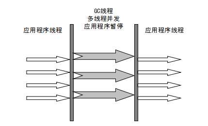

# JVM垃圾回收


当需要排查各种内存溢出问题、当垃圾收集成为系统达到更高并发的瓶颈时，我们就需要对这些“自动化”的技术实施必要的监控和调节。


Java 的自动内存管理主要是针对对象内存的回收和对象内存的分配。同时，Java 自动内存管理最核心的功能是 **堆** 内存中对象的分配与回收。

Java 堆是垃圾收集器管理的主要区域，因此也被称作**GC 堆（Garbage Collected Heap）**.从垃圾回收的角度，由于现在收集器基本都采用分代垃圾收集算法，所以 Java 堆还可以细分为：新生代和老年代：再细致一点有：Eden 空间、From Survivor、To Survivor 空间等。**进一步划分的目的是更好地回收内存，或者更快地分配内存。**


Java 堆是 JVM 所管理的内存中最大的一块，也是垃圾收集器的管理区域。大多数垃圾收集器都会将堆内存划分为上图所示的几个区域，整体分为新生代和老年代，比例为 1 : 2，新生代又进一步分为 Eden、From Survivor 和 To Survivor，默认比例为 8 : 1 : 1，请注意，可通过 SurvivorRatio 参数进行设置。

## 判断对象是否可回收的方法

### 引用计数法

引用计数法的实现很简单，在对象中添加一个引用计数器，每当有一个地方引用它时，计数器值就加一；当引用失效时，计数器值就减一；任何时刻计数器为零的对象就是不可能再被使用的。大部分情况下这个方法是可以发挥作用的，但是在存在循环引用的情况下，引用计数法就无能为力了。如：

```java
public class Student {
      // friend 字段
    public Student friend = null;
  
    public static void test() {
        Student a = new Student();
        Student b = new Student();
        a.friend = b;
        b.friend = a;
        a = null;
        b = null;
        System.gc();
    }
}
```

上述代码创建了 a 和 b 两个 Student 实例，并把它们各自的 friend 字段赋值为对方，除此之外，这两个对象再无任何引用，然后将它们都赋值为 null，在这种情况下，这两个对象已经不可能再被访问，但是它们因为互相引用着对方，导致它们的引用计数都不为零，引用计数算法也就无法回收它们。如：


但是在 Java 程序中，a 和 b 是可以被回收的，因为 JVM 并没有使用引用计数法判定对象是否可回收，而是采用了可达性分析法。

### 可达性分析法

这个算法的基本思想就是通过一系列的称为 **“GC Roots”** 的对象作为起点，从这些节点开始向下搜索，节点所走过的路径称为引用链，当一个对象到 GC Roots 没有任何引用链相连的话，则证明此对象是不可用的。

如图：


可作为GC Roots的对象包括下面几种：

* 虚拟机栈（栈帧中的本地变量表）中引用的对象
* 本地方法栈（Native方法）中引用的对象
* 方法区中类静态属性引用的对象
* 方法区中常量引用的对象
* 所有被同步锁持有的对象

## 垃圾回收算法

### 标记-清除算法


该算法的过程分为标记和清除两个阶段：首先标记出所有需要回收的对象，其中标记过程就是使用可达性分析法判断对象是否属于垃圾的过程。在标记完成后，统一回收掉所有被标记的对象，也可以反过来，标记存活的对象，统一回收所有未被标记的对象。

该算法存在两个缺点：

* 执行效率不稳定。如果 Java 堆中包含大量对象，而且其中大部分是需要被回收的，这时必须进行大量标记和清除的动作，导致标记和清除两个过程的执行效率都随对象数量增长而降低;
* 导致内存空间碎片化。标记、清除之后会产生大量不连续的内存碎片，空间碎片太多可能会导致当以后在程序运行过程中需要分配较大对象时无法找到足够的连续内存而不得不提前触发另一次垃圾收集动作，非常影响程序运行效率。

### 标记-复制算法


标记-复制算法常简称复制算法，这一算法正好解决了标记-清除算法在面对大量可回收对象时执行效率低下的问题。其实现方法也很易懂：在可用内存中划分出两块大小相同的区域，每次只使用其中一块，另一块保持空闲状态，第一块用完的时候，就把存活的对象全部复制到第二块区域，然后把第一块全部清空。

这个算法很适合用于对象存活率低的情况，因为它只关注存活对象而无需理会可回收对象，所以 JVM 中新生代的垃圾收集正是采用的这一算法。但是其缺点也很明显，每次都要浪费一半的内存。

### 标记-整理算法


这个算法完美解决了标记-清除算法的空间碎片化问题，其标记过程与“标记-清除”算法一样，但后续步骤不是直接对可回收对象进行清理，而是让所有存活的对象都向内存空间一端移动，然后直接清理掉边界以外的内存。

这个算法虽然可以很好地解决空间碎片化问题，但是每次垃圾回收都要移动存活的对象，还要对引用这些对象的地方进行更新，对象移动的操作也需要全程暂停用户线程 (Stop The World)。

### 分代收集算法

JVM 中存活对象数量与年龄之间的关系，如图：


在此基础上，人们提出了以下假说：

1. 绝大多数对象都是朝生夕灭的。
2. 熬过越多次垃圾收集过程的对象就越难以消亡。


可以把 JVM 的堆内存大致分为新生代和老年代，新生代对象大多存活时间短，每次回收时只关注如何保留少量存活而不是去标记那些大量将要被回收的对象，就能以较低代价回收到大量的空间，所以这一区域一般采用标记-复制算法进行垃圾收集，频率比较高。而老年代则是一些难以消亡的对象，可以采用标记-清除和标记整理算法进行垃圾收集，频率可以低一些。

按照 Hotspot 虚拟机的实现，针对新生代和老年代的垃圾收集又分为不同的类型，也有不同的名词，如下：

1. 部分收集 (Partial GC)：指目标不是完整收集整个Java堆的垃圾收集，其中又分为:
   - 新生代收集 (Minor GC / Young GC)：指目标只是新生代的垃圾收集。
   - *老年代收集 (Major GC / Old GC)*：指目标只是老年代的垃圾收集，目前只有CMS收集器的并发收集阶段是单独收集老年代的行为。
   - 混合收集 (Mixed GC)：指目标是收集整个新生代以及部分老年代的垃圾收集，目前只有G1收集器会有这种行为。
2. *整堆收集 (Full GC)*：收集整个Java堆和方法区的垃圾收集。

## JVM垃圾回收机制

### 分代收集原理

#### 新生代中对象的分配与回收

1. 对象优先在新生代 Eden 区中分配，当 Eden 区没有足够空间进行分配时，虚拟机将发起一次 Minor GC。
2. Eden、From Survivor 和 To Survivor 的比例为 8 : 1 : 1，之所以按这个比例是因为绝大多数对象都是朝生夕灭的，垃圾收集时 Eden 存活的对象数量不会太多，Survivor 空间小一点也足以容纳。
3. 每次新生代中可用内存空间为整个新生代容量的90% (Eden 的 80% 加上 To Survivor 的 10%)，只有From Survivor 空间，即 10% 的新生代是会被“浪费”的。不会像原始的标记-复制算法那样浪费一半的内存空间。
4. From Survivor 和 To Survivor 的空间并不是固定的，而是在 S0 和 S1 之间动态转换的，第一次 Minor GC 时会选择 S0 作为 To Survivor，并将 Eden 中存活的对象复制到其中，并将对象的年龄加1。

第一次Minor GC 如图：


在后续的 Minor GC 中，S0 和 S1会交替转化为 From Survivor 和 To Survivor，Eden 和 From Survivor 中的存活对象会复制到 To Survivor 中，并将年龄加 1。


#### 对象晋升老年代

1. 长期存活对象将进入老年代

   对象在 Survivor 区中每熬过一次Minor GC，年龄就增加1岁，当它的年龄增加到一定程度 (默认为15)，就会被晋升到老年代中。对象晋升老年代的年龄阈值，可以通过参数 -XX:MaxTenuringThreshold 设置，这个参数的最大值是15，因为对象年龄信息储存在对象头中，占4个比特 (bit)的内存，所能表示最大数字就是15。

   

#### 大对象直接进入老年到

大对象需要大量连续内存空间的对象（如：字符串、数组）。这样做是为了避免为大对象分配内存时由于分配担保机制带来的复制而降低效率。

## 垃圾收集器

* Serial 收集器
* ParNew收集器
* Parallel Scavenge收集器
* CMS收集器
* G1收集器

### Serial收集器

Serial（串行）收集器是最基本、历史最悠久的垃圾收集器了。大家看名字就知道这个收集器是一个单线程收集器了。它的 **“单线程”** 的意义不仅仅意味着它只会使用一条垃圾收集线程去完成垃圾收集工作，更重要的是它在进行垃圾收集工作的时候必须暂停其他所有的工作线程（ **"Stop The World"** ），直到它收集结束。

**新生代采用标记-复制算法，老年代采用标记-整理算法。**


虚拟机的设计者们当然知道 Stop The World 带来的不良用户体验，所以在后续的垃圾收集器设计中停顿时间在不断缩短（仍然还有停顿，寻找最优秀的垃圾收集器的过程仍然在继续）。

但是 Serial 收集器有没有优于其他垃圾收集器的地方呢？当然有，它**简单而高效（与其他收集器的单线程相比）**。Serial 收集器由于没有线程交互的开销，自然可以获得很高的单线程收集效率。Serial 收集器对于运行在 Client 模式下的虚拟机来说是个不错的选择。

### ParNew收集器

**ParNew 收集器其实就是 Serial 收集器的多线程版本，除了使用多线程进行垃圾收集外，其余行为（控制参数、收集算法、回收策略等等）和 Serial 收集器完全一样。**

**新生代采用标记-复制算法，老年代采用标记-整理算法。**


它是许多运行在 Server 模式下的虚拟机的首要选择，除了 Serial 收集器外，只有它能与 CMS 收集器（真正意义上的并发收集器，后面会介绍到）配合工作。

**并行和并发概念补充：**

- **并行（Parallel）** ：指多条垃圾收集线程并行工作，但此时用户线程仍然处于等待状态。
- **并发（Concurrent）**：指用户线程与垃圾收集线程同时执行（但不一定是并行，可能会交替执行），用户程序在继续运行，而垃圾收集器运行在另一个 CPU 上。

### Parallel Scavenge收集器

Parallel Scavenge 收集器也是使用标记-复制算法的多线程收集器，它看上去几乎和 ParNew 都一样。 **那么它有什么特别之处呢？**

```
-XX:+UseParallelGC

    使用 Parallel 收集器+ 老年代串行

-XX:+UseParallelOldGC

    使用 Parallel 收集器+ 老年代并行
```

**Parallel Scavenge 收集器关注点是吞吐量（高效率的利用 CPU）。CMS 等垃圾收集器的关注点更多的是用户线程的停顿时间（提高用户体验）。所谓吞吐量就是 CPU 中用于运行用户代码的时间与 CPU 总消耗时间的比值。** Parallel Scavenge 收集器提供了很多参数供用户找到最合适的停顿时间或最大吞吐量，如果对于收集器运作不太了解，手工优化存在困难的时候，使用 Parallel Scavenge 收集器配合自适应调节策略，把内存管理优化交给虚拟机去完成也是一个不错的选择。

**新生代采用标记-复制算法，老年代采用标记-整理算法。**



**这是 JDK1.8 默认收集器**

使用 java -XX:+PrintCommandLineFlags -version 命令查看

```
-XX:InitialHeapSize=262921408 -XX:MaxHeapSize=4206742528 -XX:+PrintCommandLineFlags -XX:+UseCompressedClassPointers -XX:+UseCompressedOops -XX:+UseParallelGC
java version "1.8.0_211"
Java(TM) SE Runtime Environment (build 1.8.0_211-b12)
Java HotSpot(TM) 64-Bit Server VM (build 25.211-b12, mixed mode)
```

JDK1.8 默认使用的是 Parallel Scavenge + Parallel Old，如果指定了-XX:+UseParallelGC 参数，则默认指定了-XX:+UseParallelOldGC，可以使用-XX:-UseParallelOldGC 来禁用该功能

### Serial Old 收集器

**Serial 收集器的老年代版本**，它同样是一个单线程收集器。它主要有两大用途：一种用途是在 JDK1.5 以及以前的版本中与 Parallel Scavenge 收集器搭配使用，另一种用途是作为 CMS 收集器的后备方案。

### Parallel Old 收集器

**Parallel Scavenge 收集器的老年代版本**。使用多线程和“标记-整理”算法。在注重吞吐量以及 CPU 资源的场合，都可以优先考虑 Parallel Scavenge 收集器和 Parallel Old 收集器。

### CMS 收集器

**CMS（Concurrent Mark Sweep）收集器是一种以获取最短回收停顿时间为目标的收集器。它非常符合在注重用户体验的应用上使用。**

**CMS（Concurrent Mark Sweep）收集器是 HotSpot 虚拟机第一款真正意义上的并发收集器，它第一次实现了让垃圾收集线程与用户线程（基本上）同时工作。**

从名字中的**Mark Sweep**这两个词可以看出，CMS 收集器是一种 **“标记-清除”算法**实现的，它的运作过程相比于前面几种垃圾收集器来说更加复杂一些。整个过程分为四个步骤：

- **初始标记：** 暂停所有的其他线程，并记录下直接与 root 相连的对象，速度很快 ；
- **并发标记：** 同时开启 GC 和用户线程，用一个闭包结构去记录可达对象。但在这个阶段结束，这个闭包结构并不能保证包含当前所有的可达对象。因为用户线程可能会不断的更新引用域，所以 GC 线程无法保证可达性分析的实时性。所以这个算法里会跟踪记录这些发生引用更新的地方。
- **重新标记：** 重新标记阶段就是为了修正并发标记期间因为用户程序继续运行而导致标记产生变动的那一部分对象的标记记录，这个阶段的停顿时间一般会比初始标记阶段的时间稍长，远远比并发标记阶段时间短
- **并发清除：** 开启用户线程，同时 GC 线程开始对未标记的区域做清扫。


从它的名字就可以看出它是一款优秀的垃圾收集器，主要优点：**并发收集、低停顿**。但是它有下面三个明显的缺点：

- **对 CPU 资源敏感；**
- **无法处理浮动垃圾；**
- **它使用的回收算法-“标记-清除”算法会导致收集结束时会有大量空间碎片产生。**

### G1 收集器

**G1 (Garbage-First) 是一款面向服务器的垃圾收集器,主要针对配备多颗处理器及大容量内存的机器. 以极高概率满足 GC 停顿时间要求的同时,还具备高吞吐量性能特征.**

被视为 JDK1.7 中 HotSpot 虚拟机的一个重要进化特征。它具备一下特点：

- **并行与并发**：G1 能充分利用 CPU、多核环境下的硬件优势，使用多个 CPU（CPU 或者 CPU 核心）来缩短 Stop-The-World 停顿时间。部分其他收集器原本需要停顿 Java 线程执行的 GC 动作，G1 收集器仍然可以通过并发的方式让 java 程序继续执行。
- **分代收集**：虽然 G1 可以不需要其他收集器配合就能独立管理整个 GC 堆，但是还是保留了分代的概念。
- **空间整合**：与 CMS 的“标记-清理”算法不同，G1 从整体来看是基于“标记-整理”算法实现的收集器；从局部上来看是基于“标记-复制”算法实现的。
- **可预测的停顿**：这是 G1 相对于 CMS 的另一个大优势，降低停顿时间是 G1 和 CMS 共同的关注点，但 G1 除了追求低停顿外，还能建立可预测的停顿时间模型，能让使用者明确指定在一个长度为 M 毫秒的时间片段内。

G1 收集器的运作大致分为以下几个步骤：

- **初始标记**
- **并发标记**
- **最终标记**
- **筛选回收**

**G1 收集器在后台维护了一个优先列表，每次根据允许的收集时间，优先选择回收价值最大的 Region(这也就是它的名字 Garbage-First 的由来)** 。这种使用 Region 划分内存空间以及有优先级的区域回收方式，保证了 G1 收集器在有限时间内可以尽可能高的收集效率（把内存化整为零）。

###  ZGC 收集器

与 CMS 中的 ParNew 和 G1 类似，ZGC 也采用标记-复制算法，不过 ZGC 对该算法做了重大改进。

在 ZGC 中出现 Stop The World 的情况会更少！

详情可以看 ： [《新一代垃圾回收器 ZGC 的探索与实践》](https://tech.meituan.com/2020/08/06/new-zgc-practice-in-meituan.html)

## 引用

**1．强引用（StrongReference）**

以前我们使用的大部分引用实际上都是强引用，这是使用最普遍的引用。如果一个对象具有强引用，那就类似于**必不可少的生活用品**，垃圾回收器绝不会回收它。当内存空间不足，Java 虚拟机宁愿抛出 OutOfMemoryError 错误，使程序异常终止，也不会靠随意回收具有强引用的对象来解决内存不足问题。

**2．软引用（SoftReference）**

如果一个对象只具有软引用，那就类似于**可有可无的生活用品**。如果内存空间足够，垃圾回收器就不会回收它，如果内存空间不足了，就会回收这些对象的内存。只要垃圾回收器没有回收它，该对象就可以被程序使用。软引用可用来实现内存敏感的高速缓存。

软引用可以和一个引用队列（ReferenceQueue）联合使用，如果软引用所引用的对象被垃圾回收，JAVA 虚拟机就会把这个软引用加入到与之关联的引用队列中。

**3．弱引用（WeakReference）**

如果一个对象只具有弱引用，那就类似于**可有可无的生活用品**。弱引用与软引用的区别在于：只具有弱引用的对象拥有更短暂的生命周期。在垃圾回收器线程扫描它所管辖的内存区域的过程中，一旦发现了只具有弱引用的对象，不管当前内存空间足够与否，都会回收它的内存。不过，由于垃圾回收器是一个优先级很低的线程， 因此不一定会很快发现那些只具有弱引用的对象。

弱引用可以和一个引用队列（ReferenceQueue）联合使用，如果弱引用所引用的对象被垃圾回收，Java 虚拟机就会把这个弱引用加入到与之关联的引用队列中。

**4．虚引用（PhantomReference）**

"虚引用"顾名思义，就是形同虚设，与其他几种引用都不同，虚引用并不会决定对象的生命周期。如果一个对象仅持有虚引用，那么它就和没有任何引用一样，在任何时候都可能被垃圾回收。

**虚引用主要用来跟踪对象被垃圾回收的活动**。

**虚引用与软引用和弱引用的一个区别在于：** 虚引用必须和引用队列（ReferenceQueue）联合使用。当垃圾回收器准备回收一个对象时，如果发现它还有虚引用，就会在回收对象的内存之前，把这个虚引用加入到与之关联的引用队列中。程序可以通过判断引用队列中是否已经加入了虚引用，来了解被引用的对象是否将要被垃圾回收。程序如果发现某个虚引用已经被加入到引用队列，那么就可以在所引用的对象的内存被回收之前采取必要的行动。

特别注意，在程序设计中一般很少使用弱引用与虚引用，使用软引用的情况较多，这是因为**软引用可以加速 JVM 对垃圾内存的回收速度，可以维护系统的运行安全，防止内存溢出（OutOfMemory）等问题的产生**。

### 

### 参考

[JVM垃圾回收](https://github.com/Snailclimb/JavaGuide/blob/master/docs/java/jvm/JVM%E5%9E%83%E5%9C%BE%E5%9B%9E%E6%94%B6.md)

[Java 虚拟机系列二：垃圾收集机制详解，动图帮你理解](https://segmentfault.com/a/1190000021667919)

