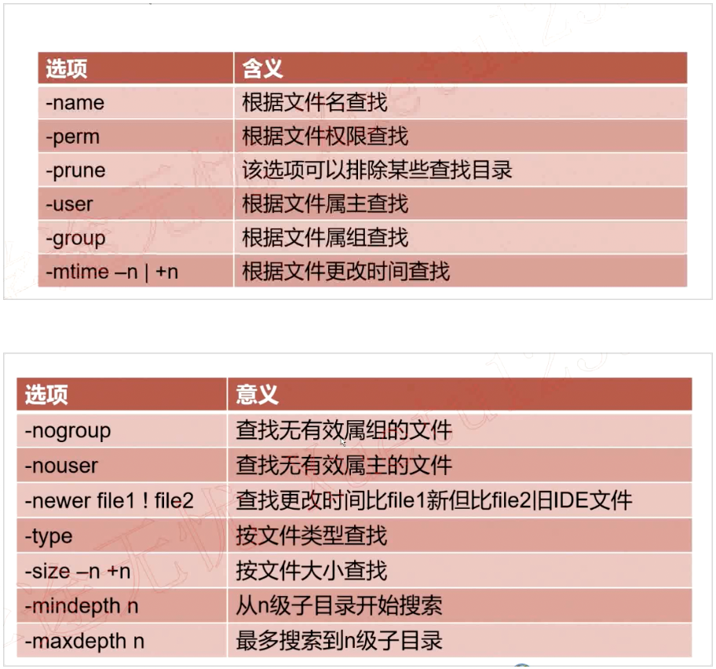

# find命令

### find语法格式

```
find [路径][选项][操作]
```

### find选项参数



### 举例

```

常用选项

	-name    查找/etc目录下以conf结尾的文件  find /etc -name ‘*conf’
	-iname    查找当前目录下文件名为aa的文件，不区分大小写  find . -iname aa
	-user       查找文件属主为hdfs的所有文件  find . -user hdfs
	-group     查找文件属组为yarn的所有文件 find . -group yarn

	-type
			
		f  文件  			 find . -type f
		d 目录 				 find . -type d
		c 字符设备文件 	find . -type c
		b 块设备文件 	 find . -type b
		i 链接文件 		  find . -type i
		p 管道文件 		  find . -type p

	-size
		
		-n 大小 小于n的文件
		+n 大小 大于n的文件

	例子：
	
		1、查找/etc目录下小于10000字节的文件  find /etc/  -size -10000c

		2、查找/etc目录下大于1M的文件  find /etc/ -size +1M

	-mtime

		-n   n天以内修改的文件
		+n  n天以外修改的文件
		n    正好n天修改的文件

	例子：

		1、查找/etc目录下5天之内修改且以conf结尾的文件  find /etc/ -mtime -5 -name ‘*.conf’
		2、查找/etc/目录下10天之前修改且属主为root的文件  find /etc/ -mtime +10 -user root

	-mmin

		-n  n分钟以内修改的文件
		+n n分钟以外修改的文件

	例子：

		1、查找/etc目录下30分钟之前修改的文件  find /etc -mmin +30
		2、查找/etc目录下30分钟之内修改的目录 find /etc -mmin -30 -type d

	-mindepth n 		表示从n级子目录开始搜索

		例子：在/etc下的3级子目录开始搜索  find /etc  -mindepth 3

	-maxdepth n 		表示最多搜索到n级子目录

		例子1:在/etc下搜索符合条件的文件，但最多搜索到2级子目录  find /etc -maxdepth 3 -name ‘*.conf’
		例子2：find ./etc/ -type f -name ‘*.conf’ -size +10k -maxdepth 2

文件查找之find命令

操作：
-print 打印输出

-exec 对搜索到的文件执行特定的操作，格式为 -exec ‘command’ {} \;

	例子1:搜索/etc/下的文件（非目录），文件名以conf结尾，且大于10k，然后将其删除

	find ./etc/ -type -f -name ‘*.conf’ -size +10k -exec rm -f {} \;

	例子2:将/var/log/目录下以log结尾的文件，且更改时间在7天以上的删除

	find /var/log/ -name ‘*.log’ -mtime +7 -exec rm -rf {} \;

	例子3:搜索条件和例子1一样，只是不删除，而是将其复制到/root/conf目录下

	find ./etc/ -size +10k -type -f -name ‘*.conf’ -exec cp {} /root/conf/ \;

-ok 和exec功能一样，只是每次操作都会给用户提示

逻辑运算符：

	-a 与
	-o 或
	-not|! 非
```

