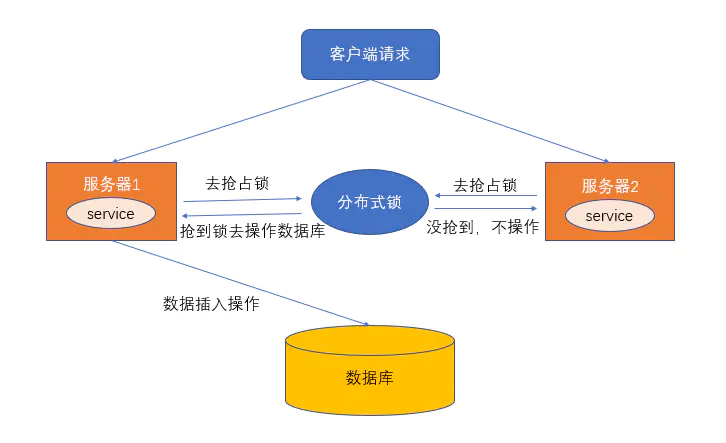

# Redis分布式锁

### 什么是分布式锁？

分布式锁，就是分布式项目开发中用的锁，可以用来控制分布式系统之间同步访问共享资源，一般来说，分布式锁需要满足的特点：

1. 互斥性：在任何时刻，对于同一条数据，只有一台应用可以获取到分布式锁；
2. 高可用性：在分布式场景下，一小部分服务器宕机不影响正常使用，这种情况就需要将提供分布式锁的服务以集群的方式部署；
3. 防止锁超时：如果客户端没有主动释放锁，服务器会在一段时间之后自动释放锁，防止客户端宕机或者网络不可达时产生死锁；
4. 独占性：加锁解锁必须由同一台服务器进行，也就是锁的持有者才可以释放锁，不能出现你加的锁，别人给你解锁了；
5. 可重入性：同一个节点上的同一个线程如果获取了锁之后那么也可以再次获取这个锁。
6. 支持阻塞和非阻塞：和ReentrantLock一样支持lock和trylock以及tryLock(long timeOut)



### 分布式锁的实现方式

* 基于数据库
* 基于Redis
* 基于zookeeper

### 基于Redis实现的分布式锁

#### Redis实现锁的命令

* ##### 利用setnx+expire命令（错误的用法）

  Redis的SETNX命令，setnx key value，将key设置为value，当键不存在时，才能成功，若键存在，什么也不做，成功返回1，失败返回0 。

  分布式锁还有锁超时的机制，所以我们利用expire命令来设置超时时间，模拟代码：

  ```java
  public boolean tryLock(String key,String requset,int timeout) {
      Long result = jedis.setnx(key, requset);
      // result = 1时，设置成功，否则设置失败
      if (result == 1L) {
          return jedis.expire(key, timeout) == 1L;
      } else {
          return false;
      }
  }
  
  ```

  这个解决方案存在问题，这个操作不具有原子性，是分两步操作的，有可能获取锁成功但设置时间失败，那这样设置的锁永远不会失效。

* ##### 使用Lua脚本（包含setnx和expire两条指令）

  代码：

  ```java
  public boolean tryLock_with_lua(String key, String UniqueId, int seconds) {
      String lua_scripts = "if redis.call('setnx',KEYS[1],ARGV[1]) == 1 then" +
              "redis.call('expire',KEYS[1],ARGV[2]) return 1 else return 0 end";
      List<String> keys = new ArrayList<>();
      List<String> values = new ArrayList<>();
      keys.add(key);
      values.add(UniqueId);
      values.add(String.valueOf(seconds));
      Object result = jedis.eval(lua_scripts, keys, values);
      //判断是否成功
      return result.equals(1L);
  }
  
  ```

* ##### 使用set key value  \[EX seconds\]\[PX milliseconds\][NX|XX] 命令 (正确做法)

  Redis在2.6.12版本开始，为SET命令增加一系列选项：

  ```
  SET key value[EX seconds][PX milliseconds][NX|XX]
  ```

  - EX seconds: 设定过期时间，单位为秒
  - PX milliseconds: 设定过期时间，单位为毫秒
  - NX: 仅当key不存在时设置值
  - XX: 仅当key存在时设置值

  value必须要具有唯一性，我们可以用UUID来做，设置随机字符串保证唯一性，至于为什么要保证唯一性？假如value不是随机字符串，而是一个固定值，那么就可能存在下面的问题：

  - 客户端1获取锁成功
  - 客户端1在某个操作上阻塞了太长时间
  - 设置的key过期了，锁自动释放了
  - 客户端2获取到了对应同一个资源的锁
  - 客户端1从阻塞中恢复过来，因为value值一样，所以执行释放锁操作时就会释放掉客户端2持有的锁，这样就会造成问题

  所以通常来说，在释放锁时，我们需要对value进行验证

* ##### 释放锁

  释放锁时需要验证value值，也就是说我们在获取锁的时候需要设置一个value，不能直接用del key这种粗暴的方式，因为直接del key任何客户端都可以进行解锁了，所以**解锁时，我们需要判断锁是否是自己的，基于value值来判断**，代码如下：

  ```java
  public boolean releaseLock_with_lua(String key,String value) {
      String luaScript = "if redis.call('get',KEYS[1]) == ARGV[1] then " +
              "return redis.call('del',KEYS[1]) else return 0 end";
      return jedis.eval(luaScript, Collections.singletonList(key), Collections.singletonList(value)).equals(1L);
  }
  
  ```

  使用Lua脚本的方式，保证原子性。

  使用 `set key value [EX seconds][PX milliseconds][NX|XX]` 命令实现方案 存在缺陷，实际上在Redis集群的时候也会出现问题，比如说A客户端在Redis的master节点上拿到了锁，但是这个加锁的key还没有同步到slave节点，master故障，发生故障转移，一个slave节点升级为master节点，B客户端也可以获取同个key的锁，但客户端A也已经拿到锁了，这就导致多个客户端都拿到锁。

#### Redlock算法与Redisson实现

实现Redlock的原理，参考文章[Redlock：Redis分布式锁最牛逼的实现](https://mp.weixin.qq.com/s?__biz=MzU5ODUwNzY1Nw==&mid=2247484155&idx=1&sn=0c73f45f2f641ba0bf4399f57170ac9b&scene=21#wechat_redirect) 和 [redis.io/topics/dist…](https://redis.io/topics/distlock)

假设有5个独立的Redis节点（**注意这里的节点可以是5个Redis单master实例，也可以是5个Redis Cluster集群，但并不是有5个主节点的cluster集群**）：

* 获取当前Unix时间，以毫秒为单位
* 依次尝试从5个实例，使用相同的key和具有唯一性的value(例如UUID)获取锁，当向Redis请求获取锁时，客户端应该设置一个网络连接和响应超时时间，这个超时时间应用小于锁的失效时间，例如你的锁自动失效时间为10s，则超时时间应该在5~50毫秒之间，这样可以避免服务器端Redis已经挂掉的情况下，客户端还在死死地等待响应结果。如果服务端没有在规定时间内响应，客户端应该尽快尝试去另外一个Redis实例请求获取锁
* 客户端使用当前时间减去开始获取锁时间（步骤1记录的时间）就得到获取锁使用的时间，当且仅当从大多数(N/2+1，这里是3个节点)的Redis节点都取到锁，并且使用的时间小于锁失败时间时，锁才算获取成功。
* 如果取到了锁，key的真正有效时间等于有效时间减去获取锁所使用的时间（步骤3计算的结果）
* 如果某些原因，获取锁失败（没有在至少N/2+1个Redis实例取到锁或者取锁时间已经超过了有效时间），客户端应该在所有的Redis实例上进行解锁（即便某些Redis实例根本就没有加锁成功，防止某些节点获取到锁但是客户端没有得到响应而导致接下来的一段时间不能被重新获取锁）

##### Redisson实现简单分布式锁

对于Java用户而言，我们经常使用Jedis，Jedis是Redis的Java客户端，除了Jedis之外，Redisson也是Java的客户端，Jedis是阻塞式I/O，而Redisson底层使用Netty可以实现非阻塞I/O，该客户端封装了锁的，继承了J.U.C的Lock接口，所以我们可以像使用ReentrantLock一样使用Redisson，具体使用过程如下。

1. 首先加入POM依赖

```xml
<dependency>
    <groupId>org.redisson</groupId>
    <artifactId>redisson</artifactId>
    <version>3.10.6</version>
</dependency>
```

1. 使用Redisson，代码如下(与使用ReentrantLock类似）

```java
// 1. 配置文件
Config config = new Config();
config.useSingleServer()
        .setAddress("redis://127.0.0.1:6379")
        .setPassword(RedisConfig.PASSWORD)
        .setDatabase(0);
//2. 构造RedissonClient
RedissonClient redissonClient = Redisson.create(config);

//3. 设置锁定资源名称
RLock lock = redissonClient.getLock("redlock");
lock.lock();
try {
    System.out.println("获取锁成功，实现业务逻辑");
    Thread.sleep(10000);
} catch (InterruptedException e) {
    e.printStackTrace();
} finally {
    lock.unlock();
}

```

关于Redlock算法的实现，在Redisson中我们可以使用RedissonRedLock来完成，具体使用细节可以参考大佬的文章： [mp.weixin.qq.com/s/8uhYult2h…](https://mp.weixin.qq.com/s/8uhYult2h_YUHT7q7YCKYQ)


### Redis实现的分布式锁

项目源码地址：[github.com/pjmike/redi…](https://github.com/pjmike/redis-distributed-lock)

