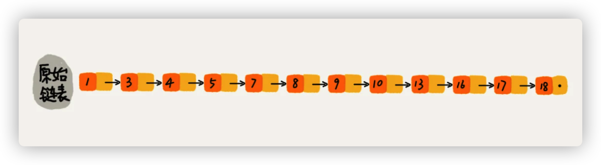
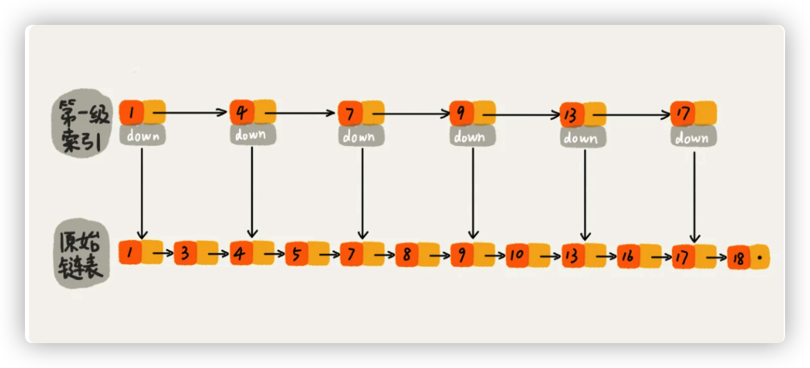
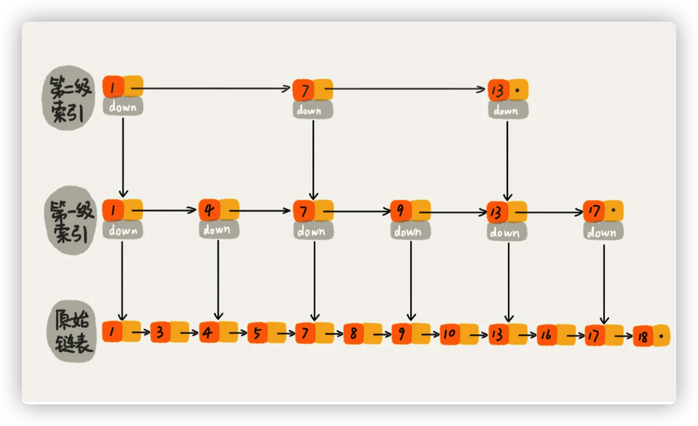
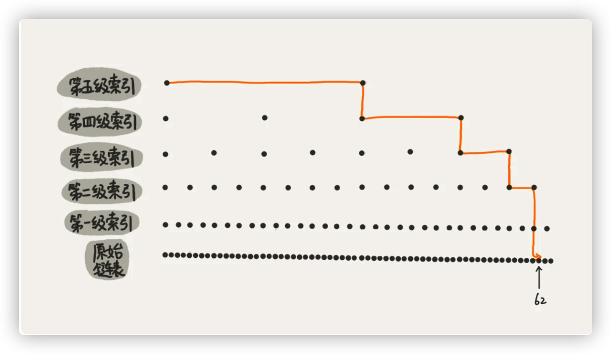
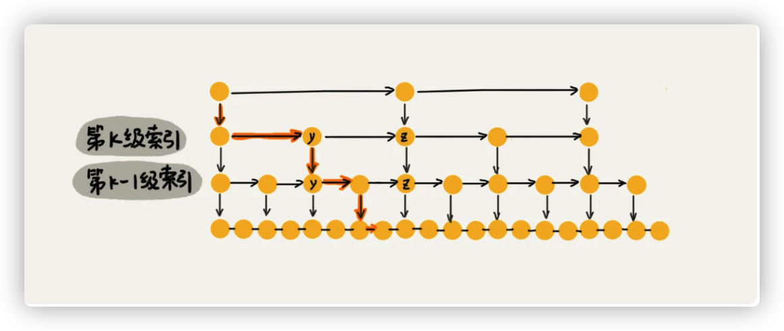
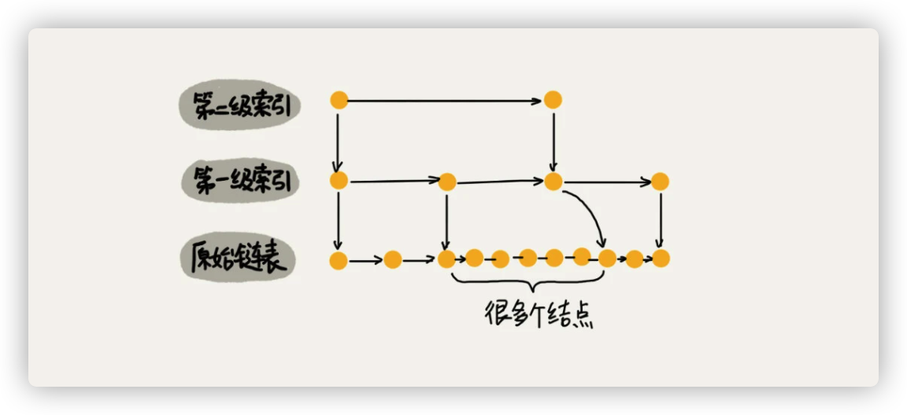
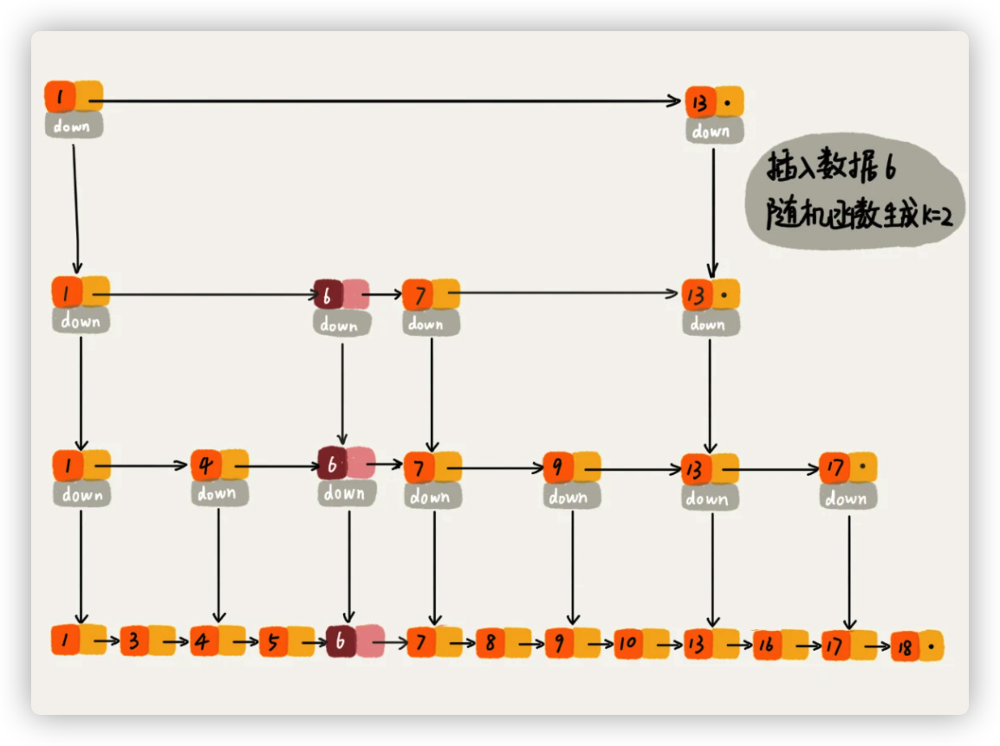

# Redis有序集合之跳表

[toc]

跳表是一种个方面都比较优秀的动态数据结构，可以支持快速地插入、删除、查找操作，写起来也不复杂，甚至可以替代红黑树。

Redis中的有序集合就是用跳表来实现的。

Redis 中的有序集合是通过跳表来实现的，严格点讲，其实还用到了散列表。

## 理解“跳表”

对于一个链表来说，即便链表中存储的数据是有序的，如果我们想在其中查找某个数据，也只能从头到尾便利链表。这样查找效率就会很低，时间复杂度也会很高，是O(n)。



如何提高链表的查找速率？我们只需要对链表稍加改造，就可以支持类似“二分”查找算法。对链表建立一级“索引”，每两个节点提取一个节点到上一级，把抽出来的那一级叫做索引或索引层。



图中的down表示down指针，指向下一级节点。

举例，比如查找16，查找过程如下：

我们可以先在索引层遍历，当遍历到索引层中值为 13 的结点时，我们发现下一个结点是 17，那要查找的结点 16 肯定就在这两个结点之间。

然后我们通过索引层结点的 down 指针，下降到原始链表这一层，继续遍历。这个时候，我们只需要再遍历 2 个结点，就可以找到值等于 16 的这个结点了。

这样，原来如果要查找 16，需要遍历 10 个结点，现在只需要遍历 7 个结点。

小结：**加来一层索引之后，查找一个结点需要遍历的结点个数减少了，也就是说查找效率提高了。** 思考：如果再加一级索引呢？效率会提升多少呢？



这时候如果在查找16，我们只需遍历6步找到目标。

如果是一个很长的链表呢？假如现有64个节点的链表，按照之前的思想，可以建立一个五级索引的跳表，则它的跳表结构如下：



在没有索引的时候，查找62需要遍历62个节点找到。

有了索引之后，查找62只需要查找11个节点就可以找到。

以此类推，如果当链表长度n比较大时，如100、1000、10000的时候，在构建索引之后，查找效率的提升就会非常明显。

**这种链表加多级索引的结构，就是跳表。**

## 跳表查询效率

一个单链表中查询某个数据的时间复杂度是O(n)。

**思考：如果是跳表的话，它的时间复杂度是多少？**

分析跳表的时间复杂度，先分析构建多级索引的依据是什么？如果链表里有n个节点，会有多少级索引？

如以上图示，每两个结点会抽出一个结点作为上一级索引的结点，那第一级索引的结点个数大约就是 n/2，第二级索引的结点个数大约就是 n/4，第三级索引的结点个数大约就是 n/8，依次类推，也就是说，**第 k 级索引的结点个数是第 k-1 级索引的结点个数的 1/2，那第 k级索引结点的个数就是 n/(2k)**

**假设索引有 h 级，最高级的索引有 2 个结点。通过上面的公式，我们可以得到 n/(2h)=2，从而求得 h=log2n-1。**如果包含原始链表这一层，整个跳表的高度就是 log2n。我们在跳表中查询某个数据的时候，如果每一层都要遍历 m 个结点，那在跳表中查询一个数据的时间复杂度就是 O(m*logn)。

那这个 m 的值是多少呢？按照前面这种索引结构，我们每一级索引都最多只需要遍历 3 个结点。为什么是3个节点？

如图：



假设我们要查找的数据是 x，在第 k 级索引中，我们遍历到 y 结点之后，发现 x 大于 y，小于后面的结点 z，所以我们通过 y 的 down 指针，从第 k 级索引下降到第 k-1 级索引。在第 k-1 级索引中，y 和 z 之间只有 3 个结点（包含 y 和 z），所以，我们在 K-1 级索引中最多只需要遍历 3 个结点，依次类推，每一级索引都最多只需要遍历 3 个结点。

通过上面的分析，我们得到 m=3，所以在跳表中查询任意数据的时间复杂度就是 O(logn)。这个查找的时间复杂度跟二分查找是一样的。这种查询效率的提升，前提是建立了很多级索引，也就是空间换时间的设计思路。

## 跳表索引动态更新

当我们不停地往跳表中插入数据时，如果我们不更新索引，就有可能出现某 2 个索引结点之间数据非常多的情况。极端情况下，跳表还会退化成单链表。



作为一种动态数据结构，我们需要某种手段来维护索引与原始链表大小之间的平衡，也就是说，如果链表中结点多了，索引结点就相应地增加一些，避免复杂度退化，以及查找、插入、删除操作性能下降。

**跳表是通过随机函数来维护“平衡性”的。**

思考：当我们往跳表重插入数据的时候，是如何选择加入哪些索引层的？

通过一个随机函数，来决定将这个结点插入到哪几级索引中，比如随机函数生成了值 K，那我们就将这个结点添加到第一级到第 K 级这 K 级索引中。随机函数的选择很有讲究，从概率上来讲，能够保证跳表的索引大小和数据大小平衡性，不至于性能过度退化。



## 跳表的代码实现

```java
/**
 * 跳表的一种实现方法。
 * 跳表中存储的是正整数，并且存储的是不重复的。
 *
 * Author：ZHENG
 */
public class SkipList {

  private static final float SKIPLIST_P = 0.5f;
  private static final int MAX_LEVEL = 16;

  private int levelCount = 1;

  private Node head = new Node();  // 带头链表

  public Node find(int value) {
    Node p = head;
    for (int i = levelCount - 1; i >= 0; --i) {
      while (p.forwards[i] != null && p.forwards[i].data < value) {
        p = p.forwards[i];
      }
    }

    if (p.forwards[0] != null && p.forwards[0].data == value) {
      return p.forwards[0];
    } else {
      return null;
    }
  }

  public void insert(int value) {
    int level = randomLevel();
    Node newNode = new Node();
    newNode.data = value;
    newNode.maxLevel = level;
    Node update[] = new Node[level];
    for (int i = 0; i < level; ++i) {
      update[i] = head;
    }

    // record every level largest value which smaller than insert value in update[]
    Node p = head;
    for (int i = level - 1; i >= 0; --i) {
      while (p.forwards[i] != null && p.forwards[i].data < value) {
        p = p.forwards[i];
      }
      update[i] = p;// use update save node in search path
    }

    // in search path node next node become new node forwords(next)
    for (int i = 0; i < level; ++i) {
      newNode.forwards[i] = update[i].forwards[i];
      update[i].forwards[i] = newNode;
    }

    // update node hight
    if (levelCount < level) levelCount = level;
  }

  public void delete(int value) {
    Node[] update = new Node[levelCount];
    Node p = head;
    for (int i = levelCount - 1; i >= 0; --i) {
      while (p.forwards[i] != null && p.forwards[i].data < value) {
        p = p.forwards[i];
      }
      update[i] = p;
    }

    if (p.forwards[0] != null && p.forwards[0].data == value) {
      for (int i = levelCount - 1; i >= 0; --i) {
        if (update[i].forwards[i] != null && update[i].forwards[i].data == value) {
          update[i].forwards[i] = update[i].forwards[i].forwards[i];
        }
      }
    }

    while (levelCount>1&&head.forwards[levelCount]==null){
      levelCount--;
    }

  }

  // 理论来讲，一级索引中元素个数应该占原始数据的 50%，二级索引中元素个数占 25%，三级索引12.5% ，一直到最顶层。
  // 因为这里每一层的晋升概率是 50%。对于每一个新插入的节点，都需要调用 randomLevel 生成一个合理的层数。
  // 该 randomLevel 方法会随机生成 1~MAX_LEVEL 之间的数，且 ：
  //        50%的概率返回 1
  //        25%的概率返回 2
  //      12.5%的概率返回 3 ...
  private int randomLevel() {
    int level = 1;

    while (Math.random() < SKIPLIST_P && level < MAX_LEVEL)
      level += 1;
    return level;
  }

  public void printAll() {
    Node p = head;
    while (p.forwards[0] != null) {
      System.out.print(p.forwards[0] + " ");
      p = p.forwards[0];
    }
    System.out.println();
  }

  public class Node {
    private int data = -1;
    private Node forwards[] = new Node[MAX_LEVEL];
    private int maxLevel = 0;

    @Override
    public String toString() {
      StringBuilder builder = new StringBuilder();
      builder.append("{ data: ");
      builder.append(data);
      builder.append("; levels: ");
      builder.append(maxLevel);
      builder.append(" }");

      return builder.toString();
    }
  }

}
```

优化跳表代码

```java
/**
 * 1，跳表的一种实现方法，用于练习。跳表中存储的是正整数，并且存储的是不重复的。
 * 2，本类是参考作者zheng ，自己学习，优化了添加方法
 * 3，看完这个，我觉得再看ConcurrentSkipListMap 源码，会有很大收获
 * Author：ldb
 */
public class SkipList2 {

    private static final int MAX_LEVEL = 16;
    private int levelCount = 1;

    /**
     * 带头链表
     */
    private Node head = new Node(MAX_LEVEL);
    private Random r = new Random();

    public Node find(int value) {
        Node p = head;
        // 从最大层开始查找，找到前一节点，通过--i，移动到下层再开始查找
        for (int i = levelCount - 1; i >= 0; --i) {
            while (p.forwards[i] != null && p.forwards[i].data < value) {
                // 找到前一节点
                p = p.forwards[i];
            }
        }

        if (p.forwards[0] != null && p.forwards[0].data == value) {
            return p.forwards[0];
        } else {
            return null;
        }
    }

    /**
     * 优化了作者zheng的插入方法
     *
     * @param value 值
     */
    public void insert(int value) {
        int level = head.forwards[0] == null ? 1 : randomLevel();
        // 每次只增加一层，如果条件满足
        if (level > levelCount) {
            level = ++levelCount;
        }
        Node newNode = new Node(level);
        newNode.data = value;
        Node update[] = new Node[level];
        for (int i = 0; i < level; ++i) {
            update[i] = head;
        }

        Node p = head;
        // 从最大层开始查找，找到前一节点，通过--i，移动到下层再开始查找
        for (int i = levelCount - 1; i >= 0; --i) {
            while (p.forwards[i] != null && p.forwards[i].data < value) {
                // 找到前一节点
                p = p.forwards[i];
            }
            // levelCount 会 > level，所以加上判断
            if (level > i) {
                update[i] = p;
            }

        }
        for (int i = 0; i < level; ++i) {
            newNode.forwards[i] = update[i].forwards[i];
            update[i].forwards[i] = newNode;
        }

    }

    /**
     * 优化了作者zheng的插入方法2
     *
     * @param value 值
     */
    public void insert2(int value) {
        int level = head.forwards[0] == null ? 1 : randomLevel();
        // 每次只增加一层，如果条件满足
        if (level > levelCount) {
            level = ++levelCount;
        }
        Node newNode = new Node(level);
        newNode.data = value;
        Node p = head;
        // 从最大层开始查找，找到前一节点，通过--i，移动到下层再开始查找
        for (int i = levelCount - 1; i >= 0; --i) {
            while (p.forwards[i] != null && p.forwards[i].data < value) {
                // 找到前一节点
                p = p.forwards[i];
            }
            // levelCount 会 > level，所以加上判断
            if (level > i) {
                if (p.forwards[i] == null) {
                    p.forwards[i] = newNode;
                } else {
                    Node next = p.forwards[i];
                    p.forwards[i] = newNode;
                    newNode.forwards[i] = next;
                }
            }

        }

    }

    /**
     * 作者zheng的插入方法，未优化前，优化后参见上面insert()
     *
     * @param value
     * @param level 0 表示随机层数，不为0，表示指定层数，指定层数
     *              可以让每次打印结果不变动，这里是为了便于学习理解
     */
    public void insert(int value, int level) {
        // 随机一个层数
        if (level == 0) {
            level = randomLevel();
        }
        // 创建新节点
        Node newNode = new Node(level);
        newNode.data = value;
        // 表示从最大层到低层，都要有节点数据
        newNode.maxLevel = level;
        // 记录要更新的层数，表示新节点要更新到哪几层
        Node update[] = new Node[level];
        for (int i = 0; i < level; ++i) {
            update[i] = head;
        }

        /**
         *
         * 1，说明：层是从下到上的，这里最下层编号是0，最上层编号是15
         * 2，这里没有从已有数据最大层（编号最大）开始找，（而是随机层的最大层）导致有些问题。
         *    如果数据量为1亿，随机level=1 ，那么插入时间复杂度为O（n）
         */
        Node p = head;
        for (int i = level - 1; i >= 0; --i) {
            while (p.forwards[i] != null && p.forwards[i].data < value) {
                p = p.forwards[i];
            }
            // 这里update[i]表示当前层节点的前一节点，因为要找到前一节点，才好插入数据
            update[i] = p;
        }

        // 将每一层节点和后面节点关联
        for (int i = 0; i < level; ++i) {
            // 记录当前层节点后面节点指针
            newNode.forwards[i] = update[i].forwards[i];
            // 前一个节点的指针，指向当前节点
            update[i].forwards[i] = newNode;
        }

        // 更新层高
        if (levelCount < level) levelCount = level;
    }

    public void delete(int value) {
        Node[] update = new Node[levelCount];
        Node p = head;
        for (int i = levelCount - 1; i >= 0; --i) {
            while (p.forwards[i] != null && p.forwards[i].data < value) {
                p = p.forwards[i];
            }
            update[i] = p;
        }

        if (p.forwards[0] != null && p.forwards[0].data == value) {
            for (int i = levelCount - 1; i >= 0; --i) {
                if (update[i].forwards[i] != null && update[i].forwards[i].data == value) {
                    update[i].forwards[i] = update[i].forwards[i].forwards[i];
                }
            }
        }
    }

    /**
     * 随机 level 次，如果是奇数层数 +1，防止伪随机
     *
     * @return
     */
    private int randomLevel() {
        int level = 1;
        for (int i = 1; i < MAX_LEVEL; ++i) {
            if (r.nextInt() % 2 == 1) {
                level++;
            }
        }
        return level;
    }

    /**
     * 打印每个节点数据和最大层数
     */
    public void printAll() {
        Node p = head;
        while (p.forwards[0] != null) {
            System.out.print(p.forwards[0] + " ");
            p = p.forwards[0];
        }
        System.out.println();
    }

    /**
     * 打印所有数据
     */
    public void printAll_beautiful() {
        Node p = head;
        Node[] c = p.forwards;
        Node[] d = c;
        int maxLevel = c.length;
        for (int i = maxLevel - 1; i >= 0; i--) {
            do {
                System.out.print((d[i] != null ? d[i].data : null) + ":" + i + "-------");
            } while (d[i] != null && (d = d[i].forwards)[i] != null);
            System.out.println();
            d = c;
        }
    }

    /**
     * 跳表的节点，每个节点记录了当前节点数据和所在层数数据
     */
    public class Node {
        private int data = -1;
        /**
         * 表示当前节点位置的下一个节点所有层的数据，从上层切换到下层，就是数组下标-1，
         * forwards[3]表示当前节点在第三层的下一个节点。
         */
        private Node forwards[];

        /**
         * 这个值其实可以不用，看优化insert()
         */
        private int maxLevel = 0;

        public Node(int level) {
            forwards = new Node[level];
        }

        @Override
        public String toString() {
            StringBuilder builder = new StringBuilder();
            builder.append("{ data: ");
            builder.append(data);
            builder.append("; levels: ");
            builder.append(maxLevel);
            builder.append(" }");
            return builder.toString();
        }
    }

    public static void main(String[] args) {
        SkipList2 list = new SkipList2();
        list.insert(1, 3);
        list.insert(2, 3);
        list.insert(3, 2);
        list.insert(4, 4);
        list.insert(5, 10);
        list.insert(6, 4);
        list.insert(8, 5);
        list.insert(7, 4);
        list.printAll_beautiful();
        list.printAll();
        /**
         * 结果如下：
         * 									    null:15-------
         * 									    null:14-------
         * 									    null:13-------
         * 									    null:12-------
         * 									    null:11-------
         * 									    null:10-------
         * 										   5:9-------
         * 										   5:8-------
         * 										   5:7-------
         * 										   5:6-------
         * 										   5:5-------
         * 										   5:4-------					 8:4-------
         * 							     4:3-------5:3-------6:3-------7:3-------8:3-------
         * 1:2-------2:2-------		     4:2-------5:2-------6:2-------7:2-------8:2-------
         * 1:1-------2:1-------3:1-------4:1-------5:1-------6:1-------7:1-------8:1-------
         * 1:0-------2:0-------3:0-------4:0-------5:0-------6:0-------7:0-------8:0-------
         * { data: 1; levels: 3 } { data: 2; levels: 3 } { data: 3; levels: 2 } { data: 4; levels: 4 }
         * { data: 5; levels: 10 } { data: 6; levels: 4 } { data: 7; levels: 4 } { data: 8; levels: 5 }
         */
        // 优化后insert()

        SkipList2 list2 = new SkipList2();
        list2.insert2(1);
        list2.insert2(2);
        list2.insert2(6);
        list2.insert2(7);
        list2.insert2(8);
        list2.insert2(3);
        list2.insert2(4);
        list2.insert2(5);
        System.out.println();
        list2.printAll_beautiful();


    }

}
```

## 参考

[数据结构与算法之美](https://time.geekbang.org/column/intro/126)
