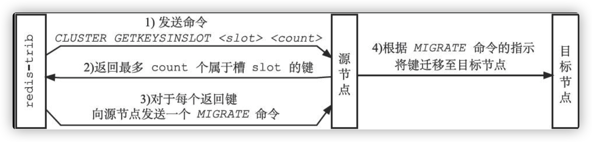

# redis集群的高可用

Redis集群是Redis提供的分布式数据库方案，集群通过分片来进行数据分享，并提供复制和故障转移功能。

## 槽指派

Redis集群通过分片的方式保存数据库中的键值对：集群的整个数据库被分为**16384个槽（slot）**，数据库中的每个键都属于这16384个槽的其中一个，集群中的每个节点可以处理0个或最多16384个槽。

通过向节点发送 CLUSTER ADDSLOTS命令，可以将一个或多个槽指派（assign）给节点负责：

```
CLUSTER ADDSLOTS <slot> [slot...]
```


**举例**

一个集群包含7000、7001、7002三个节点的集群来说：


当节点A通过消息从节点B那里接收到节点B的slots数组时，节点A会在自己的clusterState.nodes字典中查找节点B对应的clusterNode结构，并对结构中的slots数组进行保存或者更新。

因为集群中的每个节点都会将自己的slots数组通过消息发送给集群中的其他节点，并且每个接收到slots数组的节点都会将数组保存到相应节点的clusterNode结构里面，因此，集群中的每个节点都会知道数据库中的16384个槽分别被指派给了集群中的哪些节点。

Redis集群的数据结构


### 在集群中执行槽位指派

流程图：


当客户端向节点发送与数据库键有关的命令时，接收命令的节点会计算出命令要处理的数据库键属于哪个槽，并检查这个槽是否指派给了自己：

* 如果键所在的槽正好就指派给了当前节点，那么节点直接执行这个命令。
* 如果键所在的槽并没有指派给当前节点，那么节点会向客户端返回一个MOVED错误，指引客户端转向（redirect）至正确的节点，并再次发送之前想要执行的命令。

### 计算键属于那个槽

```python
def slot_number(key):
	return CRC16(key) & 16383
```

其中CRC16（key）语句用于计算键key的CRC-16校验和，而&16383语句则用于计算出一个介于0至16383之间的整数作为键key的槽号。

使用CLUSTER KEYSLOT<key> 命令可以查看一个给定键属于那个槽：

```
CLUSTER KEYSLOT "date"
```

以上命令代码实现：

```
def CLUSTER_KEYSLOT(key):
	# 计算槽号
	slot = slot_number(key)
	# 将槽号返回给客户端
	reply_client(slot)
```

### 判断槽是否由当前节点负责处理

当节点计算出键所属的槽i之后，节点就会检查自己在clusterState.slots数组中的项i，判断键所在的槽是否由自己负责：

1. 如果clusterState.slots[i]等于clusterState.myself，那么说明槽i由当前节点负责，节点可以执行客户端发送的命令。
2. 如果clusterState.slots[i]不等于clusterState.myself，那么说明槽i并非由当前节点负责，节点会根据clusterState.slots[i]指向的clusterNode结构所记录的节点IP和端口号，向客户端返回MOVED错误，指引客户端转向至正在处理槽i的节点。

举例：

1、SET date "2013-12-31"  计算出键date属于槽位2022，clusterState.slots[2022]等于clusterState.myself，说明槽2022正是由节点7000负责，于是节点7000直接执行SET命令，并将结果返回给发送命令的客户端。

2、SET msg "happy new year！"计算出键msg属于槽6257，检查clusterState.slots[6257]是否等于clusterState.myself，结果发现两者并不相等：这说明槽6257并非由节点7000负责处理，于是节点7000访问clusterState.slots[6257]所指向的clusterNode结构，并根据结构中记录的IP地址127.0.0.1和端口号7001，向客户端返回错误MOVED 6257 127.0.0.1:7001，指引节点转向至正在负责处理槽6257的节点7001

如图：


### MOVED错误

当节点发现键所在的槽并非由自己负责处理的时候，节点就会向客户端返回一个MOVED错误，指引客户端转向至正在负责槽的节点。

### 重新分片（集群的扩容和容错）

举例：

现在集群是7000、7001、7002三个节点，如果向集群中添加端口号为7003的节点，就需要集群重新分片，对slot进行重新分片的过程图：


#### 重新分片的实现原理

Redis集群的重新分片操作是由**Redis的集群管理软件redis-trib负责执行的**，Redis提供了进行重新分片所需的所有命令，而redis-trib则通过向源节点和目标节点发送命令来进行重新分片操作。

重新分片过程：

1. redis-trib对目标节点发送CLUSTER SETSLOT＜slot＞IMPORTING＜source_id＞命令，让目标节点准备好从源节点导入（import）属于槽slot的键值对。

2. redis-trib对源节点发送CLUSTER SETSLOT＜slot＞MIGRATING＜target_id＞命令，让源节点准备好将属于槽slot的键值对迁移（migrate）至目标节点。

3. redis-trib向源节点发送CLUSTER GETKEYSINSLOT＜slot＞＜count＞命令，获得最多count个属于槽slot的键值对的键名（keyname）。

4. 对于步骤3获得的每个键名，redis-trib都向源节点发送一个MIGRATE＜target_ip＞＜target_port＞＜key_name＞0＜timeout＞命令，将被选中的键原子地从源节点迁移至目标节点。

5. 重复执行步骤3和步骤4，直到源节点保存的所有属于槽slot的键值对都被迁移至目标节点为止。每次迁移键的过程如图所示

   

6. redis-trib向集群中的任意一个节点发送CLUSTER SETSLOT＜slot＞NODE＜target_id＞命令，将槽slot指派给目标节点，这一指派信息会通过消息发送至整个集群，最终集群中的所有节点都会知道槽slot已经指派给了目标节点。

### ASK错误

当客户端向源节点发送一个与数据库键有关的命令，并且命令要处理的数据库键恰好就属于正在被迁移的槽时：

1. 源节点会先在自己的数据库里面查找指定的键，如果找到的话，就直接执行客户端发送的命令。
2. 相反地，如果源节点没能在自己的数据库里面找到指定的键，那么这个键有可能已经被迁移到了目标节点，源节点将向客户端返回一个ASK错误，指引客户端转向正在导入槽的目标节点，并再次发送之前想要执行的命令。

ASK错误的过程：


#### ASK错误和MOVED错误的区别

1. MOVED错误代表槽的负责权已经从一个节点转移到了另一个节点：在客户端收到关于槽i的MOVED错误之后，客户端每次遇到关于槽i的命令请求时，都可以直接将命令请求发送至MOVED错误所指向的节点，因为该节点就是目前负责槽i的节点。
2. ASK错误只是两个节点在迁移槽的过程中使用的一种临时措施：在客户端收到关于槽i的ASK错误之后，客户端只会在接下来的一次命令请求中将关于槽i的命令请求发送至ASK错误所指示的节点，但这种转向不会对客户端今后发送关于槽i的命令请求产生任何影响，客户端仍然会将关于槽i的命令请求发送至目前负责处理槽i的节点，除非ASK错误再次出现。
