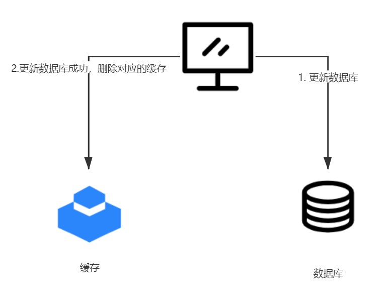
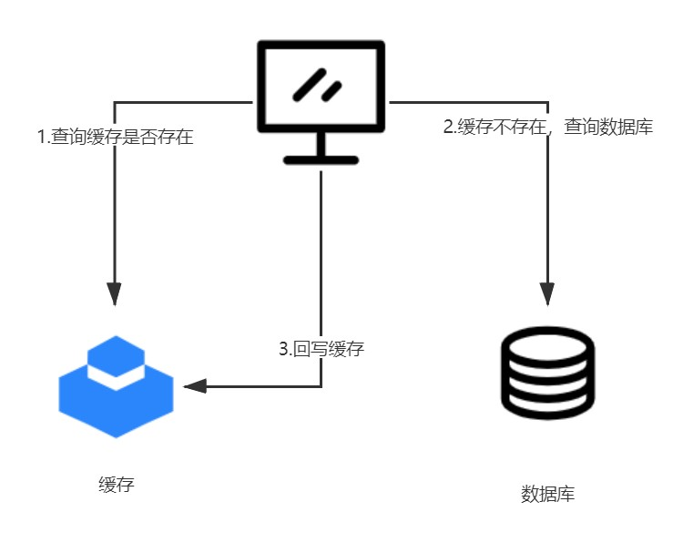

# 如何保证缓存与数据库的数据一致性问题

[toc]

## Cache Aside Pattern（旁路缓存模式）

Cache Aside Pattern时我们平时使用比较多的一个缓存读写模式，比较适合读请求比较多的场景。

Cache Aside Pattern中服务端需要同时维系DB和cache，并且是以DB的结果为准。

**写的过程**

* 先更新DB
* 然后直接删除cache

**读的过程**

* 从cache中读取数据，读取到就直接返回
* cache中读取不到的话，就从DB中读取数据返回
* 再把数据存放到cache中

### 相关问题

#### 在写数据的过程中，是否可以先删除cache，后更新DB吗？

不可以，因为会造成数据库DB和缓存数据不一致的问题。假如有两个请求，请求A先写数据dataA，请求B随后读数据dataA的话就很有可能产生数据不一致性的问题。

请求A先把cache删除了，随后请求B请求时，读取的数据还是旧数据然后缓存，但是请求A已经把数据更新为dataA了。

#### 在写数据的过程中，先更新DB，后删除cache依旧有存在数据不一致的问题

最常见的用户积分场景为例，每个用户都有自己的积分，假如发生以下过程：

- 线程A根据业务会把用户id为1的积分更新成100
- 线程B根据业务会把用户id为1的积分更新成200
- 在数据库层面，线程A和线程B肯定不存在并发情况，因为数据库用锁来保证了ACID（假如是mysql等关系型数据库），无论数据库中最终的值是100还是200，我们都假设正确。
- 假设线程B在A之后更新数据库，则数据库中的值为200
- 线程A和线程B在回写缓存过程中，很可能会发生线程A在线程B之后操作缓存的情况（因为网络调用存在不确定性），这个时候缓存内的值会被更新成100，发生了缓存和数据库不一致的情况

所以先更新DB，后删除cache还是可能会出现数据不一致性的问题，不过概率非常小，因为缓存的写入速度是比数据库的写入速度快很多！

### 存在的缺陷

**缺陷1：首次请求数据一定不在cache的问题**

解决方法：可以将热点数据可以提前放入cache中。

**缺陷2：写操作比较频繁的话导致cache中的数据会被频繁删除，这样会影响缓存命中率。**

解决办法：

- 数据库和缓存数据强一致场景 ：更新DB的时候同样更新cache，不过我们需要加一个锁/分布式锁来保证更新cache的时候不存在线程安全问题。
- 可以短暂地允许数据库和缓存数据不一致的场景 ：更新DB的时候同样更新cache，但是给缓存加一个比较短的过期时间，这样的话就可以保证即使数据不一致的话影响也比较小。
