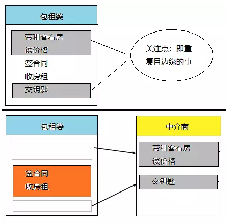

# SpringAOP

AOP(Aspect-Oriented Programming:面向切面编程)能够将那些与业务无关，**却为业务模块所共同调用的逻辑或责任（例如事务处理、日志管理、权限控制等）封装起来**，便于**减少系统的重复代码**，**降低模块间的耦合度**，并**有利于未来的可拓展性和可维护性**。

### SpringAOP的实现方式

* ##### JDK动态代理

  如果要代理的对象，实现了某个接口，那么Spring AOP会使用**JDK Proxy**，去创建代理对象

* ##### Cglib动态代理

  对于没有实现接口的对象，就无法使用 JDK Proxy 去进行代理了，这时候Spring AOP会使用**Cglib** ，这时候Spring AOP会使用 **Cglib** 生成一个被代理对象的子类来作为代理

动态代理模式实现原理，可以参考整理的动态代理知识点总结 >> [代理模式总结](javabase/proxy/代理模式总结.md)

### AOP术语和流程

* **连接点（join point）：**对应的是具体被拦截的对象，因为Spring只能支持方法，所以被拦截的对象往往就是指特定的方法。
* **切点（point cut）：**有时候，我们的切面不单单应用于单个方法，也可能是多个类的不同方法，这时，可以通过正则式和指示器的规则去定义，从而适配连接点。切点就是提供这样一个功能的概念。
* **通知（advice）：**就是按照约定的流程下的方法，分为前置通知（beforeadvice）、后置通知（after advice）、环绕通知（around advice）、事后返回通知（afterReturning advice）和异常通知（afterThrowing advice），它会根据约定织入流程中，需要弄明白它们在流程中的顺序和运行的条件。
* **目标对象（target）：**即被代理对象。
* **引入（introduction）：**是指引入新的类和其方法，增强现有Bean的功能。
* **织入（weaving）：**它是一个通过动态代理技术，为原有服务对象生成代理对象，然后将与切点定义匹配的连接点拦截，并按约定将各类通知织入约定流程的过程。
* **切面（aspect）：**是一个可以定义切点、各类通知和引入的内容，Spring AOP将通过它的信息来增强Bean的功能或者将对应的方法织入流程。

### 举例

如图：

在上面的例子中，包租婆的核心业务就是签合同，收房租，那么这就够了，灰色框起来的部分都是重复且边缘的事，交给中介商就好了，这就是 **AOP 的一个思想：让关注点代码与业务代码分离！**

### Spring AOP和AspectJ AOP有什么区别？

**Spring AOP 属于运行时增强，而 AspectJ 是编译时增强。 Spring AOP 基于代理(Proxying)，而 AspectJ 基于字节码操作(Bytecode Manipulation)，**属于静态织入，通过修改代码来实现，有如下几个织入的时机：

* 编译期织入（Compile-time weaving）：如类A使用AspectJ添加类一个属性，类B应用了它，这个场景就需要编译期的时候就进行织入，否则没法编译类B。
*  编译后织入（Post-compile weaving）：也就是已经生成了.class文件，或已经打成jar包了，这种情况我们需要增强处理的话，就要用到编译后织入。
* 类加载后织入（Load-time weaving）：指的是在加载类的时候进行织入，要实现这个时期的织入，有几种常见的方法。1、自定义类加载器来干这个，这个应该是最容易想到的办法，在被织入类加载到 JVM 前去对它进行加载，这样就可以在加载的时候定义行为了。2、在 JVM 启动的时候指定 AspectJ 提供的 agent：`-javaagent:xxx/xxx/aspectjweaver.jar`。

Spring AOP 已经集成了 AspectJ ，AspectJ 应该算的上是 Java 生态系统中最完整的 AOP 框架了。AspectJ 相比于 Spring AOP 功能更加强大，但是 Spring AOP 相对来说更简单，

如果我们的切面比较少，那么两者性能差异不大。但是，当切面太多的话，最好选择 AspectJ ，它比Spring AOP 快很多。

### 参考

[面试官：什么是AOP？Spring AOP和AspectJ的区别是什么？](https://segmentfault.com/a/1190000022019122)

[深入浅出Spring Boot 2.x](https://book.douban.com/subject/30323325/)

[Spring常见问题总结](https://github.com/Snailclimb/JavaGuide/blob/master/docs/system-design/framework/spring/Spring%E5%B8%B8%E8%A7%81%E9%97%AE%E9%A2%98%E6%80%BB%E7%BB%93.md)

[Spring(4)——面向切面编程（AOP模块）](https://www.jianshu.com/p/994027425b44)
