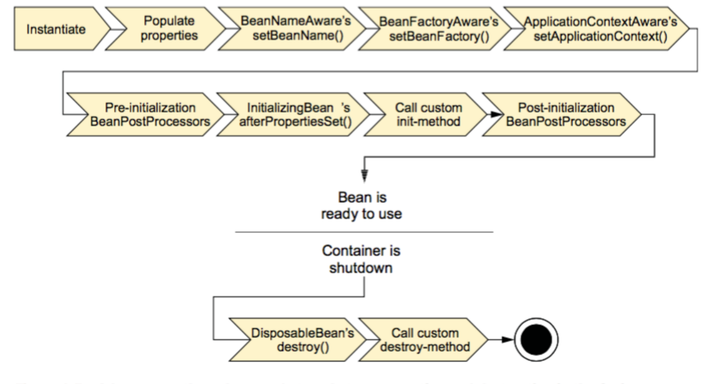

# Spring生命周期

### 生命周期过程

* Bean容器找到配置文件中Spring Bean的定义。
* Bean容器利用Java Reflection API创建一个Bean示例。
* 如果涉及到一些属性值 利用 `set()`方法设置一些属性值。
* 如果Bean实现了`BeanNameAware`接口，调用`setBeanName()`方法，传入Bean的名字。
* 如果Bean实现了`BeanClassLoaderAware`接口，调用`setBeanClassLoader()`方法，传入`ClassLoader`对象的实例。
* 与上面的类似，如果实现了其他`*Aware`接口，就调用相应的方法。
* 如果有和加载这个Bean的Spring容器相关的`BeanPostProcessor`对象，执行`postProcessBeforeInitialiaztion()`方法。
* 如果是实现了`InitializingBean`接口，执行`afterPropertiesSet()`方法。
* 如果Bean在配置文件中定义了包含init-method属性，执行指定的方法。
* 如果有和加载这个Bean的Spring容器相关的`BeanPostProcessor`对象，执行`postProcessAfterInitialization()`方法。
* 当要销毁Bean的时候，如果Bean实现了`DisposableBean`接口，执行`destory()`方法。
* 当要销毁Bean的时候，如果Bean在配置文件中的定义包含destory-method属性，执行指定的方法。

流程图：



### 示例代码

1. Bean的配置文件

   ```xml
   <?xml version="1.0" encoding="UTF-8"?>
   <beans xmlns="http://www.springframework.org/schema/beans"
          xmlns:xsi="http://www.w3.org/2001/XMLSchema-instance" xmlns:p="http://www.springframework.org/schema/p"
          xsi:schemaLocation="
               http://www.springframework.org/schema/beans
               http://www.springframework.org/schema/beans/spring-beans-3.2.xsd">
   
       <bean id="beanPostProcessor" class="com.springbeans.lifetime.postprocessor.MyBeanPostProcessor">
       </bean>
   
       <bean id="instantiationAwareBeanPostProcessor" class="com.springbeans.lifetime.awarebeanpostprocessor.MyInstantiationAwareBeanPostProcessor">
       </bean>
   
       <bean id="beanFactoryPostProcessor" class="com.springbeans.lifetime.postprocessor.MyBeanFactoryPostProcessor">
       </bean>
   
       <bean id="person" class="com.springbeans.lifetime.beans.Person" init-method="myInit"
             destroy-method="myDestory" scope="singleton" p:name="张三" p:address="广州" p:phone="15900000000" />
   </beans>
   ```

2. 创建bean --> Person

   ```java
   // 实现了BeanFactoryAware, BeanNameAware接口 对应会执行 相关的set...Aware()方法
   // 实现了InitializingBean 接口 对应会 加载 afterPropertiesSet 方法
   // 实现了DisposableBean 接口 对应会 加载destory() 方法
   public class Person implements BeanFactoryAware, BeanNameAware,
           InitializingBean, DisposableBean {
   
       private String name;
       private String address;
       private int phone;
   
       private BeanFactory beanFactory;
       private String beanName;
   
       public Person() {
           System.out.println("【构造器】调用Person的构造器实例化");
       }
   
       public String getName() {
           return name;
       }
   
       public void setName(String name) {
           System.out.println("【注入属性】注入属性name");
           this.name = name;
       }
   
       public String getAddress() {
           return address;
       }
   
       public void setAddress(String address) {
           System.out.println("【注入属性】注入属性address");
           this.address = address;
       }
   
       public int getPhone() {
           return phone;
       }
   
       public void setPhone(int phone) {
           System.out.println("【注入属性】注入属性phone");
           this.phone = phone;
       }
   
       @Override
       public String toString() {
           return "Person [address=" + address + ", name=" + name + ", phone="
                   + phone + "]";
       }
   
       // 这是BeanFactoryAware接口方法
       @Override
       public void setBeanFactory(BeanFactory arg0) throws BeansException {
           System.out
                   .println("【BeanFactoryAware接口】调用BeanFactoryAware.setBeanFactory()");
           this.beanFactory = arg0;
       }
   
       // 这是BeanNameAware接口方法
       @Override
       public void setBeanName(String arg0) {
           System.out.println("【BeanNameAware接口】调用BeanNameAware.setBeanName()");
           this.beanName = arg0;
       }
   
       // 这是InitializingBean接口方法
       @Override
       public void afterPropertiesSet() throws Exception {
           System.out
                   .println("【InitializingBean接口】调用InitializingBean.afterPropertiesSet()");
       }
   
       // 这是DiposibleBean接口方法
       @Override
       public void destroy() throws Exception {
           System.out.println("【DiposibleBean接口】调用DiposibleBean.destory()");
       }
   
       // 通过<bean>的init-method属性指定的初始化方法
       public void myInit() {
           System.out.println("【init-method】调用<bean>的init-method属性指定的初始化方法");
       }
   
       // 通过<bean>的destroy-method属性指定的初始化方法
       public void myDestory() {
           System.out.println("【destroy-method】调用<bean>的destroy-method属性指定的初始化方法");
       }
   }
   ```

3. 创建与这个Bean相关的Spring容器的 BeanPostProcessor对象

   ```java
   public class MyBeanPostProcessor implements BeanPostProcessor {
   
       public MyBeanPostProcessor() {
           super();
           System.out.println("这是BeanPostProcessor实现类构造器！！");
           // TODO Auto-generated constructor stub
       }
   
       @Override
       public Object postProcessAfterInitialization(Object arg0, String arg1)
               throws BeansException {
           System.out
                   .println("BeanPostProcessor接口方法postProcessAfterInitialization对属性进行更改！");
           return arg0;
       }
   
       @Override
       public Object postProcessBeforeInitialization(Object arg0, String arg1)
               throws BeansException {
           System.out
                   .println("BeanPostProcessor接口方法postProcessBeforeInitialization对属性进行更改！");
           return arg0;
       }
   }
   ```

   ```java
   public class MyBeanPostProcessor implements BeanPostProcessor {
   
       public MyBeanPostProcessor() {
           super();
           System.out.println("这是BeanPostProcessor实现类构造器！！");
           // TODO Auto-generated constructor stub
       }
   
       @Override
       public Object postProcessAfterInitialization(Object arg0, String arg1)
               throws BeansException {
           System.out
                   .println("BeanPostProcessor接口方法postProcessAfterInitialization对属性进行更改！");
           return arg0;
       }
   
       @Override
       public Object postProcessBeforeInitialization(Object arg0, String arg1)
               throws BeansException {
           System.out
                   .println("BeanPostProcessor接口方法postProcessBeforeInitialization对属性进行更改！");
           return arg0;
       }
   }
   ```

   ```java
   public class MyInstantiationAwareBeanPostProcessor extends
           InstantiationAwareBeanPostProcessorAdapter {
   
       public MyInstantiationAwareBeanPostProcessor() {
           super();
           System.out
                   .println("这是InstantiationAwareBeanPostProcessorAdapter实现类构造器！！");
       }
   
       // 接口方法、实例化Bean之前调用
       @Override
       public Object postProcessBeforeInstantiation(Class beanClass,
                                                    String beanName) throws BeansException {
           System.out
                   .println("InstantiationAwareBeanPostProcessor调用postProcessBeforeInstantiation方法");
           return null;
       }
   
       // 接口方法、实例化Bean之后调用
       @Override
       public Object postProcessAfterInitialization(Object bean, String beanName)
               throws BeansException {
           System.out
                   .println("InstantiationAwareBeanPostProcessor调用postProcessAfterInitialization方法");
           return bean;
       }
   
       // 接口方法、设置某个属性时调用
       @Override
       public PropertyValues postProcessPropertyValues(PropertyValues pvs,
                                                       PropertyDescriptor[] pds, Object bean, String beanName)
               throws BeansException {
           System.out
                   .println("InstantiationAwareBeanPostProcessor调用postProcessPropertyValues方法");
           return pvs;
       }
   }
   ```

4. 测试

   ```java
   public static void main(String[] args) {
           System.out.println("现在开始初始化容器");
   
           ApplicationContext factory = new ClassPathXmlApplicationContext("beans.xml");
           System.out.println("容器初始化成功");
           //得到Preson，并使用
           Person person = factory.getBean("person",Person.class);
           System.out.println(person);
   
           System.out.println("现在开始关闭容器！");
           ((ClassPathXmlApplicationContext)factory).registerShutdownHook();
       }
   ```

5. 输出结果

   ```
   现在开始初始化容器
   这是BeanFactoryPostProcessor实现类构造器！！
   BeanFactoryPostProcessor调用postProcessBeanFactory方法
   这是BeanPostProcessor实现类构造器！！
   这是InstantiationAwareBeanPostProcessorAdapter实现类构造器！！
   InstantiationAwareBeanPostProcessor调用postProcessBeforeInstantiation方法
   【构造器】调用Person的构造器实例化
   InstantiationAwareBeanPostProcessor调用postProcessPropertyValues方法
   【注入属性】注入属性address
   【注入属性】注入属性name
   【注入属性】注入属性phone
   【BeanNameAware接口】调用BeanNameAware.setBeanName()
   【BeanFactoryAware接口】调用BeanFactoryAware.setBeanFactory()
   BeanPostProcessor接口方法postProcessBeforeInitialization对属性进行更改！
   【InitializingBean接口】调用InitializingBean.afterPropertiesSet()
   【init-method】调用<bean>的init-method属性指定的初始化方法
   BeanPostProcessor接口方法postProcessAfterInitialization对属性进行更改！
   InstantiationAwareBeanPostProcessor调用postProcessAfterInitialization方法
   容器初始化成功
   Person [address=广州, name=张三, phone=110]
   现在开始关闭容器！
   【DiposibleBean接口】调用DiposibleBean.destory()
   【destroy-method】调用<bean>的destroy-method属性指定的初始化方法
   ```

### 参考

[Spring Bean的生命周期](https://www.cnblogs.com/zrtqsk/p/3735273.html)

[Spring常见问题总结](https://github.com/Snailclimb/JavaGuide/blob/master/docs/system-design/framework/spring/Spring%E5%B8%B8%E8%A7%81%E9%97%AE%E9%A2%98%E6%80%BB%E7%BB%93.md)

