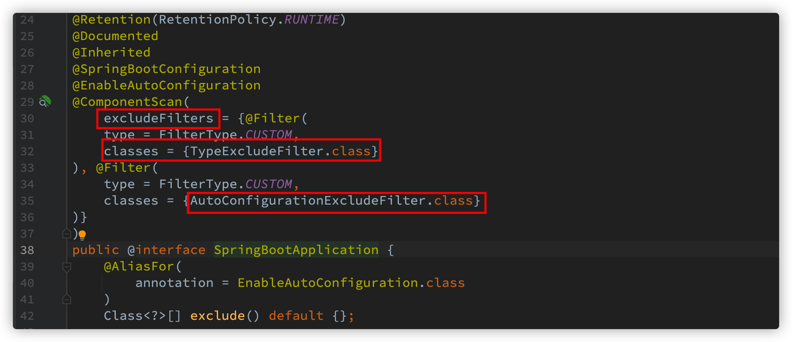
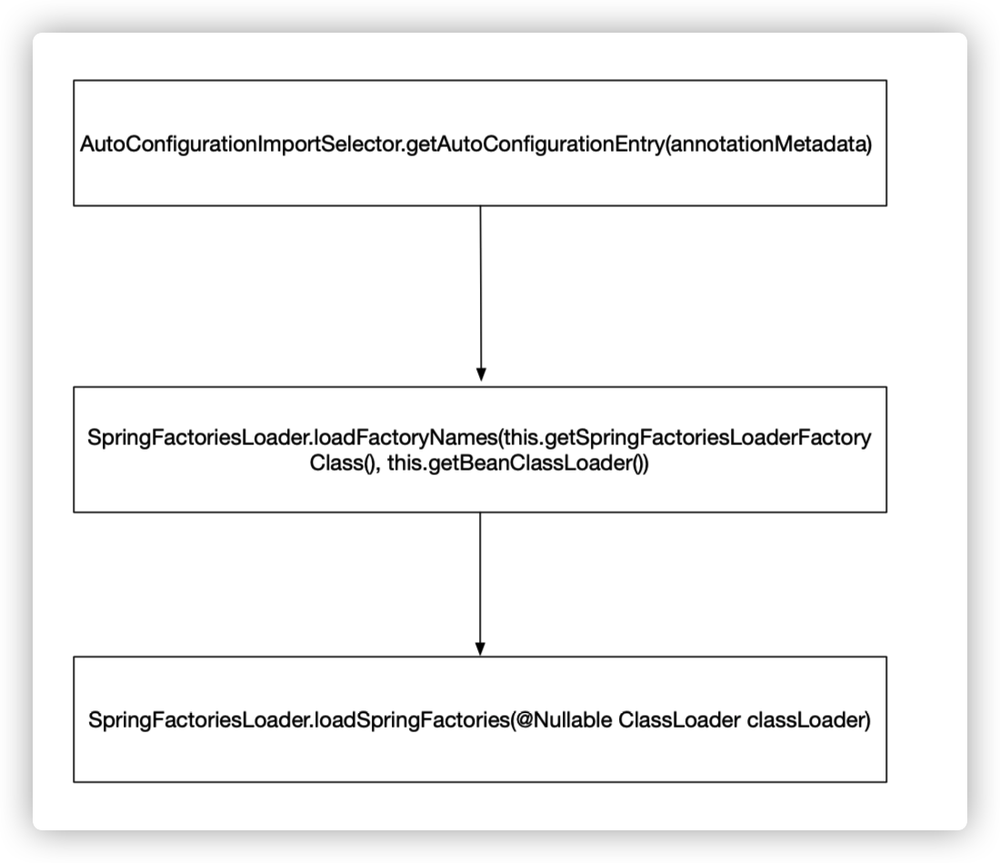
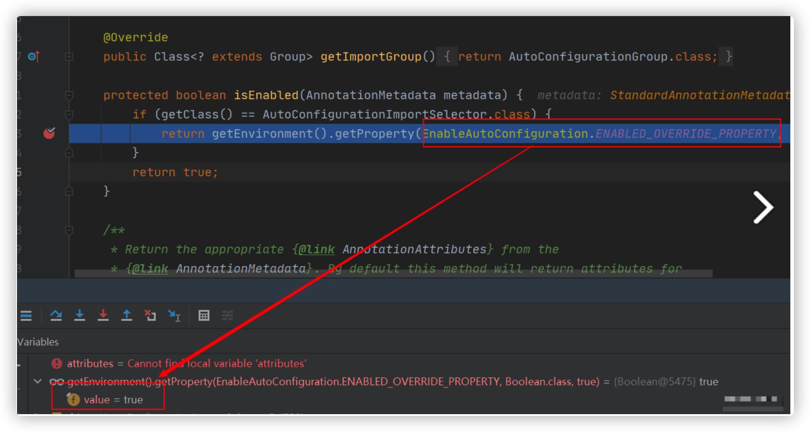
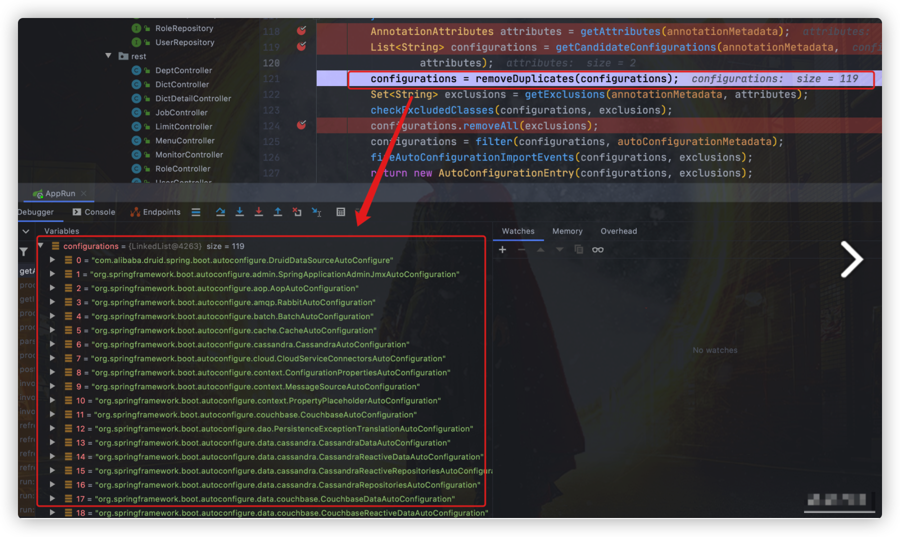

# SpringBoot自动装配机制

[toc]

## 什么是SpringBoot自动装配？

SpringBoot定义了一套接口规范，这套规范规定：SpringBoot在启动时会扫描外部引用jar包中的**META-INF/spring.factories**文件，将文件中配置的类型信息加载到Spring容器（此外涉及到JVM类加载机制与Spring容器知识），并执行类中定义的各种操作。对于外部jar来说，只需要按照SpringBoot定义的标准，就能将自己的功能装置进SpringBoot。

比如在项目中使用redis的话，在没有SpringBoot的情况下，如果我们需要第三方依赖，需要手动配置，比较麻烦。但是SpringBoot中，我们直接引入一个starter即可。如：

```xml
<dependency>
    <groupId>org.springframework.boot</groupId>
    <artifactId>spring-boot-starter-data-redis</artifactId>
</dependency>
```

自动装配可以简单理解为：**通过注解或者一些简单的配置就能在 Spring Boot 的帮助下实现某块功能。**

## SpringBoot是如何实现自动装配的？

先看一下SpringBoot的启动类上边的核心注解`@SpringBootApplication`。

```java
@Target({ElementType.TYPE})
@Retention(RetentionPolicy.RUNTIME)
@Documented
@Inherited
@SpringBootConfiguration // 1.
@ComponentScan           // 2.
@EnableAutoConfiguration // 3.
public @interface SpringBootApplication {

}

@Target({ElementType.TYPE})
@Retention(RetentionPolicy.RUNTIME)
@Documented
@Configuration 
public @interface SpringBootConfiguration {
}
```

大概可以把 `@SpringBootApplication`看作是 `@Configuration`、`@EnableAutoConfiguration`、`@ComponentScan` 注解的集合。

* `@EnableAutoConfiguration`：启用 SpringBoot 的自动配置机制
* `@Configuration`：允许在上下文中注册额外的 bean 或导入其他配置类
* `@ComponentScan`： 扫描被`@Component` (`@Service`,`@Controller`)注解的 bean，注解默认会扫描启动类所在的包下所有的类 ，可以自定义不扫描某些 bean。如下图所示，容器中将排除`TypeExcludeFilter`和`AutoConfigurationExcludeFilter`。



从`@EnableAutoConfiguration`注解入手，继续追踪实现过程。

### @EnableAutoConfiguration:实现自动装配的核心注解

`EnableAutoConfiguration` 只是一个简单地注解，自动装配核心功能的实现实际是通过 `AutoConfigurationImportSelector`类。

```java
@Target({ElementType.TYPE})
@Retention(RetentionPolicy.RUNTIME)
@Documented
@Inherited
@AutoConfigurationPackage // 将main包下的所有组件注册到容器中
@Import({AutoConfigurationImportSelector.class}) // 加载自动装配类 xxxAutoConfiguration
public @interface EnableAutoConfiguration {
    String ENABLED_OVERRIDE_PROPERTY = "spring.boot.enableautoconfiguration";

    Class<?>[] exclude() default {};

    String[] excludeName() default {};
}

```

### AutoConfigurationImportSelector:加载自动装配类

```java
public class AutoConfigurationImportSelector implements DeferredImportSelector, BeanClassLoaderAware, ResourceLoaderAware, BeanFactoryAware, EnvironmentAware, Ordered {
		private static final String[] NO_IMPORTS = new String[0];
		...
		 public String[] selectImports(AnnotationMetadata annotationMetadata) {
        if (!this.isEnabled(annotationMetadata)) {
            return NO_IMPORTS;
        } else {
            AutoConfigurationImportSelector.AutoConfigurationEntry autoConfigurationEntry = this.getAutoConfigurationEntry(annotationMetadata);
            return StringUtils.toStringArray(autoConfigurationEntry.getConfigurations());
        }
    }
    
    ...
}
```

```java
public interface DeferredImportSelector extends ImportSelector {

}

public interface ImportSelector {
    String[] selectImports(AnnotationMetadata var1);
}
```

可以看出，`AutoConfigurationImportSelector` 类实现了 `ImportSelector`接口，也就实现了这个接口中的 `selectImports`方法，该方法主要用于**获取所有符合条件的类的全限定类名，这些类需要被加载到 IoC 容器中**。

### 分析AutoConfigurationImportSelector:加载自动装配类中的selectImports方法

```java
		private static final String[] NO_IMPORTS = new String[0];
	
		 public String[] selectImports(AnnotationMetadata annotationMetadata) {
        // 1.判断自动装配开关是否打开
        if (!this.isEnabled(annotationMetadata)) {
            return NO_IMPORTS;
        } else {
        		// 2.获取所有需要装配的bean
            AutoConfigurationImportSelector.AutoConfigurationEntry autoConfigurationEntry = 						this.getAutoConfigurationEntry(annotationMetadata);
            return StringUtils.toStringArray(autoConfigurationEntry.getConfigurations());
        }
    }
```

需要重点关注一下`getAutoConfigurationEntry()`方法，这个方法主要负责加载自动配置类的。

该方法的调用链：



追踪`getAutoConfigurationEntry()`的源码来详细分析：

```java
private static final AutoConfigurationEntry EMPTY_ENTRY = new AutoConfigurationEntry();

AutoConfigurationEntry getAutoConfigurationEntry(AutoConfigurationMetadata autoConfigurationMetadata, AnnotationMetadata annotationMetadata) {
        //1.
        if (!this.isEnabled(annotationMetadata)) {
            return EMPTY_ENTRY;
        } else {
            //2.
            AnnotationAttributes attributes = this.getAttributes(annotationMetadata);
            //3.
            List<String> configurations = 		this.getCandidateConfigurations(annotationMetadata, attributes);
            //4.
            configurations = this.removeDuplicates(configurations);
            Set<String> exclusions = this.getExclusions(annotationMetadata, attributes);
            this.checkExcludedClasses(configurations, exclusions);
            configurations.removeAll(exclusions);
            configurations = this.filter(configurations, autoConfigurationMetadata);
            this.fireAutoConfigurationImportEvents(configurations, exclusions);
            return new 			AutoConfigurationImportSelector.AutoConfigurationEntry(configurations, exclusions);
        }
    }
```

**第一步：**

判断自动装配开关是否打开。默认`spring.boot.enableautoconfiguration=true`，可在 `application.properties` 或 `application.yml` 中设置



**第二步：**

用于获取`EnableAutoConfiguration`注解中的 `exclude` 和 `excludeName`。


**第三步：**

获取需要自动装配的所有配置类，读取`META-INF/spring.factories`

```
spring-boot/spring-boot-project/spring-boot-autoconfigure/src/main/resources/META-INF/spring.factories
```



从下图可以看到这个文件的配置内容都被我们读取到了。`XXXAutoConfiguration`的作用就是按需加载组件。


不光是这个依赖下的`META-INF/spring.factories`被读取到，所有 Spring Boot Starter 下的`META-INF/spring.factories`都会被读取到。

可以看到， druid 数据库连接池的 Spring Boot Starter 就创建了`META-INF/spring.factories`文件。

如果，我们自己要创建一个 Spring Boot Starter，这一步是必不可少的。


**第四步：**

`spring.factories`中这么多配置，每次启动都要全部加载么？

肯定不是的。等debug 到后面会发现，`configurations` 的值变小了。


因为，这一步有经历了一遍筛选，`@ConditionalOnXXX` 中的所有条件都满足，该类才会生效。

```java
@Configuration
// 检查相关的类：RabbitTemplate 和 Channel是否存在
// 存在才会加载
@ConditionalOnClass({ RabbitTemplate.class, Channel.class })
@EnableConfigurationProperties(RabbitProperties.class)
@Import(RabbitAnnotationDrivenConfiguration.class)
public class RabbitAutoConfiguration {
}
```

了解下 Spring Boot 提供的条件注解：

- `@ConditionalOnBean`：当容器里有指定 Bean 的条件下
- `@ConditionalOnMissingBean`：当容器里没有指定 Bean 的情况下
- `@ConditionalOnSingleCandidate`：当指定 Bean 在容器中只有一个，或者虽然有多个但是指定首选 Bean
- `@ConditionalOnClass`：当类路径下有指定类的条件下
- `@ConditionalOnMissingClass`：当类路径下没有指定类的条件下
- `@ConditionalOnProperty`：指定的属性是否有指定的值
- `@ConditionalOnResource`：类路径是否有指定的值
- `@ConditionalOnExpression`：基于 SpEL 表达式作为判断条件
- `@ConditionalOnJava`：基于 Java 版本作为判断条件
- `@ConditionalOnJndi`：在 JNDI 存在的条件下差在指定的位置
- `@ConditionalOnNotWebApplication`：当前项目不是 Web 项目的条件下
- `@ConditionalOnWebApplication`：当前项目是 Web 项 目的条件下

## 如何实现一个Starter


## 参考

[淘宝一面：“说一下 Spring Boot 自动装配原理呗？”](https://www.cnblogs.com/javaguide/p/springboot-auto-config.html)
