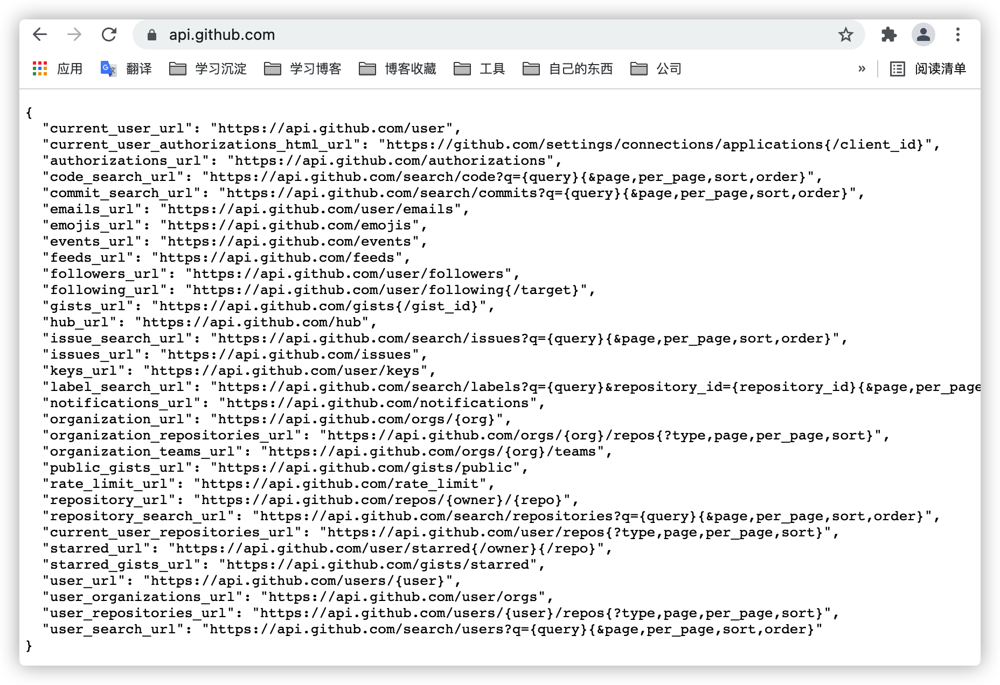

# 关于RESTful API设计

[toc]

## 什么是RESTful？

REST这个词来源于Roy Thomas Fielding博士在2000年所发表的博士论文，在论文中Fielding将他对互联网软件的架构原则定名为REST，即Representtational State Transfer的缩写，字面意思理解为**表现层状态转化**。

### 什么是表现层？

所谓的表现层是指资源（Resource）的表现层，对于互联网来说，网络上任何一个具体信息（如一段文本、一张图片、一首歌曲或一种服务）都可成为一个资源。对互联网上的资源我们可以使用URI（统一资源标识符）执行它，每种资源都可以对应一个特定的URI，要获取这个资源，访问响应的URI就可以。

> URI是Uniform Resource Identifier的缩写。
>
> Uniform：规定统一的格式可方便处理多种不同类型的资源，而不用根据上下文环境来识别资源指定的访问方式。另外，加入新增的协议方案（如http: 或ftp:）也更容易。
>
> Resource：资源的定义是“可标识的任何东西”。不仅是文档文件，图像或服务（例如当天的天气预报）等能够区别于其他类型的，全都可作为资源。另外，资源不仅可以是单一的，也可以是多数的集合体。
>
> Identifier：表示可标识的对象。也称为标识符。
>
> 所以，**URI就是由某个协议方案表示的资源的定位标识符。协议方案是指访问资源所使用的协议类型名称。**如采用HTTP协议时，协议方案就是http。
>
> URI用字符串标识某一互联网资源，而URL表示资源的地点（互联网上所处的位置）。可见URL是URI的子集。

因为所有的互联网应用，资源都是保存在服务器上，所以客户端每次向服务器发送请求就代表了让服务器端资源发生“状态转化（State Transfer）”，而资源的这种转化最终通过表现层展示出来，所以这就是REST--表现层状态转化。**我们把符合REST这种原则的互联网应用架构称之为RESTful架构。**

## RESTful API设计

### 1.以资源为中心进行URL设计

资源时RESTful API的核心，所有的操作都是针对某一特定资源进行的，所以简洁、清晰、结构化的URL（统一资源定位符）设计是至关重要的。

对于资源，可以理解为一个集合，所以URL中尽量使用复数来表示资源，而对于特定的单个资源则通过添加ID或者其他唯一标识符来表示。对于有关联关系的资源可以通过资源嵌套的方式来表示，如：

```
/users
/users/{id}
/users/{loginName}
/products/{id}/comments
```

**Tips: URL是大小写敏感的，而且Spring MVC默认对URL也是区分大小写的，所以为了避免歧义，定义URL时最好都使用小写字母。**

RESTful API的设计最好做到Hypermedia化，也就是在返回结果中包含所提供相关资源的链接，使得用户可以根据返回结果就能得到后续操作需要访问的地址。

这种设计也被称为HATEOAS（Hypermedia As The Engine Of ApplicationState）。比如Github API设计就是这种设计，当访问https://api.github.com时，就会得到一个API地址列表：



得到这个API列表后，就可以根据需要执行响应的URL即可。

### 2.正确使用HTTP方法及状态码

资源的URL设计好之后，剩下的就是针对资源的操作都是使用HTTP方法指定的。如比较常用的有：

* GET用来获取资源；
* POST用来创建资源（也可以用于更新资源）；
* PUT用来更新资源；
* DELETE则是用来删除资源；
* PATCH方法用来更新资源，但用的比较少，常使用POST来替代。

在实际资源操作中，常常会增加一些资源处理动作，这时一般会给该动作增加一个端点，并使用POST执行该动作，如POST/orders/{id}/resubmit重新提交订单。

有时候也可以把动作转换成资源，**比如喜欢一个商品就可以使用POST /products/{id}/star，而取消喜欢则可以使用DELETE /products/{id}/star。通常在创建或者更新一个资源时，应该返回资源的最新数据，而删除资源一般不会返回内容。**

因为REST是基于HTTP协议的，所以对于用户请求的应答中应该使用正确的状态码，以便客户端能够做出正确的处理。HTTP标准状态码都是三位整数，大概分成了以下几个区间。

* 2XX：请求正常处理并返回。
* 3XX：重定向，请求的资源位置发生变化。
* 4XX：客户端发送的请求有错误。
* 5XX：服务器端错误。

**tips：返回码不一定就按照这种设计，只是这种返回码更通用一些，我们可以根据自己系统应用灵活的设计符合的返回码信息。**

### 3.查询及分页处理原则

通常我们遇到查询时需要附加一些查询条件对所要显示的列表进行过滤，这个时候可以通过在URL中附加参数来实现，比如：

* ?state=closed：查询指定状态。
* ?limit=10：指定返回10条记录。
* ?page=2& size=25&sort=created, desc：进行分页查询，并指定每页记录数及排序方式。

当我们使用Spring Data的Pageable进行分页查询时，需要传入的分页参数的默认名称如下。

* page：所要查询的页面数，也就是第几页数据。从0开始，默认值也是0。
* size：每一页中最大记录数，默认值为20。
* sort：分页数据的排序字段及方式，格式为property(, ASC|DESC)。其中排序方式为可选，默认排序方式为升序（ASC）。该参数可以多个，比如sort=firstname&sort=lastname, asc。

如果分页参数和项目中不同，可以通过实现PageableHandlerMethodArgumentResolverCustomizer接口进行自定义。

### 4.其他指导原则

* ##### 使用JSON作为响应返回格式

  JSON具有可读性、紧凑性及多种语言支持等优点，并且对前端开发中的JavaScript也支持，其他App开发都有比较成熟的库支持，所以使用JSON作为API返回的数据格式是最合适的。如果用户需要其他格式，如XML，可以通过请求头部中Accept来指定。

* ##### API域名

  应该尽量将API全部部署在一个专用的域名之下，如https://api.cd826dong或https://www.cd826dong/api。

* ##### API版本

  在设计API时最好将API的版本放入URL中，如https://api.cd826dong/v1/users。

* ##### 错误处理

  当出现错误时，在响应的内容中需要通过errmsg给出明确的信息，还可以创建统一的错误码，可以使用errcode返回。

  如果只是返回类似4XX BadRequest状态码给客户端，很难让客户端知道具体是哪里有问题，从而无法快速修改。

  此外，对于返回的错误信息最好以JSON的数据格式返回，这样可以方便客户端进行统一处理。如：

  ```
  {
  	errcode:40001,
  	errmsg:“这是一个错误信息”
  }
  ```

  ## 结合实际工作举例

  我们会对外部提供一些网络接口，都是基于HTTP协议的。

  我们的设计原则，都是符合上述的RESTful API设计原则，比如我们采用的JSON的方式作为请求和响应格式；使用固定的API域名；API版本；返回成功或失败的返回码和错误信息等。但是一般不会把所有的网络接口像github那样全部暴露到互联网上。

  除此之外还会有权限控制，网关控制等。

  如图一个RESTful的请求与响应：

  
